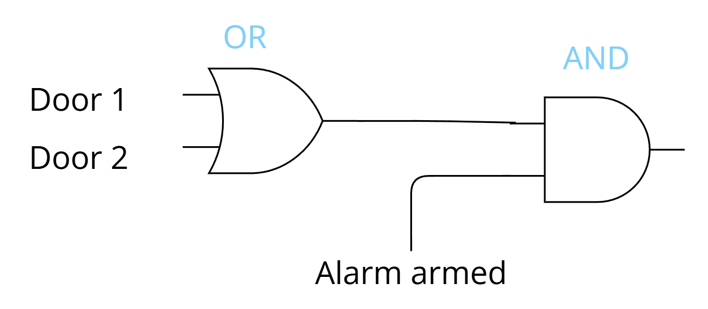
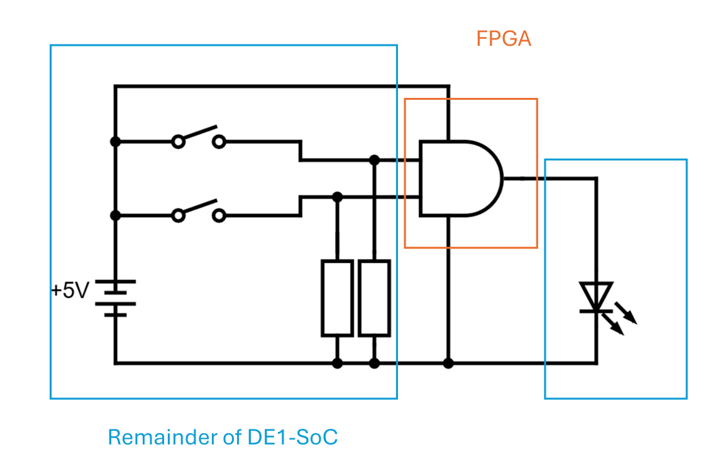
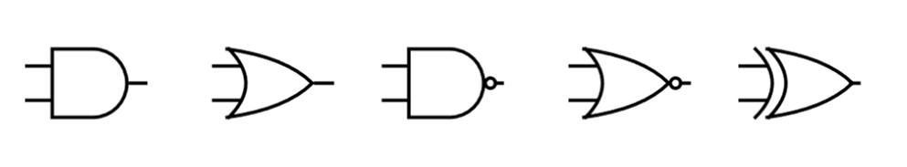
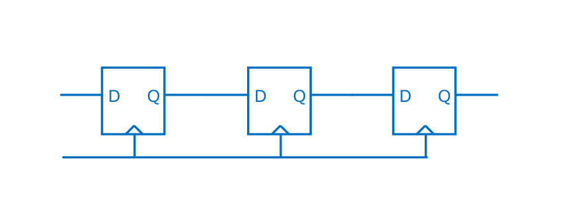
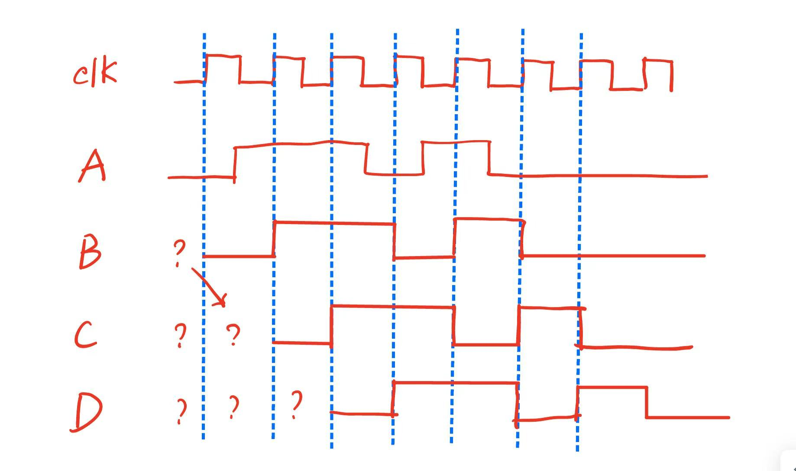
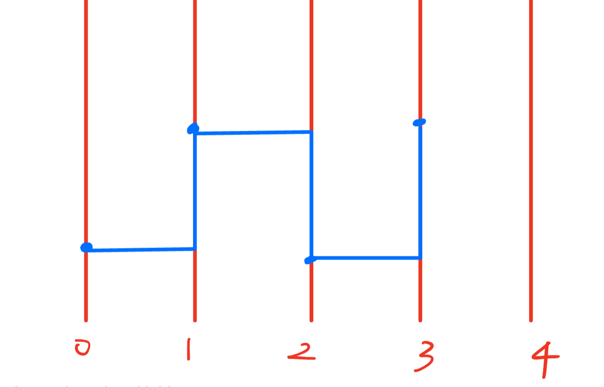
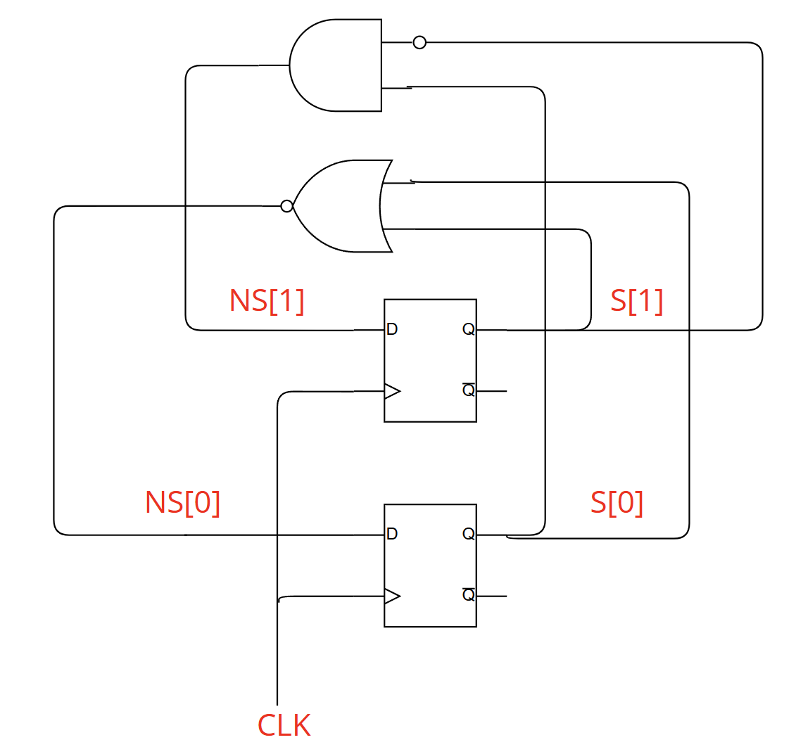

---  
title: 《数字系统》课程笔记  
date: 2026-03-28
description: 墨尔本大学工程与信息技术学院-2026第一学期  
math: true  
slug: digital-systems
categories:  
    - university  
tags:  
    - 交换
image: ds.png
---  

# Getting Started

## Lecture 1

### Two Types of Components

Digital systems, as we currently know them, are built from just two basic types of components

- Logic gates: outputs are an (almost) instantaneous function of the inputs
- Flip-flops: have memory! Past input can influence present output

### Logic Gates

Output is a function of the inputs

- Since each input is 0 or 1, only a finite number of possible inputs
- Therefore, can define the output using a table, known as a **truth table**

Already, we can build a simple burglar alarm.

LED turns on if ((Door 1 is open) OR (Door 2 is open)) AND (Alarm is armed))



The most common logic gates are:

- NOT (also known as an inverter)
- AND, OR
- NAND, NOR
- XO

Purpose of Logic Gates: 

- Logic gates allow us to perform “computations” on our signals. 
- The only limitation is that there is no memory. We must have all our inputs ready at the same time

### Flip Flops

- A flip flop can store a single bit of information (0 or 1)
- It is one form of memory
  - Fast but takes up a lot of physical room relative to how dedicated memory chips can store bits
- With memory comes our ability to implement finite-state machines, and any digital system is, abstractly, merely a FSM

## Lecture 2

### FPGA

Field Programmable Gate Array

- Field Programmable = can program it in the field
- Gate Array = array of gates
  - Array = 2 x 2 grid arrangement
  - Gate = logic gate

### Decompose Circuit: Internal vs External to FPGA



### Quartus

- Quartus is the software that comes with Altera/Intel FPGAs
- The two steps (configuring a logic circuit inside the FPGA;connecting it to physical pins) are done using two different utilities
  - Quartus wraps several utilities into a single interface
- Step 1 requires us to specify our logic circuit
  - Schematic (no longer supported)
  - Hardware Description Language
    - Verilog
    - VHDL
- Step 2 is done using the Pin Planner utility

### Top-Level Module

- The inputs and outputs of our logic circuit inside the FPGA are described by input and output statements inside the top-level module
- Top-level = not contained in any other module
  - You can have modules within modules
- Module = what I like to call a “chip” 
  - A container which describes an internal circuit
  - It has its own inputs and outputs

### Our First Module

```verilog
module MyCircuit(input A, input B, output C);
    assign C = A & B;
endmodule
```

Basic logic gates: `& = AND, | = OR, ^ = XOR, ! = NOT`

### Pull-up & Pull-down Resistors

[](assets/pull_up_down.png)

| Switch Position | Output PU | Output PD |
| :-------------: | :-------: | :-------: |
|      OPEN       |     1     |     0     |
|     CLOSED      |     0     |     1     |

### How to Emulate?

The DE1-SoC board has pull-up resistors, but we wish to emulate pull-down resistors

```verilog
module MyCircuit(input A, B, output C);
  assign C = (!A) & (!B);
endmodule
```

## Lecture 3

### Standard Logic Gates

Note Gate

|  IN  | OUT  |
| :--: | :--: |
|  0   |  1   |
|  1   |  0   |

Other Logic Gates

| IN1  | IN2  | AND  |  OR  | NAND | NOR  | XOR  |
| :--: | :--: | :--: | :--: | :--: | :--: | :--: |
|  0   |  0   |  0   |  0   |  1   |  1   |  0   |
|  0   |  1   |  0   |  1   |  1   |  0   |  1   |
|  1   |  0   |  0   |  1   |  1   |  0   |  1   |
|  1   |  1   |  1   |  1   |  0   |  0   |  0   |



In the graph, the bubble inverts the signal.

### Some Tips

- A) Does an FPGA execute Verilog code?
  - No, the FPGA execute a circuit. To put it simply, it runs by a truth table.
- B) Is it safe to leave the input to a logic gate floating?
  - No, we have to connect the input to $V_{CC}$ or to the ground. (Pull up / Pull down)
- C) What are the two main components in digital systems, out of which any digital system can be made?
  - Logic gates and Flip flops
- D) Can I go to the shop, buy an FPGA, and solder it into a larger circuit. so, how do I configure it?
  - Yes.

### Combinational Logic Circuits

Problem: For whatever reason, I want to build a digital circuit whose behaviour is as follows. How do I do it?

|  A   |  B   |  C   |  F   |
| :--: | :--: | :--: | :--: |
|  0   |  0   |  0   |  1   |
|  0   |  0   |  1   |  0   |
|  0   |  1   |  0   |  1   |
|  0   |  1   |  1   |  1   |
|  1   |  0   |  0   |  0   |
|  1   |  0   |  1   |  0   |
|  1   |  1   |  0   |  0   |
|  1   |  1   |  1   |  1   |

- We can cascade logic gates
  - Connect the output of one gate to the input of another
- We claim that, in this way, we can implement any truth table
- Importantly, we prohibit cycles (otherwise we leave the realm of digital electronics)
- Logic gates, together with acyclic networks of logic gates, form **combinational logic circuits**
  - They have no memory
  - Their output is a function of their inputs, representable using a truth table

### A Systematic Method-Sum of Product

The method does not lead to an efficient design, in general. It might use more logic gates than necessary.

We do have more efficient techniques like Karnaugh maps, and in certain advanced situations, knowledge of these
techniques might still be useful.

Formally, the solution we present is based on something called the **Sum of Product** form in Boolean algebra

1. Identify all the rows producing a 1
2. Design a circuit that outputs 1 only for a specific row
3. Simply combine these circuits using an OR gate

Why is it called Sum of Products?

- In Boolean algebra, an AND gate is like multiplication (product) and an OR gate is like addition (sum)
- When we take our inputs, feed them (possibly inverted) into AND gates, then OR all the outputs together, we have a Sum of Products

###  The Universality of NAND gates

- How to make a NOT gate using a NAND gate
  - Both inputs are connected to a single input
- How to make an AND gate using only NAND gates
  - NAND followed by a NOT(an NOT gate can be made using an NAND gate)
- How to make an OR gate using only NAND gates
  - Two NOT gates are connected to the two input of an NAND gate(an NOT gate can be made using an NAND gate)

Every truth table can be implemented using 2-input NAND gates

## Lecture 4

### Exercise

Using only NOT, AND and OR gates, implement an XOR gate.
$$
Y = (A \cdot \overline{B}) + (\overline{A} \cdot B)
$$

- **2 NOT gates**: To create the inverted signals $\overline{A}$ and $\overline{B}$.
- **2 AND gates**: To handle the two specific conditions where XOR is true.
- **1 OR gate**: To combine the results.

### Describe XOR Circuit in Verilog

Option 1 Single Line

```verilog
module OneLiner(input A, B, output F);
  assign F = (!A & B) | (A & !B);
endmodule
```

Option 2 Multiple Line

```verilog
module ThisShouldAlmostMakeSense(input A, B, output F);
  wire C, D;
  assign C = !A & B;
  assign D = A & !B;
  assign F = C | D;
endmodule
```

Option 3 Module Instantiation

In Verilog, **Module Instantiation** is the process of creating an "instance" of a previously defined module within another module.

```verilog
module C1(input A, B, output F);
  assign F = !A & B;
endmodule

module C2(input A, B, output F);
  assign F = A & !B;
endmodule

module MyXOR(input X, Y, output F);
  wire C, D;
  C1 chip1(.A(X), .B(Y), .F(C));
  C2 chip2(.A(X), .B(Y), .F(D));
  assign F = C | D;
endmodule
```

### Order of Assign Statements

- In Verilog, the order of assign statements does not matter
- At a high level, we simply understand this to mean that if we are describing a circuit to someone, it does not matter where we start and where we end, as long as we cover everything
- Later when we understand Verilog is also a programming language (used for simulation and testing), we will understand this is a consequence of Verilog being a **concurrent** programming language
  - All assign statements are effectively running at the same time

### Describe Flip Flop in Verilog

- Two inputs and one output
  - clk = clock
    - Will play the role of the drummer on a dragon boat later in this course, so to speak
    - Used for synchronisation of digital systems
    - We generally seek alignment to the rising edge of the clock signal
- D = data
- Q = output (called Q simply by convention)

A FF should behave like: When there is a rising edge at the clock pin, the output Q should be set equal to the input D

```verilog
module MyFF(input D, input clk, output reg Q);
  always @(posedge clk)
    Q<=D;
endmodule
```

Use **reg** because we update the value inside an always statement.

`<=` is **non-blocking**, which means that the simulator does not stop (block) until the assignment is made

## Lecture 5

### Timing Diagrams

They plot voltage levels as a function of time

Exercise 1

Two signals, A and B

- At time 0, both are 0
- At time 1, A becomes 1
- At time 2, B becomes 1
- At time 3, both become 0
- At time 5, B becomes 1
- At time 6, B becomes 0 and A becomes 1

[](assets/4c9abe0b3326fd463bf32a02a7c122f2.jpg)

Exercise 2

You are given a timing diagram describing A and B. Add the signal C to the timing diagram, where C = A & B

Exercise 3

- You are given a timing diagram containing D and clk. Add Q to the timing diagram, the output of a FF
  - Use “don’t know” for the initial value of Q

### Shift Register



A timing diagram of a shift register is like this: 



'Photographs' are taken before the rising edge.

### Initial State of a FF

In the past, the state of a FF on power-on was random

Modern FPGAs allow us to configure the starting state of each and every flip-flop

We describe this in Verilog by using an `initial` statement

```verilog
module MyFF(input D, clk, output reg Q);
  initial Q = 0;
  always @(posedge clk)
    Q <= D;
endmodule
```

A short cut is

```verilog
module MyFF(input D, clk, output reg Q = 0);
  always @(posedge clk)
    Q <= D;
endmodule
```

Simple Rule: Always explicitly initialise your flip-flops. If you don’t, simulations will not match FPGA behaviour.

## Lecture 6

### Verilog Simulation

- Verilog is a concurrent programming language-All modules run at once
  - In practice, it need not physically run all code at once – it can schedule code execution – but it gives the illusion of running all code at once
- We can therefore get **race conditions**
  - Two things are scheduled to be executed at the same time
  - We call this a race condition if we will get a different output depending on the order of execution
- Which gets executed first?
  - As far as we are concerned, it is up to the compiler and thus random
  - If we create a race condition, then we must live with the consequences
  - Good Verilog code does not have any race conditions in it. We get the same output whenever or wherever we run the code

### Time in Verilog

- Verilog keeps track of simulation time
  - It is different from wall-clock time
- Simulation time increases monotonically
  - It can never go backwards
- Simulation time never advances unless we include a delay
  - Via “hash number”, e.g., #1, #5, #7.2 
- Just like we draw a timing diagram from left to right, Verilog simulates our circuit first at time zero, then it increments time and simulates it at the new time, and so forth

### $realtime

```verilog
module ExamineTime;
  initial begin
    $display($realtime);
    #1 $display($realtime);
    #2 $display($realtime);
  end
endmodule
```

### A Simple Attempt

```verilog
module Simple;
  reg clk;
  initial begin
    clk = 0;
    #1 clk = 1;
    #1 clk = 0;
    #1 clk = 1;
  end
endmodule
```



### Using a Repeat Statement

```verilog
module ALittleBitFancy;
  reg clk;
  initial begin
    clk = 0;
    repeat (4) #1 clk = !clk;
  end
endmodule
```

### $monitor

- We will often use $monitor($realtime, …); where we include a list of nets we wish to monitor
- Whenever one of these nets changes, everything in the monitor statement gets printed out
- But only at the very end of the current simulation time

So, we can update our code:

```verilog
module testbench;
  reg clk = 0;
  initial begin
    $display(“Time Clock”);
    $monitor($realtime, “ ”, clk);
    repeat (8) #1 clk = !clk;
  end
endmodule
```

Or we can do this:

```verilog
module testbench;
  reg clk = 0;
    initial $monitor($realtime,, clk);//,,can produce a space
  initial repeat (8) #1 clk = !clk;
  initial $display(“Time Clock”);
endmodule
```

### Always Start Your Clock at 0

- Our flip-flops are triggered by a rising edge of the clock
- All nets start off life as “don’t know” in Verilog
- If we do reg `clk = 1`; the value of clk changes from don’t know to 1
- And this is considered a rising edge!
- Always start your clock at zero, to avoid a rising edge at time zero

### Generating Two Signals

Here is where the concurrent nature of Verilog saves much effort. We just need a separate `initial begin … end`  construction

```verilog
module testbench;
  reg clk = 0, A;
  initial $monitor($realtime,, clk,, A);
  initial repeat (8) #1 clk = !clk;
  initial $display(“Time Clock A”);
  initial begin
    A = 0; #2 A = 1; #2 A = 0; #4 A = 1;
  end
endmodule
```

## Lecture 7

### Synthesis

- What does Quartus do when it sees `always @(*)`?
  - Produce a truth table
- What does Quartus do when it sees `always @(posedge …)`?
  - Try to figure out if it is a flip flop

### Generating a Truth Table

We need to, over time, generate every possible input.

Anyway, we need to generate 00 then 01 then 10 then 11. We can generate 0, 1, 2, 3

## Lecture 8

### Representing Numbers in Digital Systems

Any table (that is one-to-one) will work, but using binary is very convenient.

### Relevance to Digital Systems

- We want to pass information from one part of a circuit to another
- A single wire allows us to pass 1 bit
- Multiple wires allow us to pass multiple bits 
- N wires = N bits

### Multiple Bits in Verilog

- We have learnt `wire x`; and `reg x`;
  - These a 1-bit wide
- `input x` is the same as `input wire x`
  - Similarly for output
- We can also have `wire [3:0] x`; and `reg [3:0] x`;
  - These are 4 bits wide 
  - Most Significant Bit is bit 3
  - Least Significant Bit is bit 0
  - But just remember we want this ‘reversed’ order in this course

### Accessing Individual Bits

```verilog
module ThisShouldExplainEverything;
  reg [3:0] x;
  initial begin
    x=3; $display(x,,x[3],,x[2],,x[1],,x[0]);
    x=6; $display(x,,x[3],,x[2],,x[1],,x[0]);
    x=10; $display(x,,x[3],,x[2],,x[1],,x[0]);
  end
endmodule
```

### Concatenation Operator

- Another useful Verilog syntax is the concatenation operator`{ … }`
- To combine A and B, use `{A,B}` If A is 1 bit, and B is 1 bit, then `{A,B}` will be 2 bits

- To demonstrate this, it would be convenient to type `{0,1}` into Verilog BUT this will not work as expected, because if we do not tell Verilog the width, it assumes numbers are 32 bits wide.

### Number Representation

```verilog
[number of bits]’[base][number]//The number of bits (by definition of bit) is always the number of digits in binary, regardless of the base
```

- Binary: b
- Decimal: d
- Hexadecimal: h
- Octal: o

### Concatenation Operator on the Left

By this, the hardware equivalent of taking one bundle of 10 wires, and splitting it into a bundle of 4 plus a bundle of 6 wires, for example

```verilog
module BreakingUpWires;
  reg [2:0] x, [3:0] y;
  initial begin
    {x,y} = 7’b0101110; $display(x); $display(y);
  end
endmodule
```

### Splitting an Integer into Bits

We can now solve our original problem

```verilog
module GenerateInputs;
  integer i;
  reg A,B;
  initial begin
    for(i=0; i<=3; i=i+1) begin
      {A,B} = i;
      $display(A,,B);
    end
  end
endmodule
```

### Automatically Generating a Truth Table

```verilog
module GenerateTruthTableForFredIncorrectly;
  integer i;
  reg A, B;
  wire out;
  Fred f(.A(A), .B(B), .C(out)); // Whenever A or B changes, update out
  initial begin
    for(i=0; i<=3; i=i+1) begin
    {A,B} = i;// Change A and B
    #1 $display(A,B,,out); // Print out the current values of A, B and out
    end
  end
endmodule

module Fred(input A, B, output C);
  assign C = A ^ B;
endmodule
```

We have to notice the potential race condition, so we use `#1` to provide a delay.

# Finite State Machines

## Lecture 9

### The Two Sub-problems

- We need to understand how to count (0 to 9 then repeat)
- We need to understand how to get something to update once every second 

### Current State

- When building a counter, we must store the current count
  - In FSM parlance, this is known as the **current state**
- By knowing our current count, we can:
  - Turn on the correct LED;
  - And we can deduce what the next count will be
  - Add 1, and wrap around if we would otherwise reach 10
- Which parts should use flip-flops and which logic gates?
  - Store the current count
  - Determine which LED to turn on 
  - Determine the next count

### Storing the Current State

Flip-flops are the only things we have for storing bits, so we use flip-flops to store the current count.

### Output Logic

- Assume the current count is stored in reg [3:0] cnt;
- Pick a particular LED
- Whether or not this LED is on, is a function of cnt
  - We can write a truth table!
- So the mapping from **current state** to **output** can be handled using combinational logic
  - Known as the **output logic**

### Next State Logic

- Assume the current count is stored in reg [3:0] cnt;
- We need to compute the next value of cnt
- The next value of cnt is a function of cnt
- We can write a truth table!
- So the mapping from the **current state** to the **next state** can be handled using combinational logic
  - Known as the **next state logic**

### Build a Verilog Module

We can use an Inline IF Statement (same as in C)

```verilog
module MyLEDCounter(input clk, output [9:0] LEDR);
  reg [3:0] cnt = 4’d0;// Current state
  wire [3:0] next_cnt;// Next state
  always @(posedge clk) cnt <= next_cnt;
    assign next_cnt = (cnt < 4’d9) ? cnt+4’d1 : 4’d0;
    assign LEDR[9] = (cnt == 4’d9) ? 1’b1 : 1’b0;
  assign LEDR[8] = (cnt == 4’d8);
  assign LEDR[0] = (cnt == 4’d0);
endmodule
```

### Inferred Latch

We want a more compact way of describing the same truth table

```verilog
assign LEDR[9] = (cnt == 4’d9) ? 1’b1 : 1’b0;
assign LEDR[8] = (cnt == 4’d8);
// fill in the rest
assign LEDR[0] = (cnt == 4’d0);
```

An incorrect attempt is this

```verilog
always @(*) begin
  LEDR[cnt] = 1’b1;
end
```

- If `cnt=2` then all the code tells us is that `LEDR[2]=1`
- But it does not tell us what `LEDR[0]` is!
- If we simulate this code then `LEDR[0]` will retain its old value
  - We are describing something with memory!
  - But without a clock!
- Quartus will complain about an inferred latch (whatever that is)
  - But will not implement it because there are no latches in our FPGA

Two simple ways and a rule of thumb

1. If using case, use a default statement
2. At the start of the code block, assign a default value to all the nets we might change
3. Use multiple always blocks rather than one big one

So we can do this:

```verilog
always @(*) begin
  LEDR = 10’d0;
  LEDR[cnt] = 1’b1;
end
```

### A Counter on the Board

Top-level Module

```verilog
module MyLEDCounter(input clk, output [9:0] LEDR);
  reg [3:0] cnt = 4’d0;// Current state
  wire [3:0] next_cnt;// Next state
  always @(posedge clk) cnt <= next_cnt;
  assign next_cnt = (cnt < 4’d9) ? cnt+4’d1 : 4’d0;
  always @(*) begin
    LEDR = 10’d0;
    LEDR[cnt] = 1’b1;
  end
endmodule
```

### State Encoding

We mainly just use three types

1. A simple enumeration of all states: 0, 1, 2, …
2. One-hot encoding: only a single bit is a 1
3. Numbers with a specific meaning for the design at hand

For our **modulo 3 counter**, we have two options.

- Option 1: Use two flip-flops to store the current state as 00, 01 and 10
- Option 2: Use three flip-flops to store the current state as 001, 010 and 100

Changing the state encoding can affect:

- How many flip-flops are needed
- The complexity of the next-state logic and output logic

These in turn can affect:
- How much “space” the design requires
- How fast it can operate, and how soon after a rising edge the output can be updated
- Energy consumption

And, from a design perspective, they can influence how difficult it is to design the circuit
- Complexity of manually determining the combinational logic circuits
- Effort required to describe them in Verilog

## Lecture 11

### Factoring out Sub-expressions

In describing the two rules for computing the truth tables of two different combinational logic circuits, you find that both rules contain a common sub-expression.

How can we factor this sub-expression out in our code? What if both rules include the same if-condition?

For example, we can do

```verilog
assign E = A & B ^ C;
always @(*)
    next_Fred = E;
```

### Process For Autonomous FSMs

1. Choose the state encoding
2. Write down the truth table for the next-state logic
3. Then deduce a hardware implementation of it
4. Write down the truth table for the output logic
5. Then deduce a hardware implementation of it
6. Then add flip-flops and the design is done

### Next-State Logic

- We need a rule (in the form of a truth table) for determining the next state given the current state
- In a general FSM, this rule can also depend on the current input
- But since our counter is autonomous, the next state is purely a function of the current state

Two-bit

| **S[1]** | **S[0]** | **NS[1]** | **NS[0]** |
| :------: | :------: | :-------: | :-------: |
|  **0**   |  **0**   |   **0**   |   **1**   |
|  **0**   |  **1**   |   **1**   |   **0**   |
|  **1**   |  **0**   |   **0**   |   **0**   |
|    1     |    1     |     0     |     0     |

One-hot

| **S[2]** | **S[1]** | **S[0]** | **NS[2]** | **NS[1]** | **NS[0]** |
| :------: | :------: | :------: | :-------: | :-------: | :-------: |
|    0     |    0     |    0     |     0     |     0     |     1     |
|  **0**   |  **0**   |  **1**   |   **0**   |   **1**   |   **0**   |
|  **0**   |  **1**   |  **0**   |   **1**   |   **0**   |   **0**   |
|    0     |    1     |    1     |     0     |     0     |     1     |
|  **1**   |  **0**   |  **0**   |   **0**   |   **0**   |   **1**   |
|    1     |    0     |    1     |     0     |     0     |     1     |
|    1     |    1     |    0     |     0     |     0     |     1     |
|    1     |    1     |    1     |     0     |     0     |     1     |

When specifying the truth table, if we have somehow entered an invalid state, we just choose a single “reset” state and jump to that, commonly.

### Hardware for Next-State Logic(2-bit encoding)

We look at NS[0] and NS[1] separately

- For NS[0], we recognise it as a NOR gate

- For NS[1], we use Sum of Product form `AND( NOT S[1], S[0] )`

We can draw the main body of our counter now



### Hardware for Next State Logic (one-hot encoding)

- `NS[2]` and `NS[1]` are easily represented using an AND and some NOT gates
  - Only one row is a 1
- `NS[0] `we have options
  - Use sum-of-products
  - Use sum-of-products to compute NOT NS[0]
  - Take an ad hoc approach
- Visually, we see `NS[0] = OR( S[2], NOT XOR(S[0], S[1]) )`
  - If `S[2]=1` then `NS[0] = 1`
  - Otherwise, `NS[0]`, if we invert it, is an XOR of `S[1]` and `S[0]`

### Output Logic

| **S[1]** | **S[0]** | **O[2]** | **O[1]** | **O[0]** |
| :------: | :------: | :------: | :------: | :------: |
|  **0**   |  **0**   |  **0**   |  **0**   |  **1**   |
|  **0**   |  **1**   |  **0**   |  **1**   |  **0**   |
|  **1**   |  **0**   |  **1**   |  **0**   |  **0**   |
|    1     |    1     |    1     |    1     |    0     |

| **S[2]** | **S[1]** | **S[0]** | **O[2]** | **O[1]** | **O[0]** |
| :------: | :------: | :------: | :------: | :------: | :------: |
|    0     |    0     |    0     |    0     |    0     |    0     |
|  **0**   |  **0**   |  **1**   |  **0**   |  **0**   |  **1**   |
|  **0**   |  **1**   |  **0**   |  **0**   |  **1**   |  **0**   |
|    0     |    1     |    1     |    0     |    1     |    1     |
|  **1**   |  **0**   |  **0**   |  **1**   |  **0**   |  **0**   |
|    1     |    0     |    1     |    1     |    0     |    1     |
|    1     |    1     |    0     |    1     |    1     |    0     |
|    1     |    1     |    1     |    1     |    1     |    1     |

- Do what we like for invalid states
- But why not make our lives easier?
- Make a choice leading to simpler output logic

Hardware for Output Logic (2-bit encoding)

- `O[2] = S[1]`
- `O[1] = S[0]`
- `O[0] = NOR( S[0], S[1] )`

Hardware for Output Logic (one-hot encoding)

- `O[0] = S[0]`
- `O[1] = S[1]`
- `O[2] = S[2]`
- The current state is also the output

## Lecture 12

### State Encoding in Verilog

Two standard approaches to representing states in Verilog:

- Use `localparam `to give the states names
  - `localparam S0 = 3’b001, S1 = 3’b010, S2 = 3’b100;`
  - `reg [3:0] state;`
  - `… next_state = S1;`
- If numerical values have meaning, then simply use a reg with an appropriate name
  - `reg [2:0] cnt;`
- Of course, we can do both, if the state is split across multiple nets

### Localparam vs Numerical State

With localparam, it is easy to change state encoding! Just remember to adjust the width of `state` and `next_state`
But with localparam, you cannot use an arithmetic rule

- Cannot do `next_state=state+1`;
- Instead, use `case` and `if` statements

With a numerical state, you can update it using arithmetic or more complex numerical algorithms

- But then you cannot easily change state encodings!
- Your algorithm would have to be rewritten from scratch

### Mod 3 Counter with Localparam

```verilog
module CountToThree(input clk, output [2:0] LEDR);
  localparam S0 = 3’b001, S1 = 3’b010, S2 = 3’b100;
  reg [2:0] state = S0, next_state;
  always @(posedge clk) state <= next_state;
  always @(*)
    case (state)
      S0: next_state = S1;
      S1: next_state = S2;
      default: next_state = S0;
    endcase
  assign LEDR[2] = (state == S2);
  assign LEDR[1] = (state == S1);
    assign LEDR[0] = (state == S0);//Why did we not write LEDR = state? To fit state encoding.
endmodule
```

We can see that it is easy to change to another state encoding

```verilog
module CountToThree(input clk, output [2:0] LEDR);
  localparam S0 = 2’b00, S1 = 2’b01, S2 = 2’b10;
    reg [1:0] state = S0, next_state;
  always @(posedge clk) state <= next_state;
  always @(*)
    case (state)
      S0: next_state = S1;
      S1: next_state = S2;
      default: next_state = S0;
    endcase
  assign LEDR[2] = (state == S2);
  assign LEDR[1] = (state == S1);
    assign LEDR[0] = (state == S0);//Output logic continues to work because we did not use LEDR = state;
endmodule
```

### How Quartus Synthesizes FSMs

- When we designed counters by hand, we wrote down the truth tables then deduced the combinational circuits
- Quartus does the same
- All our Verilog code does, is provide a rule for describing the truth tables (and the flip-flops, and how to connect them together)
  - Next-state logic
  - Output logic
- These parts are connected together by shared names of nets
  - The outputs of our flip-flops share the same name as the inputs to our next-state logic, for example

### Note

- An FSM comprises flip-flops, next-state logic and output logic
- The flip-flop code is always the same
- So, all we need to do is describe two lots of combinational logic
  - Next-state logic
  - Output logic
- Hence one more example of how to describe combinational logic will not go astray

### Exercise: Finding the Highest Bit

Solution 1: casez

```verilog
always @(*)
  casez (in)
    10’b1?_????_????: out = 10’b10_0000_000;
    10’b01_????_????: out = 10’b01_0000_000;
    // etc
    10’b00_0000_0001: out = 10’b1;
  default: out = 10’b0;
endcase
```

Solution 2: Write code to produce the correct answer

```verilog
integer i, highest;
  always @(*) begin
    highest = -1;
    for(i=0; i<=9; i=i+1)
      if (in[i]) highest = i;
    out = 10’d0;
      if (highest >= 0) out[highest] = 1’b1;
end
```

