---  
title: 《财务会计》课程笔记  
date: 2026-03-22  
description: 北京大学国家发展研究院双学位课程-2025秋季学期  
math: true  
categories:  
    - university  
tags:  
    - 经济学  
    - 双学位  
image: fa.jpg
slug: financial-accounting
---  

# Lecture 1  

## 课程导入  

课程难度：超出初级水平，接近中级  

怎样创业？  

- 想法（idea）：Marc Benioff创立Salesforce，提供CRM服务  
- 资源（resource）  
  - 资金（money）  
  - 人力资源（human resource）  

资金从哪里筹集？  

- 本人储蓄、向亲戚和朋友借贷  
- 天使投资人：需要讲清楚自己的想法，制作商业计划书 Business Plan  

假定有了想法和资源，然后做什么？  

- 用资源去实现想法，获取最大的利润  

如何实现利润最大化？  

对信息的需求  

## 会计信息  

### 管理会计 Management Accounting  

- 管理会计向企业内部管理人员提供决策支持，为生产经营过程的有效管理提供信息，为企业的规划、决策、控制、评价服务  
- 管理会计信息是企业的**商业秘密**，企业无需向任何外部单位或个人披露其管理会计信息  
- 管理会计信息没有统一规范，形式不拘一格，唯一标准是“有用性”（天气预报也有可能属于管理会计信息）  

### 成本会计 Cost Accounting  

- 成本会计是管理会计的一个领域  

- 成本会计主要用来记录、分摊、核算产品成本，一般应用于制造型企业。会计专业通常会单独开设“成本会计”课程，但从会计信息分类角度出发，可以将其理解为管理会计的一个重要部分  

Two things are certain in life, death and taxes. -Benjamin Franklin  

### 税务会计 Tax Accounting  

- 企业管理人员根据国家的税收法律法规向税务部门申报纳税义务并缴纳税款  
  - 国家对企业应缴税款有详细的规定  
  - 很多国内企业要缴纳增值税、消费税、城市维护建设税、教育费附加、印花税以及<u>企业所得税</u>等众多税种  
  - 企业应用税务会计的目的是合理合法地少交税——将其所申报的应纳税所得最小化，减少应该缴纳的企业所得税  

如果需要资金扩展规模？  

两种资金来源  

- 向VC、PE投资者筹资（需要说服投资人）  
- 向银行借贷（需要说服银行贷款经理）  

但最终他们要看看你企业的会计资料，哪一个？  

### 财务会计 Financial Accounting  

- 在市场经济里，生产要素中资金的分配是通过以资本市场和银行体系为主体的金融市场（存在国别差异）来完成的  
- 企业需要向资本市场或商业银行等金融机构提供经营信息，资金持有人根据这些信息决定是否购买其股票、债券或者对其发放贷款  
- 这种为外部信息使用者（主要是投资者，也包括供应商、政府相关部门等）提供企业经营成果、财务状况、现金流量以及股东权益变动等方面的信息叫做财务会计  

## 财务会计信息监督  

财务会计信息的提供过程  

1. 政府或行业协会制定《企业会计准则》  
2. 企业根据《企业会计准则》准备财务报告  
3. 审计师根据有关标准对企业提供的信息进行审计，发表审计意见，出具审计报告，发挥信息鉴证作用  
4. 企业发布经过审计的财务报告  

财务会计的目的就是为外部投资者提供一份对企业客观、公允、完整的技术性描述报告  

## 会计准则 Accounting Principle/Standards  

- 企业会计准则是市场经济的一种重要运行规则  
- 用于规范企业会计确认、计量和报告行为，是会计信息质量的根本保证，是一套技术标准  
- 反映微观企业财务信息的“照相机”  
- 不同国家间准则的规定可能有差异：戴姆勒奔驰公司1993年在美国纽约交易所上市，按照德国会计准则，当年净利润为6.15亿马克，按照美国会计准则当年亏损18.39亿马克  

### 全球两大会计准则体系  

- 美国证券交易委员会（SEC）委托具有较高专业性和独立性的民间专业机构财务会计准则委员会（FASB）制定通用会计准则（GAAP）  
- 国际会计准则理事会（IASB）——国际性独立的会计职业机构（总部设在伦敦），制定国际财务报告准则（IFRS）  
- FASB：以具体规则为导向的准则制定模式；IASB：以基本原则为导向的准则制定模式  

### 1美分的力量  

- 连续17次超过华尔街分析师预期的中国概念股——UT斯达康，在2004年7月28日迎来了首次“失落”，而这次“失落”仅仅是因为前一天发布盈利报告每股盈利32美分，低于分析师预期1美分，由此导致该公司股价下跌多少？3%?  
- 实际每股下跌4.25美元，跌幅达到29.31%。原因：形式上差1美分，但实际上该公司的盈利已经走到边缘，否则还会“揉”出这一美分的利润。  
- 不同的人根据会计准则对同一件事可能会作出不同的判断——会计学并不是像数学物理学一样严格的科学，管理人员存在一定的操纵空间  
- 很多大企业某一段时期的经营结果通常应该是一个利润区间，而不是一个单个数值  

### 国际四大会计师事务所 “Big Four” International Accounting Firms  

- Price Waterhouse Coopers普华永道  
- Deloitte & Touche Tohmatsu德勤  
- KPMG毕马威  
- Ernst Young安永  
- 目前全球公认的规模最大、雇员最多、实力最强、影响最广的四家国际会计师事务所  

财政部曾对普华永道进行处罚，恒大  

### 我国财务会计与税务会计差别举例  

- 利润总额与应纳税所得的区别  
- 国债利息收益  
  - 财务会计算作投资收益，增加当期利润总额  
  - 税务会计不算作应税所得，向税务部门报税时不用交税  
  - 1000万元利润总额，其中100万为国债利息收益  
- 业务招待费  
  - 《企业所得税法实施条例》第四十三条规定，企业发生的与生产经营活动有关的业务招待费支出，按照发生额的60%扣除，但最高不得超过当年销售（营业）收入的5‰  
  - 1000万销售收入，100万业务招待费  

一些企业向股东和税务局报告的利润比较（美国国会2001例子）  

|   公司   |   期间    | 向股东报告的利润 | 向税务部门报告的应纳税所得 |  
| :------: | :-------: | :--------------: | :------------------------: |  
| WorldCom | 1996-2000 |      160亿       |            10亿            |  
|  Enron   | 1996-2000 |       18亿       |           -10亿            |  
|  K-Mart  | 1996-2000 |       16亿       |           5100万           |  

差异产生原因  

- 企业不适当地向股东夸大其利润  
- 两种利润形成依据不同。大多数情况下，二者的差别是完全合法的  

## 什么是会计？  

- 会计是企业的一个管理信息系统，它为外部投资者、内部管理人员以及政府部门提供信息  
- 按服务对象不同，会计可以划分为财务会计、管理会计与税务会计  
- 在一个经济体系中，企业的基本功能是将取得的基本生产要素（劳动力、技术、自然资源和资本），转化为客户所需要的产品或服务，这个转化过程可以划分为三个基本阶段  
  - 生产要素的最优配置——财务会计  
  - 生产过程的有效管理——管理会计  
  - 经营成果的合理分配——税务会计  

### 三类会计信息的比较  

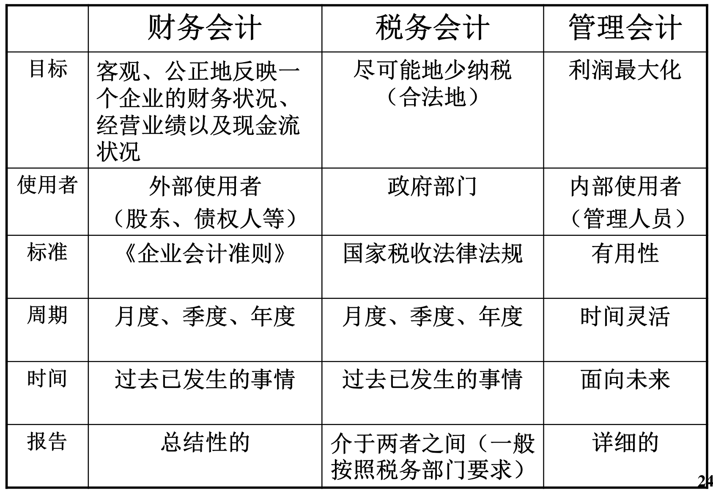  

既然有三类会计信息，是否需要对应记录三套账？  

- 一般记账都是财务会计的账，其他都是以财务会计的数据为基础  

大型企业会计与财务组织结构图  

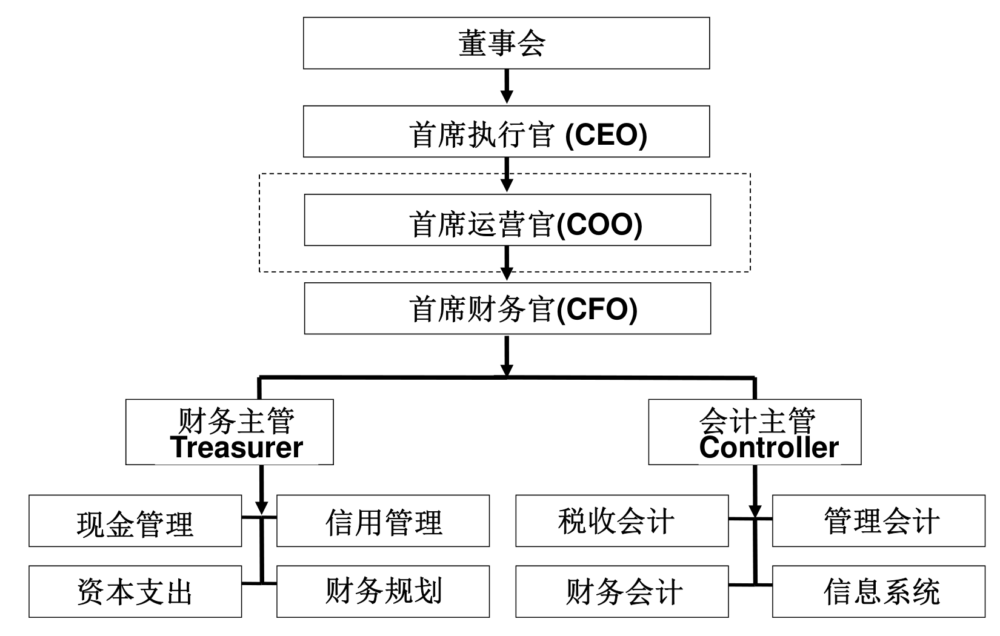  

### 会计与财政的区别  

- 会计：作为单个经济组织的一个管理信息系统，一般只反映该组织的**微观**经济信息，其目的在于提供信息，支持微观经济决策的制定  
- 财政：各级**政府部门**资金收支活动的总称，其目的是完成政府职能，实现政府工作目标，同时调整社会产品和国民收入的分配关系。财政政策也是宏观经济政策的一个组成部分  

### 学习会计作为投资的工具  

- 在一个管理有效的企业中，社会上的稀缺资源（即资本、劳动力、土地、以及其他自然资源）会得到合理利用。资源的有效利用可以为企业、为社会创造出更多的财富  
- 聪明的投资者将其资金投入到盈利良好的企业中，在这个过程中为自己带来巨大的财富  

### 股神：Warren Buffett  

- 1965年5月10日收购一家濒临破产的纺织厂，伯克希尔—哈撒韦公司（Berkshire Hathaway Inc.）  
- 股东权益从1964年2289万美元，增长到2025年6月30日 **6680亿美元**  
- 股票价格从每股7美元上涨到 **750103美元（2025年9月5日）**  

Berkshire’s Performance vs. the S&P 500  

|                       | 伯克希尔每股市场价格变化 | 含股利的标准普尔指数变化 |  
| :-------------------: | :----------------------: | ------------------------ |  
| 1965-2024年年均收益率 |          19.9%           | 10.4%                    |  
|     60年总收益率      |        5,502,284%        | 39,054%                  |  

《董事长致股东的信》都是Buffett自己撰写  

### 2015年巴菲特致股东的信  

- 我们接手伯克希尔的前几十年，公司账面价值与内在价值之间的关联性远比现在要强  

- 今天，我们的重心已经发生重大变化，转向拥有和运营大型商业资产。这其中不少企业的价值要远远超过他们基于成本计算的账面价值。结果就是，伯克希尔公司内在价值与账面价值的差距实质上拉大  

## 会计信息与资本市场  

- 资本市场的最终目的是促进社会资源的有效分配和利用  
- 能真实反映企业业绩的资本市场可以吸引高质量的公司上市；有效的资本市场还可以对上市公司的管理提供监督  
- 准确可靠的会计信息会增强投资者对资本市场的信心，还会使企业的市场价值更紧密地反映企业的经营业绩，从而有更多的资金将流向那些更为高效的企业  

The success of US markets is a direct product of our high quality financial reporting system. This system give investors <u>confidence</u> in the integrity of US capital markets and without investor <u>confidence</u> markets cannot thrive.  
--Arthur Levitt 1996 Former SEC Chairman  

- 在全球化的大环境下，只有能保证高质量会计信息披露的资本市场能够生存  
- 投资者依赖于审计师和市场监管机构来保证 会计信息的准确性  
  - 英美等国家的资本市场和会计信息监管相对有效  
  - 但是2002年前后美国也出现了一连串的丑闻  

It's not the economy anymore, stupid. It is the accounting. -Wall Street Journal, 2002  

# Lecture 2  

## 中国企业会计准则  

- 由财政部（会计司）负责制定《企业会计准则》，规范会计核算与信息披露  
- 1992年11月，制订发布《企业会计准则》（从前沿用苏联体制）  
- 2006年2月，全面修订发布《企业会计准则》  
- 截至目前，现行会计准则包括1项基本准则与42项具体准则，与国际会计准则趋同  
  - 《企业会计准则第1号——存货》  
  - 《企业会计准则第2号——长期股权投资》  

中国证监会的职责呢？负责上市公司的会计信息披露，格式、年报内容的规范  

### 中国会计准则体系  

- 基本准则（本节重点）：指导具体准则的制定，为具体准则尚未规范的会计实务问题提供处理原则  
- 具体准则：规范企业发生的具体交易或事项的会计处理，如：存货准则、收入准则（但是细度仍达不到操作层面）  
- 应用指南：对具体准则相关条款的细化，对有关重点问题提供操作性规定  
- 解释公告：针对企业会计准则实施中遇到的问题作出解释（最新一期在2024年发布）  

### 企业会计基本准则 Conceptual Framework  

- 基本准则是企业会计准则体系的概念基础，是具体准则、应用指南和解释公告等的制定依据  
- 在会计准则体系中的地位与作用可以近似理解为是法律体系中的“宪法”  
- 基本准则第三条：具体准则的制定应当遵循本准则  

## 会计四大基本假设——基本前提  

### 会计主体 Accounting Entity  

- 界定企业会计确认、计量和报告的空间范围，例：巴菲特与Berkshire Hathaway  
- 不同于法律主体，法律主体一般都是会计主体；会计主体不一定都是法律主体，如：基金、分公司  

### 持续经营 Going Concern Concept  

- 在可以预见的未来，企业将会按当前的规模和状态继续经营下去，不会停业，也不会大规模削减业务（未来12个月）  

### 会计分期 Accounting Period Convention  

- 将企业持续经营的生产经营活动划分为一个个连续的、长短相同的期间  
- 分为会计年度（fiscal year, FY）与中期（interim period, **短于**一个完整会计年度的报告期间，含月度、季度、半年度）：Wal-Mart ，J.C. Penny ，January 31 （零售业年底销售旺季）；Microsoft，June 30（很多70年代前成立的公司受从前美国政府财政年度影响，现在美国政府的财政年度为10.1-9.30）；Toyota，March 31（日本、加拿大、中国香港财政年度4.1-3.31）  
- 国内会计法规定1.1-12.31  
- 阿里巴巴（在海外上市的）会计年度？4.1-3.31  
- Apple Inc.的会计年度？比较诡异，九月的最后一个周六，每过五六年都要调整一次  

### 货币计量 Monetary Measure Concept  

- 会计主体在财务会计确认、计量和报告时以货币作为计量尺度，反映会计主体的生产经营活动，便于汇总和比较  
- 局限：无法反映公司战略、研发能力、市场占有率等信息  
- 币值稳定(Stable Monetary Unit Concept)，1980–1986年FASB要求大型上市公司在财务报表附注中披露通货膨胀调整数据  
- 要选择一种记账本位币，由此也引出一种会计：通货膨胀会计（大部分国家和地区都没有，历史上南美国家出现过）  

## 会计要素 Accounting Elements（我国界定的六要素）  

- 资产（Assets）：简单地说就是企业的资源（钱、物、权（土地使用权、收款权等））  
- 负债（Liability）：义务（借的、欠的、该缴的、预收的）  
- 所有者（股东）权益（Owner’s / Shareholders ’ Equity）：所有者（股东）的账面财富  
- 收入（Revenue）：所有者权益的**常规**增加  
- 费用（Expense）：所有者权益的**常规**减少  
- 利润（Income / Profit）：简单地说就是收入减去费用  

### 资产  

- 是指企业过去的交易或者事项形成的、由企业**拥有或者控制**的，预期会给企业带来经济利益的资源  
- 确认条件：  
  - 与该资源有关的经济利益很可能流入企业  
  - 该资源的成本或者价值能够可靠地计量  
- 按照时间长短划分为流动资产与非流动资产  
  - 流动资产（current assets）：可以在一年内或者超过一年的一个营业周期内变现，出售或耗用的资产以及为交易目的而持有的资产  
  - 非流动资产（non-current assets）：流动资产以外的资产  

### 负债  

- 是指过去的交易或事项形成的现时义务，履行该义务预期会导致经济利益流出企业  

- 确认条件：  

  - 与该义务有关的经济利益很可能流出企业  
  - 未来流出经济利益的金额能够可靠地计量  

- 按照时间长短划分为流动负债、非流动负债  

  - 流动负债（current liabilities）：需要在一年内或者超过一年的一个营业周期内偿还的负债以及为交易目的而持有的负债  

  - 非流动负债（non-current liabilities） ：流动负债以外的负债  

### 所有者权益  

- 所有者权益（Owner’s Equity）/ 股东权益（Shareholders ’ Equity）——“剩余价值”企业资产扣除负债后由所有者（股东）享有的<u>剩余权益</u>，也叫净资产（Net Assets）  

会计恒等式：资产=负债+所有者权益  

所有者权益不与指定资产对应  

所有者权益的来源  

- 投资者投入资本（投入资产的价值体现）  
- 生产经营所得——企业的留存收益（Returned Earnings）  
- 特殊交易或事项  

思考：所有者权益有没有可能出现负数？  

可能，只要资产小于负债，即资不抵债。例如，中国东方航空公司2008年底：资产732亿，负债842亿，所有者权益-110亿；累计亏损175亿，当年亏损140亿。当年上半年油价快速上涨，很多航空公司都做了金融衍生业务，对冲价格风险，但下半年价格又急转直下。  

思考：资不抵债的企业一定破产吗？  

企业法人不能清偿到期债务，并且资产不足以清偿全部债务或者明显缺乏清偿能力的，依照本法规定清理债务——《中华人民共和国企业破产法》  

### 收入  

- 是指企业在<u>日常活动</u>中形成的、会导致所有者权益增加的、与所有者投入资本无关的经济利益的总流入（企业会计准则第14号——收入）  
- 按照企业经营业务的主次分类  
  - 主营业务收入：销售商品或提供服务劳务  
  - 其他业务收入：出售材料、出租闲置资产等  
- 主营业务收入加上其他业务收入对应利润表中的营业收入  

### 费用  

- 是指企业在日常活动中发生的、会导致所有者权益减少的、与**向所有者分配利润无关**的经济利益的总流出  
- 费用是创造当期收入时所负担的各方面支出，费用应该与收入相配比（配比性原则 matching principle）例如，9月买了一辆电车，买车的支出不能算作当期费用，应该算作资产的购置  
- 主营业务成本、其他业务成本与主营业务收入、其他业务收入相对应  

费用按照功能分类  

- 营业成本：营业活动直接相关的成本  
- 税金及附加：经营过程中负担的税费支出（不含企业所得税）  
- 销售费用：为销售产品或服务负担的支出  
- 管理费用：为组织和管理生产经营负担的支出  
- 研发费用：研发支出中当期费用化的部分  
- 财务费用：为筹集资金负担的支出  
- 所得税费用：根据税法负担的所得税支出  

### 利润  

- 企业在一定会计期间的经营成果，主要来自于收入减去费用的差额  
- 利润总额：收入减去除所得税费用以外其他费用的差额  
- 净利润（Net Income / profit）：利润总额扣除所得税费用。如果企业实现了净利润，所有者权益将增加；如果企业发生了亏损（即净利润为负数），所有者权益将减少  

以上规定的要素其实并不全面  

### 利得与损失  

- 利得（gain）：除收入与所有者投资之外，由于不重要或偶然业务和其他交易、事件、环境变化所导致的经济利益流入。例如：资产处置收益，政府补贴  
- 损失（loss）：除费用与向所有者分配之外的，由于不重要或偶然业务和其他交易、事件、环境变化所导致的经济利益流出。例如，自然灾害导致资产价值受损，资产处置损失  

会计准则将企业发生的利得与损失分两类处理  

- 计入当期损益，影响净利润（大部分）  
- 不计入当期损益，直接计入所有者权益  

收入-费用（含所得税费用）+计入当期损益的利润-计入当期损益的损失=（净）利润  

## 会计信息质量要求  

- 可靠性（Reliability）：如实反映，信息真实可靠，内容完整，态度中立。技术层面：资产一般按照**历史成本**计价，即按取得或生产某项财产物资时所实际支付的款项计价  
- 相关性（Relevance）：会计信息应有助于决策，以可靠性为基础。技术层面：部分资产按**公允价值**计价。在公允价值计量下，资产和负债按照市场参与者在计量日发生的有序交易中，出售资产所能收到或者转移负债所需支付的价格计量  

如果广泛使用公允价值计价，通常会导致价值虚高  

- 可理解性（Understandability）：信息清晰明了，便于理解和使用  
- 可比性（Comparability）  
  - 横向可比（不同公司）：万科VS保利地产  
  - 纵向可比（不同时期）：万科2022年VS2023年  
- 重要性（Materiality）：应该反映所有重要交易或者事项。重要性的应用需要依赖职业判断，应当根据企业所处环境和实际情况，从项目的性质和金额大小两方面加以判断  

- 实质重于形式（Substance over form）：按照交易或者事项的经济实质进行会计确认、计量和报告，不仅仅以交易或者事项的法律形式为依据。例如：售后回购；售后租回  

- 谨慎性（Conservatism）：在面临不确定性因素的情况下做出职业判断时，应保持应有的谨慎，充分估计到各种风险和损失，不高估资产或者收益，不低估负债或者费用  
- 及时性（Timeliness）：及时收集整理各种原始单据或者凭证，对经济交易或者事项进行确认、计量、报告，不得提前或延后，及时地将编制的财务报告传递给使用者  

## 会计基础 Accounting Basis  

- 权责发生制（accrual basis）：交易或事件的影响在发生时确认——凡是<u>当期实现</u>的收入和<u>发生或应当负担</u>的费用，无论款项是否收付，都作为当期的收入和费用，凡是不属于当期的收入和费用，即使款项已在当期收取或支付，也不应当作为当期的收入和费用  
- 收付实现制（cash basis）：是以收到或支付现金作为确认收入和费用的依据。我国的行政单位以及事业单位非经营性业务目前使用收付实现制——苏联会计  

为了更好地理解，现举出实际例子：  

- 假定2013年7月10日凤凰卫视与联想公司签订协议，协议规定凤凰卫视在８月为联想公司制作一个3分钟的宣传片，并播放90次，由此产生的相关成本能够可靠计量，联想公司将在9月为此支付500万元。凤凰卫视在8月按照规定履行了协议，并于9月10日收到联想公司支付的相关款项。  
- 按照权责发生制，凤凰卫视应该在什么时候确认该笔收入？8月  

- 按照收付实现制，凤凰卫视应该在什么时候确认该笔收入？9月  
- 假定凤凰卫视7、8、9三个月没有其他经济业务，权责发生制下凤凰卫视的第三季度收入是多少？收付实现制下，第三季度收入是多少？都是500万  

权责发生制与收付实现制记账结果产生差异的原因  

- 交易或者事项的发生时间与相关货币收支时间并不完全一致  

- 会计分期  

权责发生制产生了一些特有资产和负债，比如应收账款与应付账款  

## 财务报表概述与复式（借贷）记账法  

### 主要财务报表(Primary Financial Statements)  

主要财务报表可以回答下面问题  

- 公司目前的财务状况怎么样？  
- 公司某个时期的经营成果怎么样？  
- 公司某一时期如何获取和使用现金流？  
- 公司所有者享有的公司账面财富在一段时期内发生了怎样的变化？  

#### 利润表、损益表（Income Statement）  

- 它反映企业在**一定的期间**内（月、季、年度）的经营业绩，即盈利（或亏损）情况，国外也称statement of earnings, statement of profit or loss, statement of operations  
- 格式  
  - 单步式：国外公司使用较多，Exxon Mobil  
  - 多步式：我国公司使用，恒瑞医药  

其他综合收益的税后净额：反映直接计入股东权益的利得与损失  

#### 资产负债表（Balance Sheet）  

对公司在某一时点的财务状况的总结，有时也被称为财务状况表Statement of Financial Position  

- 反映企业在某一特定日期的财务状况。它表明企业在某一特定日期所拥有或控制的经济资源、所承担的现有义务和所有者享有的财富  
- 资产负债表的格式  
  - 账户式（Account Format）  
  - 报告式（Report Format）  

- 账户式资产负债表，万科  
  - 资产记在左边  
  - 负债与所有者权益记在右边  
- 报告式资产负债表，青岛啤酒  
  - 资产记在上面  
  - 负债与所有者权益记在下面  

- 资产负债表要分别列示期初、期末财务状况  
- 资产与负债的列示顺序  
  - 中国与美国，流动性递减，Exxon Mobil  
  - 香港、欧洲，流动性递增，VolksWagen，腾讯  

### 复式记账法  

每一项经济业务都将使得，要么是等式一边零和变化，要么是等式两边同时增减  

进一步刻画交易的影响，要对六要素进一步细分，形成更为具体的账户  

账户(Account)  

- 仅仅使用会计要素来描述经济业务过于笼统  
- 根据实际需要，对会计要素的内容进行再分类，形成了具体的账户。例如：库存现金账户，银行存款账户、原材料账户  

例：  
1、公司的银行账户收到所有者投入的10万元  
2、公司支付5,000元银行存款购入原材料  
3、公司从工商银行借入长期借款8万元  

资产 = 负债 + 所有者权益  

1、银行存款+10万				实收资本+10万  
2、银行存款-5,000，原材料+5,000  
3、银行存款+8万	长期借款+8万  

那么复式记账法如何表示各个账户的增减？  

- T型账：账户名称分为借方、贷方  

借和贷的由来：威尼斯——意大利——英国——日本  

## 全要素拓展会计恒等式  

资产 = 负债 ＋ 所有者权益  

所有者权益 = 资本 ＋ 其他综合收益 ＋ 期末留存收益  

期末留存收益 = 期初留存收益 ＋ 当期净利润  

当期净利润 = 收入－费用 ＋ 计入当期损益的利得 － 计入当期损益的损失  

于是可以得到  

资产＝负债＋资本＋其他综合收益＋期初留存收益＋收入－费用＋计入当期损益的利得－计入当期损益的损失  

我们把右侧的负项挪到左边  

资产 ＋ 费用 ＋计入当期损益的损失 = 负债＋资本＋其他综合收益＋期初留存收益＋收入＋计入当期损益的利得  

在复式记账法下，每一项经济业务将导致扩展会计恒等式两边不同的会计要素同时发生增减，或者等式同侧的不同会计要素有增有减，或者同一会计要素内部的不同项目之间有增有减  

从此以后，只说借贷，不说增减！  

复式记账法的基本原则：每一项业务至少影响两个账户；有借必有贷，借贷必相等  

### T型账的应用  

假定甲公司银行存款账户期初余额为350万元。收到客户为两个月前采购商品支付的货款200万元，为购买原材料支付了120万元。  

350万不是交易，仅仅是账目的原始记录。银行存款借记200，应收账款贷记200；银行存款贷记120，原材料借记120。对于这两笔交易，借贷相等，总体来说不相等的原因是这只是账目的一部分，不全。  

# Lecture 3  

## 账户属性  

企业开设的全部账户分为两类  

- 永久性账户（Permanent Accounts），这类账户期末有余额，并且余额随企业经营活动的延续而递延到下一个会计期间，例如：资产类、负债类、所有者权益类账户  
- 暂时性账户（Temporary Accounts），反映某一期间的经营成果，应归属于特定的会计期间，只要该会计期间结束，这些账户就应该全部结平。到下一个会计期间，由零重新开始，例如：收入类、费用类账户（贷记到“本年利润”账户；这是会计分期假设的结果）  

## 记录业务  

- 分析经济业务后，将其以会计分录（entry）的形式记录在记账凭证上，然后根据记账凭证，登记账簿  
- 会计分录：通过借记和贷记某些账户的形式来反映某项经济业务对企业的影响  
- 会计分录的形式：  
  - 借：库存现金 50000  
  - ​&emsp;&emsp;贷：银行存款 50000  

## 会计凭证  

- 记账凭证  
  由本单位会计部门根据已审核的原始凭证所填制的、载有会计分录并作为登账依据的书面文件  
- 原始凭证（Source Document）  
  发生经济业务时取得的相关单据，例如：购货发票，领料单，支票存根等  

如何利用账户分析、记录经济业务？三步法A three-step process:  

1. 识别账户 Identify which accounts are involved.  
2. 判断增减 For each account, determine if it is increased or decreased.  
3. 确定金额 For each account, determine by how much it will change.  

## 简单分录（A simple journal entry）  

例：A公司支付银行存款5000元购入一批原材料（暂不考虑相关税费），请编制会计分录。  

借：原材料 5000  

&emsp;&emsp;贷：银行存款 5000  

## 复合分录(A compound journal entry)  

例：B公司购入一台设备作为固定资产使用，价值10000元（不考虑相关税费），经协商上述款项先用银行存款支付一半，另一半暂未支付。请编制会计分录。  

借：固定资产 10000  

&emsp;&emsp;贷：银行存款 5000  

&emsp;&emsp;&emsp;&emsp;应付账款 5000  

美国没有记账凭证的概念，而是使用日记账 Journal  

## 现金流量表  

- 这里的现金是一个广义的概念  
- 现金流量表是反映企业一定会计期间现金和  
  现金等价物流入和流出的报表  
- 按照收付实现制原则编制（只有现金流量表使用收付实现制）  
- 现金流量表的重要性很明显：很多企业由于资金周转问题而破产，其中不少企业在破产前还报告了相当不错的利润表和资产负债表  
- 各国会计准则对现金流量表的规定略有不同  
- 现金流量对于企业的重要性就如同血液对于人体  

我国现金流量表中现金和现金等价物包括  

- 库存现金  
- 银行存款（定期存款不属于）  
- 其它货币资金（银行本票存款、银行汇票存款、外埠存款、信用证保证金存款、信用卡存款）  
- 现金等价物，通常指在3个月或更短时间内即到期或即可转换为现金的投资  

现金流量表包括三个部分  

1. 经营活动（operating activities）产生的现金流量：跟企业生产、销售产品和提供服务等活动有关的现金流入和流出，包括购买商品、采购劳务、支付税费、发放工资及收到税费返还等  
2. 投资活动（investing activities）产生的现金流量：企业购建或处置房产、机器、设备，投资于债券或股票所引起的现金流入和流出  
3. 筹资活动（financing activities）产生的现金流量：企业发行股票、债券或者向银行等金融机构借款、还款等行为所引起的现金流入和流出  

经营活动是关注的重点。对于健康成熟的公司而言，经营活动产生的现金流量应该是现金流量的主要来源  

### 经营活动现金流量的计算  

1. 直接法（direct method）：按现金收入和现金支出的主要类别直接反映企业经营活动产生的现金流量  
2. 间接法（indirect method）：以本期净利润为起点，调整不涉及现金的收入、费用以及计入当期损益的利得与损失，剔除净利润中投资活动、筹资活动的影响，计算出经营活动产生的现金流量  

例：2009年7月10日联想公司与凤凰卫视签订协议，协议规定凤凰卫视在8月要播放90次关于联想公司的3分钟宣传片。8月凤凰卫视按照规定履行了协议，9月10日联想公司支付了款项，共计500万元。假定凤凰卫视8月份用银行存款支付了录制联想公司宣传片的员工薪酬300万元，8月没有其他经济业务。  

凤凰卫视8月份经营活动现金流情况  

直接法（direct method）  
经营活动现金流入：0  
经营活动现金流出：300  
经营活动现金净流量：-300  

间接法（indirect method）  
本期净利润：200  
未收到现金的收入：500  
经营活动现金净流量：-300  

投资活动和筹资活动都用直接法  

分配股利、利润或偿付利息支付的现金，这样合到一起写不太好，我们更希望知道各部分是多少  

#### 与资金流入相关的业务与会计分录  

1. 股东投入银行存款设立有限责任公司  
   借：银行存款 XXX  
   	&emsp;&emsp;贷：实收资本 XXX  
2. 企业从金融机构取得长（短）期借款  
   借：银行存款 XXX  
   	&emsp;&emsp;贷：长期借款/短期借款 XXX  
3. 企业发出商品之前预先收到货款  
   借：银行存款 XXX  
   	&emsp;&emsp;贷：合同负债 XXX  
4. 企业现销商品或劳务，取得收入  
   借：银行存款 XXX  
   	&emsp;&emsp;贷：主营业务收入 XXX  
5. 企业收回前期销售形成的应收账款  
   借：银行存款 XXX  
   	&emsp;&emsp;贷：应收账款 XXX  

#### 与资金流出相关的业务与会计分录  

1. 企业分配利润（暂时忽略中间过程）  
   借：利润分配——未分配利润 XXX  
   	&emsp;&emsp;贷：银行存款 XXX  
2. 企业偿还金融机构长（短）期借款  
   借：长期借款/短期借款 XXX  
   	&emsp;&emsp;贷：银行存款 XXX  
3. 企业支付银行存款购置固定资产  
   借：固定资产 XXX  
   	&emsp;&emsp;贷：银行存款 XXX  
4. 发生并支付董事会会议费  
   借：管理费用 XXX  
   	&emsp;&emsp;贷：银行存款 XXX  

90年代北京、上海等十大城市万名青年问卷调查：你最崇拜的人物？  

Bill Gates 史玉柱  

启示：  

- 讲诚信，有责任感——《论语》  
- 永不言弃——持续经营  
- 盈利对企业最重要——实质重于形式  
- 戒骄戒躁，保持低调——谨慎性  
- 现金流关系到企业的生死存亡  

## 所有者权益变动表（Statement of Changes in Equity）  

- 所有者权益变动表：全面反映某一期间企业所有者权益各组成部分增减变化情况的报表，是对资产负债表中所有者权益各个项目期初期末余额变化过程的详细描述  
- 所有者权益总额变化的原因  
  - 投资者增加资本或者减少资本  
  - 某些夹层融资（MEZZANINE FINANCING）  
  - 取得经营收益或者发生经营亏损（净利润）  
  - 一些较为特殊的经济业务  
  - 分配现金股利  
  - 回购股票  

## 财务报表的勾稽关系  

资产负债表、利润表、现金流量表以及所有者权益变动表四张财务报表之间具有的内在逻辑联系与数量对应关系被称为财务报表的勾稽关系  

假定：货币资金中没有使用受限的资金  

## 会计循环（Accounting Cycle）  

1. 分析业务  
2. 记录业务的影响 Record the effects of the transactions  
   中国—记账凭证 ；US－journal  
3. 汇总业务影响 Summarize the effects of transactions.  
   过账 Posting journal entries.  
   编制试算平衡表 Preparing a trial balance.  
4. 准备报告 Prepare reports.  
   编制调整分录 Adjusting entries.  
   准备财务报表 Preparing financial statements.  
   结账 Closing the books.  

股东出资设立公司的会计处理  

此项业务涉及哪些账户？如何记录？  

## 所有者权益（Owner’s Equity）  

公司的所有者权益的报表项目主要包括  

- 实收资本/股本（Paid-in Capital/ Common Stock/Capital Stock）  
- 其他权益工具（Other Equity Instruments）  
- 资本公积（Capital Surplus /Additional Paid-in Capital）  
- 库存股（Treasury Stock）  
- 其他综合收益（Other Comprehensive Income），反映直接计入权益的利得与损失  
- 未分配利润：本身不是一个账户，在“利润分配——未分配利润”  
- 盈余公积  

### 所有者出资  

公司（Corporation）可以分为有限责任公司与股份有限公司  

- 是法律主体（法人）  
- 只负有限责任：出资人以出资额为限  
- 股东持有的公司股份不得抽回但可以转让  

### 股东出资  

第四十八条：股东可以用货币出资，也可以用实物、知识产权、土地使用权、股权、债权等可以用货币估价并可以依法转让的非货币财产作价出资。对作为出资的非货币财产应当评估作价，核实财产，不得高估或者低估作价。法律、行政法规对评估作价有规定的，从其规定。  
——《公司法》  

### 银行存款  

- 银行存款是企业存放在银行或其他金融机构的各种存款，企业设置“银行存款”账户用以核算有关业务  
- 企业要设置“银行存款日记账”，由出纳人员根据记账凭证逐笔登记，每日终  
  了，结出余额（出纳是办理本单位现金收付、银行结算以及保管现金、票据、证券、印章等工作的总称）  
- 企业需定期将银行存款日记账与银行对账单（bank statement）进行核对，对未达账项进行调整，编制银行存款余额调节表（bank reconciliation），银行的账面余额应与企业的银行存款余额相符  
- 银行存款也是审计的重点  

思考：一家国内企业的1亿美元存款如何记录？  

记账本位币（functional currency），选择时要充分考虑收入、支出、融资的主要币种。如果使用人民币记账，按照当天汇率入账。  

记账本位币之外的银行存款按期末汇率调整，例如汇率由7掉到6.5，则出现汇兑损失。  

### 库存现金  

- 指企业库存现金，即企业手头保存的现金，是流动性最强的一种货币性资产，通过“库存现金”账户核算  
- 企业要设置“库存现金日记账”，由出纳人员根据记账凭证逐笔登记，每日终了，库存现金日记账的余额要与库存金额进行核对，做到账实相符，同时月份终了，“库存现金日记账”的余额要与总账余额进行核对，做到账账相符  

库存现金和银行存款的管理规定  

- 不相容岗位相互分离  
  出纳不得兼任稽核，不得登记收入、支出账项，公司不得由一人办理货币资金业务的全过程  

- 建立授权批准制度，明确审批人对货币资金业务的授权批准方式、权限、程序、责任和相关控制措施，规定经办人办理货币资金业务职责范围和工作要求  

思考题：库存现金账户如果出现贷方余额说明什么？  

一定是记账记错了  

库存现金和银行存款的期末披露  

- 期末根据“库存现金”、“银行存款”以及“其他货币资金”账户的期末余额合计数填列在资产负债表中的货币资金项目下  
- 其他货币资金指用于核算企业的银行汇票存款、银行本票存款、信用卡存款、信用证保证金存款、存出投资款等各种其他货币资金  

### 实收资本(Paid-in Capital)  

- 实收资本：是指投资者作为资本投入到公司中的各种资产的价值。所有者向公司投入的资本无需偿还，可以长期使用  
- 实收资本的构成比例通常是确定所有者在所有者权益中所占的份额和参与公司经营管理决策的基础，也是公司分配利润或股利以及清算时分配净资产的主要依据——具有产权意义  
- 有限责任公司设置“实收资本”科目，股份有限公司对股东投入资本设置“股本”（如果划分为股份就是股份有限公司）  

初建有限责任公司的会计处理  
借：银行存款 XX  
	&emsp;&emsp;固定资产 XX  
	&emsp;&emsp;无形资产 XX  
	&emsp;&emsp;长期股权投资 XX  
	&emsp;&emsp;贷：实收资本——某公司/某人 XX  

例：某有限责任公司由甲、乙、丙三位股东各自出资100万元而设立。  

借：银行存款 3,000,000  
	&emsp;&emsp;贷：实收资本——甲 1,000,000  
		&emsp;&emsp;&emsp;&emsp;实收资本——乙 1,000,000  
		&emsp;&emsp;&emsp;&emsp;实收资本——丙 1,000,000  

例：某有限责任公司由甲、乙、丙三位股东各自出资100万元而设立。经过三年的经营，该公司留存收益为200万元。这时又有投资者丁有意加入该企业，丁是否可以同其他股东一样出资100万占该公司股份的25%？  

不行  

例：某有限责任公司由甲、乙、丙三位股东各自出资100万元而设立。经过三年的经营，该公司留存收益为200万元。这时又有丁投资者有意加入该企业，并表示愿意出资180万元而仅占该企业股份的25%  

借：银行存款 1,800,000  
	&emsp;&emsp;贷：实收资本——丁 1,000,000  
		&emsp;&emsp;&emsp;&emsp;**资本公积——资本溢价** 800,000  

### 资本公积(Capital Surplus)  

- 资本公积主要反映企业收到投资者出资额超出其在注册资本或股本中所占份额的部分（通过明细科目“资本溢价” 或“股本溢价” ）  

- 公司设置“资本公积”账户核算相关业务  
- 资本公积的其他明细科目“其他资本公积”也可以反映一些特殊事项，例如控股股东向公司的捐赠、债务减免（从前可以作为损益，但是这样会扭曲损益情况）  

资本公积与实收资本的区别  

- 实收资本一般是投资者投入的、为谋求资本增值与回报的原始投资，属于法定资本，与具体投资人对应  
- 资本公积主要来源于资本溢价部分，一般不谋求投资回报，主要用于转增资本，也可弥补亏损，不与具体投资人对应  

# Lecture 4  

## 股票发行  

第一百四十二条：公司的资本划分为股份。公司的全部股份，根据公司章程的规定择一采用面额股或者**无面额股**。采用面额股的，每一股的金额相等 。 公司可以根据公司章程的规定将已发行的面额股全部转换为无面额股或者将无面额股全部转换为面额股。采用无面额股的，应当将发行股份所得股款的二分之一以上计入注册资本。——《公司法》  

第一百四十八条：面额股股票的发行价格可以按票面金额，也可以超过票面金额，但**不得低于**票面金额。——《公司法》  

## 资本公积（Capital Surplus）  

资本公积——股本溢价  
股份公司委托证券商发行股票而支付的手续费、佣金等，应从溢价发行收入中扣除，将扣除手续费、佣金后的金额计入“资本公积——股本溢价”  

会计处理  
借：银行存款	实际收到金额  
	&emsp;&emsp;贷：股本	发行股数×股票面值（我国很多面值都是1元）  
		&emsp;&emsp;&emsp;&emsp;资本公积——股本溢价	上面两项之差  

例：某股份有限公司委托东方证券公司代理发行普通股2,000,000股，每股面值1元，发行价格1.2元。东方证券公司与该股份公司约定，按发行收入3%收取手续费，并从发行收入中扣除。假定公司收到的认股款已存入银行  

企业收到委托发行单位交来的发行收入200×1.2×（1－3%）＝232.8万元  
应计入“资本公积——股本溢价”科目的金额＝232.8－200=32.8万元  

会计处理  
借：银行存款	2,328,000  
	&emsp;&emsp;贷：股本	2,000,000  
		&emsp;&emsp;&emsp;&emsp;资本公积——股本溢价	328,000  

例：永辉超市2014年8月7日发布临时公告2——本公司现正筹划重大事项，为保证信息披露公平，避免造成公司股价异常波动，维护全体投资者利益，根据《上海证券交易所股票上市规则》规定，经公司申请，公司股票已于2014年8月7日紧急停牌，并自2014年8月8日开市起继续停牌。8月12日复牌并宣布向牛奶有限公司定向增发8.1亿股，筹集57亿元（全部为银行存款）【一般认为这一次增发体现对永辉超市市场地位的认可】  

回顾第一次消息：永辉超市2014年8月7日发布临时公告1——2014年8月6日，公司接到高级管理人员副总裁谢香镇先生通知其因手机不慎操作于2014年8月5日以7.42元/股的价格一次性误买入公司股票27.1万股。因该买入行为处于公司2014年半年报窗口期内，谢香镇先生表示上述误操作所购入股票于6月后至公司2015年半年报前卖出，如有盈利归上市公司所有。  

2015年谢香镇持有的27.1万股股票被出售，取得收益164万，如何进行账务处理？  
不能计入当期损益，否则会乱套。  

借：银行存款	164万  
	贷：资本公积——其他资本公积	164万  

### 股票面值不是1元的情况  

紫金矿业A股将发行 股票面值0.1元为A股首例  

国内最大的矿产金生产企业，按2007年黄金产量排名，在世界主要黄金矿业公司中位居第10位的紫金矿业今日披露A股招股书。招股书显示，公司本次发行不超过15亿股A股，发行后总股本不超过146.41亿股，其中：A股不超过106.36亿股，占总股本的比例不超过72.64%；H股40.05亿股，占总股本的比例不低于27.36%。*比较特殊的是，公司此次即将发行的股票面值为每股0.1元人民币。这在国内A股市场尚属首次，颇为市场关注*——2008年4月7日，上海证券报  

符合“同股同权”的要求  

紫金矿业2008年4月以7.13元/股的价格发行14亿股A股，每股面值0.1元，募集资金净额98.1亿元（总额99.82亿元）。如何编写会计分录？  

借：银行存你看	98.1亿元  
	&emsp;&emsp;贷：股本	1.4亿元  
		&emsp;&emsp;&emsp;&emsp;资本公积——股本溢价	96.7亿元  

国外其实没有面值的限制，例如腾讯：0.00002港币、阿里：0.000025美元。面值其实没有实际意义，只是为了方便。  

目前国内有11家面值不等于1元的国内上市公司，还有三家无面值的：中国移动、中国海油、华虹（？）  

## Common Stock 普通股  

Basic rights inherent in its ownership  

- **The right to vote** in corporate matters such as the election of the board of directors or the undertaking of major actions such as the purchase of another company.  
- **Right to receive dividends** if they are paid.  
- **Rights to ownership** of all corporate assets once obligations to everyone else have been satisfied.  

## Preferred Stock 优先股  

优先于普通股的股东拿股利，也正因此，股利也比较固定。也就具有了一定的债权人的特征，实务操作中通常叫做优先股的股息.  

财产分配也优先给优先股股东分配，再有剩余在普通股股东中间分配  

Preferred Stock  
A class of stock that usually provides dividend and liquidation preferences over common stock.   

Convertible Preferred Stock  
Preferred stock that can be converted to common stock at a specified conversion rate. 为认为公司还有较好发展前景的投资者设立  

国务院关于开展优先股试点的指导意见（2013）  

优先股持有人优先于普通股股东分配公司利润和剩余财产，但参与公司决策管理等权利受到限制  

- 按照约定票面股息率优先于普通股东分配利润  
- 向优先股股东支付现金股息，在完全支付约定的股息之前，不得向普通股股东分配利润  
- 因解散、破产等原因进行清算时，优先支付未派发的股息并分配剩余财产  
- 优先股股东一般不出席股东大会会议（对重要事项没有表决权）  

中国证监会《优先股试点管理办法（2023年修订）》  

当时一开始都是金融机构发售，以补充权益资本  

财政部发布《金融负债与权益工具的区分及相关会计处理规定》（2014年）  

- 优先股可以归类为权益工具，也可以归类为债务工具，具体分类视优先股具体条款而定（例如如果有购买者强制赎回的条款，则视为债务工具；如果赎回权在公司手里，则视为权益工具）  
- 浦发银行2014年11月28日向境内投资者发行金额150亿元的非累积优先股（发行利率6.00%），按扣除发行费用后的金额计人民币149.6亿元计入“其他权益工具”（所有者权益类账户）  

——是由税后收入计入的，和债不同，债是计算净利润之前计入  

实体企业也陆续发布优先股：牧原股份2017年发行优先股：公司于2017年12月26日非公开发行优先股2475.93万股，发行价格100元/股，扣除发行手续费后，实际募集资金净额为2,459,689,826.11元（2022年回购）  

一般来说股价比较高的时候才发售普通股，股价被低估时不发售普通股  

国外利用优先股投资的例子：巴菲特购买高盛优先股  

著名投资家沃伦·巴菲特领导的伯克希尔·哈撒韦公司23日宣布，将以50亿美元购买高盛集团优先股。此举被认为是向高盛投出一张极为重要的信任票  

- 优先股股息率为10%  
- 还获得今后5年内任意时间购入50亿美元高盛普通股的认股权，认购价格为每股115美元  

——《经济参考报》2008年9月25日  

高盛赎回巴菲特所持优先股，股神55亿美元入账——《第一财经日》2011年04月21日  

- 近日，高盛正式从巴菲特旗下公司伯克希尔·哈撒韦手中赎回所有优先股，除股息之外，高盛向巴菲特一次性支付55亿美元  
- 2010年初，高盛已发行利率仅为6％的公司债，也计划发行新股，另外，美联储向银行提供的隔夜拆借也提供了充分的流动性  

## 永续债券（Perpetual Bond）  

永续债券，又称无期债券，发行人在市场发行的无固定期限债券。永续债券的每个付息日，发行人可以自行选择将当期利息以及已经递延的所有利息，推迟至下一个付息日支付，且不受到任何递延支付利息次数的限制  

- 最早历史记录是荷兰水务管理机构于1648年发行的永续债券，至今仍在付息  
- 18世纪，为筹措英法战争所需资金，英国政府发行了没有到期日的债券以缓解财政压力  

例：2017年，紫金矿业发行可续期公司债券，本金5亿元人民币，年利率5.17%，扣除发行费用后，实际募集资金4.9855亿元  

- 基础期限3年，在约定的基础期限末及每个续期的周期末，发行人有权行使续期选择权（延长1个周期）  
- 债券附设发行人延期支付利息权，每个付息日，发行人可自行选择将当期利息以及已经递延的所有利息及其孳息推迟至下一个付息日支付，且不受到任何递延支付利息次数的限制（除非发生强制付息事件）  

原来只有国外有永续债，国内为什么开始搞？2015年12月中央经济工作会议提出降杠杆减负债。当时企业、居民负债率（宏观经济负债率）都在上升。  

但是这种存在什么问题？真正的永续债利率应该偏高，而现实中企业发售的利率确实也比正常的三年期高。大部分发行人在达成一致的情况下实际上还是会赎回的。  

## 库存股  

- 回购股票的会计处理：  
  借：库存股	XX  
  	&emsp;&emsp;贷：银行存款	XX  
- 库存股属于较为特殊的所有者权益类账户记账规则与一般所有者权益账户相反  
- 注销库存股的会计处理：  
  借：股本	XX  
  	&emsp;&emsp;资本公积——股本溢价	XX  
  	&emsp;&emsp;贷：库存股	XX  

## 股票回购  

第一百六十二条：公司不得收购本公司股份。但是，有下列情形之一的除外：  
（一）减少公司注册资本；  
（二）与持有本公司股份的其他公司合并；  
（三）将股份用于员工持股计划或者股权激励；  
（四）股东因对股东会作出的公司合并、分立决议持异议，要求公司收购其股份；  
（五）将股份用于转换公司发行的可转换为股票的公司债券；  
**（六）上市公司为维护公司价值及股东权益所必需。**  
——《公司法》  

当时资本市场情况比较糟糕，很多采用质押的方式获得现金，可能会出现股灾，所以修改《公司法》规定  

例：丽珠医药集团2008年  

公司自2008年12月5日实施回购部分B股方案，截至12月31日，共计回购229.1万股B股，尚未注销，计入库存股（B股面向境外投资者，但时市场交易有限制，最初上海要求只有外国人和外资机构用美元交易，深圳要求用港币交易，这实际上和A股是割裂的。B股一直也比较低迷，后来取消了对外资的限制，但依旧非常冷清，出现公司同时发售A、B股但有价格差异的情况）  

借：库存股	1580万  
	&emsp;&emsp;贷：银行存款	1580万  

如果未完成注销  

借：股本	229.1万  
	&emsp;&emsp;资本公积	1350.9万  
	&emsp;&emsp;贷：库存股	1580万  

2009年新增回购B股802.3万股，共计回购1031.3万股B股，回购方案于12月2日实施完毕，公司按照相关规定，**注销了回购的股份**，总股本变更为29572.2万股  

中国资本市场回购股票并不多见，但美国资本市场更希望通过股票回购的形式回馈股东，如此操作和税有关  

公司出钱到市场上回购股票有什么影响？股价持稳或上涨。原因：增加了股票交易的购买方，增加了需求，总流通的股数（供给不变），这一瞬间会拉动股票价格上升。交易结束后，在市场流通的股数变少，即供给下降，假设需求不变，则股价上涨。  

国内股市上的高送转意味着什么？  

高送转在国内资本市场上指由于使用资本公积、盈余公积转增股本，或者发放股票股利，总股本大幅增加。  

公司的估值不会因高送转而改变，都是所有者权益里的项目  

例：全聚德公司2012年度分配方案中，按1.4亿股（14,156万股）总股本为基数，以资本公积转增股本, 向全体股东每10股转增10股。转增后公司总股本由1.4亿股增加到2.8亿股  

借：资本公积——股本溢价	14,156万  
	&emsp;&emsp;贷：股本	14,156万  

2013年6月3日收盘价34.8元，6月4日开盘价？正常来讲开盘价为一半，实际是17.16元  

高送转：本质上属于股东权益内部结构调整，对公司的盈利活动没有实质影响。“高送转”后，虽然公司股本总数扩大了，但公司的股东权益并不会因此而增加  

在公司净资产与净利润不变的情况下，公司总价值不发生变化，由于股本扩大，股票价格应该相应下降  

## 股票发行与交易市场  

一级市场（Primary Markets）：主要是公司向投资者出售股票，IPO（Initial public offering，首次公开发行）  

只要是A股第一次发行，都是IPO  

借：银行存款	XXX  
	&emsp;&emsp;贷：股本	XXX  
		&emsp;&emsp;资本公积——股本溢价	XXX  

 二级市场（Secondary Markets）：投资者之间相互买卖股票（除发行者主动在二级市场回购）  

例：阿里巴巴IPO共发行3.2亿股美国存托股（ADS），其中1.23亿股是新股，其余1.97亿股则由老股东献售  

正常来说有关大部分是新股，这里比较特殊  

思考题  
A公司股票发行上市后，该公司股票在二级市场交易价格的变化对公司所有者权益有什么影响？  

无影响，二级市场发生的交易不应该影响发行方的所有者权益。会计主体概念的辨析。  

例：中国石油（PetroChina）A股回归  

大背景：90年代末的国有企业。1997年提出国有企业“三年脱困”的目标  

中石油1999年进行股权改制，2000年在纽交所、港交所上市  

国际油价：美国用WDI，欧洲地区用Brent油价，国际油价的上升给中石油带来了巨量的利润。长期坚持以按照国际准则净利润的45%派发股息+特别股利  

2005年在香港市场增发H股  

巴菲特2003年入股中石油，他认为国际油价当时被大幅低估，10美元的国际油价不合理，认为石油公司盈利会上升  

外汇管制  

沪港通、深港通、沪伦通  

2007年，中石油回归A股市场  

净资产收益率：$\dfrac{净利润}{所有者权益}$  

中石油股价有巨大的泡沫  

中石油上市后开始被少数机构投资者操纵了，机构投资者凭借巨大的资金实力拿到很多16.7的股票，上市公开交易后通过挂高价逐步销售手中的股票  

# Lecture 5  

## 购置长期资产的会计处理  

涉及的账户  

- 固定资产  
- 使用权资产  
- 无形资产  
- 商誉  
- 生产性生物资产  
- 油气资产  
- 投资性房地产  
- 长期待摊费用  

## 固定资产  

同时具有以下特征的有形资产  

- 为生产商品、提供劳务、出租（融资租赁、出租的房地产除外）或经营管理而持有使用年限超过一个会计年度  
- 通常金额较大（总需要一个标准）  

房产、厂房及设备 Fixed Assets (Property, Plant, and Equipment or Plant Assets)  

为了出售而持有的资产不算固定资产  

土地是否属于固定资产？  

——与土地制度有关，例如苹果公司就有Land and Buildings这一项。  

## Time Line of Business Issues  

- Evaluate  
- Acquire  
- Estimate and Recognize  
- Monitor  
- Dispose  

财务会计主要关心的方面：  

- 取得（新购建）固定资产会计处理  
- 后续持有使用资产会计处理  
- 固定资产处置会计处理  

## 取得（新购建）固定资产的会计处理  

- 计价基础：按历史成本计价  
- 历史成本是指企业购建某项固定资产**达到可使用状态前**所发生的**一切合理、必要的支出**（包括固定资产购买价款、包装费、安装成本、专项借款利息、外币借款汇兑损益等）  
- 发生了可以抵扣的**增值税（进项税额）**，要单独记录  
- 企业设置“固定资产”账户核算有关业务  

## 增值稅（Value Added Tax）  

- 增值稅起源于法国，是就货物或服务（劳务）的增值额征收的一种稅  
- 纳税义务人：境内销售货物、无形资产、不动产或者提供服务与劳务以及进口货物的单位和个人  

税款是由买方来负担，付的总价里包含了增值税  

- 增值额在生产和流通过程中是一个难以准确计算的数据，实际操作上采用间接计算办法，即税款抵扣办法  
  - 根据销售商品或服务（劳务）的销售额，按规定的税率计算出销项税额  
  - 扣除取得该商品或劳务时所支付的进项税额  
  - 差额就是增值额应交的税额  
- 增值稅是一种价外稅（零售环节除外）  
- 税收负担由商品、服务（劳务）最终消费者承担  

增值税是第一大税种：2024年国内增值税6.6万亿  

- 增值税税率：13%、9%和6%三档税率  
  - 13%：销售、进口货物、提供加工、修理修配劳务、有形动产租赁  
  - 9%：交通运输、邮政、基础电信、建筑、不动产租赁、销售土地使用权、不动产；销售、进口粮食、食用油等农产品；自来水、暖气、天然气、居民用煤等公用事业产品；报纸图书杂志等产品  
  - 6%：增值电信、金融服务、现代服务、生活服务（文化体育、教育医疗、旅游娱乐、餐饮住宿、居民日常服务）、销售土地使用权以外的无形资产  

## 应交税费（Accrued Taxes）  

- 企业根据税法规定与权责发生制原则，应该确认但暂未上缴的税费产生的一种负债（是一种义务——负债）  
- 企业设置“应交税费”会计科目，具体包括应交增值税、应交消费税、应交所得税、应交城市维护建设税、应交教育费附加、应交资源税、应交土地增值税、应交房产税、应交土地使用税、应交车船税、应交印花税、应交耕地占用税等明细科目  

## 取得（新购建）固定资产的会计处理  

### 购入不需安装的固定资产——可以抵扣增值税  

借：固定资产 XX  
	应交税费——应交增值税（进项税额）	金额等于固定资产买价的13%  
	&emsp;&emsp;贷：银行存款 XX  

如果站在卖方的角度呢？  

借：银行存款 XX  
	&emsp;&emsp;贷：主营业务收入 XX  
		&emsp;&emsp;&emsp;&emsp;应交税费——应交增值税（销项税额） XX  

例： 某企业购入一台不需安装的设备，采购价格50,000元，增值稅额6,500元，款项全部付清（无特殊说明情况，增值税认为可以抵扣）  

借：固定资产 50,000  
	&emsp;&emsp;应交税费——应交增值税（进项税额） 6,500  
	&emsp;&emsp;贷：银行存款 56,500  

###  需要安装或自行建造——可以抵扣增值税  

（1）初始购入阶段  

借：在建工程 XX  
	应交税费——应交增值税（进项税额） 金额等于安装设备买价的13%  
	&emsp;&emsp;贷：银行存款 XX  

“在建工程”用于核算固定（无形）资产投入使用之前发生的相关支出。企业为在建工程准备的各种物资，包括工程用材料、尚未安装的设备等在“工程物资”中核算  

（2）安装或建造阶段  
借：在建工程 XX  
	&emsp;&emsp;应交税费——应交增值税（进项税额）××  
	&emsp;&emsp;贷：银行存款（应付职工薪酬） XX  

（3）安装建造结束后  
借：固定资产 XX  
	&emsp;&emsp;贷：在建工程 XX  

## 应付职工薪酬(Accrued Employee Compensation)  

- 是企业对职工个人的一种负债，包括工资、奖金、津贴和补贴、职工福利费、社会保险费、住房公积金、工会经费、职工教育经费、非货币性福利、辞退福利、股份支付等  
- 企业设置“应付职工薪酬”会计科目，核算与职工薪酬有关的经济业务  

例：2020年3月10日，甲公司购入需安装的生产设备一台，取得的增值税专用发票上注明的设备价款为30万元，增值税税额为3.9万元。当日，设备运抵甲公司并开始安装。为安装设备，以银行存款支付安装费，取得的增值税专用发票上注明的安装费为4万元，增值税税额为3,600元。3月28日，该设备经调试达到预定可使用状态。  

- 3月10日购入设备  

借：在建工程 300,000  
	&emsp;&emsp;应交税费——应交增值税（进项税额） 39,000  
	&emsp;&emsp;贷：银行存款 339,000  

- 安装设备  

借：在建工程 40,000  
	&emsp;&emsp;应交税费——应交增值税（进项税额） 3,600  
	&emsp;&emsp;贷：银行存款 43,600  

- 3月28日安装完毕，投入使用  

借：固定资产 340,000  
	&emsp;&emsp;贷：在建工程 340,000  

用于集体福利或个人消费的固定资产（不能投入使用）——增值税不能抵扣  

借：固定资产/在建工程 XX  
	&emsp;&emsp;贷：银行存款 XX  

如果支付的增值税不能抵扣，应计入相关资产成本  

## 一揽子采购（ Basket Purchase）  

收购生产线？  

- 以一笔款项购入多项没有单独标价的固定资产  
- 按照各项固定资产公允价值比例对总成本进行分配，分别确定各项固定资产的成本 （ Relative Fair Market Value Method）  

例：2021年4月21日，甲公司向乙公司一次购入3套不同型号且具有不同生产能力的设备A、B和C。甲公司使用银行存款支付价款500万元，增值税税额65万元；支付装卸费2万元，增值税税额1200元。假定A、B、C设备均满足固定资产确认条件，其公允价值分别为156万、234万、130万。不考虑其他相关税费。  

固定资产的采购成本为：  
500+2=502  

A、B、C应分配的比例及采购成本为：  
156/(156+234+130)=30%	502\*30%=1,506,000  
254/(156+234+130)=45%	502\*45%=2,259,000  
130/(156+234+130)=25%	502\*25%=1,255,000  

会计分录：  
借：固定资产——A设备	1,506,000  
	&emsp;&emsp;固定资产——B设备	2,259,000  
	&emsp;&emsp;固定资产——C设备	1,255,000  
	&emsp;&emsp;应交税费——应交增值税（进项税额）	651,200  
	&emsp;&emsp;贷：银行存款	5,671,200  

固定资产后续使用过程中，需要如何核算？  

## 折旧（Depreciation）  

折旧：在固定资产使用寿命内，按照一定的方法将固定资产的购置成本系统地分摊到产品成本或当期费用的过程  

折旧费用是一种费用。但与一般费用不同，这种费用发生期间并没有实际付出货币资金而是在购建固定资产时支出了货币  

### 术语：  

- 使用寿命（Useful Life）  
  预计资产可使用的时间或生产产品、提供劳务的数量  
- 残值（Salvage Value or Residual Value）  
  预计固定资产在使用寿命期末处置时可以收到的金额（实际操作中估计比较麻烦，现实当中对固定资产进行分类，给出不同的残值率）  
- 应计折旧额（Depreciable Value）  
  以折旧形式分摊到使用期的那部分购置成本，等于固定资产初始成本减去残值  

累计折旧：是固定资产的备抵账户（ContraAccount），记录已经提取的折旧总额  

- 累计体现了资产从开始使用到目前为止的累积状况，全新的固定资产累计折旧为0，使用时间越长的固定资产累计折旧金额越大，因此可以反映固定资产的损耗情况  
- 可以被看作是一种负资产，因此其借贷记账规则正好与资产相反  
  - 累计折旧增加，要贷记  
  - 累计折旧减少，要借记  

### 折旧规定（Rule of Depreciation）  

中国准则：  

- 固定资产应当按月计提折旧，并根据用途计入相关资产的成本或者当期损益  
- 当月增加的固定资产，当月不计提折旧，从下月起计提折旧；当月减少的固定资产，当月照提折旧，从下月起不提折旧  
- 固定资产提足折旧后，不管能否继续使用，均不再提取折旧；提前报废的固定资产，也不再补提折旧  

US. GAAP:  
All assets placed in or taken out of service during <u>the first half of a month</u> are treated as if the event occurred on the first day of that month. That is, these businesses compute depreciation on the added assets for the entire month. Likewise, all fixed addition and deductions during <u>the second half of a month</u> are treated as if the event occurred on the first day of the next month  

### 计提折旧的会计处理  

根据固定资产的不同用途  
借：主营业务成本（服务型企业运营过程中使用的固定资产，如航空公司的飞机）？  
	&emsp;&emsp;其他业务成本（闲置不用对外出租的固定资产）？  
	&emsp;&emsp;制造费用（生产车间固定资产）？  
	&emsp;&emsp;销售费用（销售部门固定资产）？  
	&emsp;&emsp;管理费用（管理部门固定资产）？  
	&emsp;&emsp;贷：累计折旧 ？  

### 主营业务成本与其他业务成本  

- “主营业务成本”科目核算企业销售商品时商品的采购或制造成本以及提供服务、劳务时营业活动应负担的相关成本  
- “其他业务成本”科目核算企业确认的其他经营活动所发生的支出，包括制造型企业销售原材料的成本、出租固定资产的折旧额、出租无形资产的摊销额、出租包装物的成本或摊销额等  

主营业务成本与其他业务成本在利润表中“营业成本”对外披露  

### 制造费用（Manufacturing Overhead）  

- 制造费用：所有与制造过程有关，但是不能作为直接材料、直接人工的支出。制造费用是产品生产成本的一部分，最终要计入产品成本  
- 企业设置“制造费用”科目核算有关业务  

制造费用在财务报表哪里体现？——  

### 管理费用（Administrative Expense）  

- 管理费用：是指企业行政管理部门为组织和管理生产经营活动所发生的各种必要支出。管理费用一般不具体由经营活动或产品负担  
- 企业设置“管理费用”科目核算有关业务  

- 管理费用：主要包括管理人员薪酬、折旧（摊销）费用、办公设施修理费、中介服务费、办公费、开办费、租赁费、工会经费、董事会费、诉讼费、业务招待费等  

### 销售费用（Selling Expense）  

- 销售费用：是指企业产品在销售环节发生的各项费用，其目的是为了促进、扩大产品的销售，占领市场，最终提高产品的市场竞争能力  
- 企业设置“销售费用”科目核算有关业务  
- 销售费用：主要包括保险费、包装费、展览费和广告费、商品维修费、预计产品质量保证损失、运输费、装卸费等，以及为销售商品而专设的销售机构（含销售网点、售后服务网点等）的职工薪酬、业务费、折旧费等  

### 折旧方法  

- 年限平均法（旧准则及国外：直线法）(Straight-Line Depreciation)  
- 工作量法(Units-of-Production Depreciation)  
- 双倍余额递减法(Double-Declining-Balance Depreciation)  
- 年数总和法(Sum-of-Years’ Digits Depreciation）  
- 后两种方法也被称为加速折旧(Accelerated Depreciation)  

#### 年限平均法（Straight-Line Depreciation）  

$$  
年折旧费用=\dfrac{成本-残值}{预计使用寿命(年)}  
$$  

$$  
月折旧费用=\dfrac{年折旧费用}{12}  
$$  

例：某农场2008年12月购入一辆叉车，初始入账成本为40万元，使用年限为5年，可以行驶36万公里，预计残值为4万元  

年折旧费用=72000元，月折旧费用=6000元  

年限平均法（Straight-Line Depreciation）  
$$  
年折旧率=\dfrac{1-残值率}{预计使用寿命(年)}  
$$  

$$  
月折旧率=\dfrac{年折旧率}{12}  
$$  

多家钢铁企业延长折旧年限  

- 鞍钢股份从2011年10月1日起调整固定资产折旧年限，房屋、建筑物年限由20年调整为30年，机器设备年限由10年调整为15年，第四季度减少折旧费用4.9亿元，增加净利润3.7亿元  
- 武钢股份从2012年4月1日起将房屋建筑物及机器设备类固定资产折旧年限延长3年，当年减少折旧费用5.9亿元，增加净利润4.5亿元  
- 新钢、柳钢、马钢、南钢股份等也先后作出类似调整，增加公司利润  
- （之前已经缩短）宝钢股份从2003年1月1日起，对运输类固定资产的折旧年限和折旧率进行调整，变更前折旧年限为6～10年，年折旧率9.6%～16%，变更后除大型运输设备折旧年限为10年外，运输类设备使用年限为5年，年折旧率9.6% ～ 19.2%  

#### 工作量法(Units-of-Production Depreciation)  

$$  
单位工作量折旧费用=\dfrac{成本-残值}{预计使用寿命(工作量)}  
$$  

$$  
月折旧费用=单位工作量折旧费用\times月工作量  
$$  

例：某农场2008年12月购入一辆叉车，初始入账成本为40万元，使用年限为5年，可以行驶36万公里，预计残值为4万元。假定某月行驶5000公里。  

单位工作量折旧费用 =1元/公里，月折旧费用=1×5000=5000元  

航空公司对飞机发动机按飞行小时数以工作量法计提折旧  

双倍余额递减法(Double-Declining-Balance Depreciation)  
$$  
年折旧费用=固定资产年初账面价值\times\dfrac{2}{预计使用寿命(年)}  
$$  

$$  
月折旧费用=\dfrac{年折旧费用}{12}  
$$  

#### 账面余额与账面价值  

- 账面余额（Balance of Account）  
  - 指某账户的账面实际余额，不扣除该账户备抵账户金额  
- 账面价值（Book Value/net book value/carrying amount）  
  - 指某账户账面余额减去该账户备抵项目（例如：累计折旧、固定资产减值准备等）后的金额  

使用双倍余额递减法必须注意  

- 应当在固定资产折旧年限到期前两年内，将固定资产净值扣除残值后的余额平均摊销，即最后两年改为年限平均折旧法，确保使用寿命结束时固定资产账面价值等于预计残值  
- 不能使固定资产的账面价值降低到它的预计残值以下  

例：某设备初始购置成本为100万，使用寿命为4年，预计残值30万元，采用双倍余额递减法计提折旧  

第一年折旧费=100 ×（2/4）=50万  
第二年折旧费  
（100 – 50）×（2/4）=25万  
100 – 50 – 25 = 25万（低于预计残值）  
第二年折旧费=100 – 50 – 30 =20万  

例：某农场2008年12月购入一辆叉车，初始入账成本为40万元，使用年限为5年，可以行驶36万公里，预计残值为4万元  

双倍余额递减法：  
2009年折旧费用= 40×2/5=16万元  
2010年折旧费用=(40 – 16) ×2/5=9.6万元  
2011年折旧费用=(40 – 16 –9.6)×2/5=5.76万元  
2012/13年折旧费用=(40–16–9.6–5.76–4)/2=2.32万元  

#### 年数总和法(Sum-of-Years’ Digits Depreciation)  

$$  
年折旧费用=(成本-残值)\times\dfrac{剩余使用年限(年初时点)}{预计使用寿命的加总(年)}  
$$  

$$  
月折旧费用=\dfrac{年折旧费用}{12}  
$$  

例：某农场2008年12月购入一辆叉车，初始入账成本为40万元，使用年限为5年，可以行驶36万公里，预计残值为4万元  

年数总和法：  
2009年折旧费用= (40 – 4) ×5/(1+2+3+4+5)=12万元  
2010年折旧费用= (40 – 4) ×4/(1+2+3+4+5)=9.6万元  
2012年折旧费用= (40 – 4) ×3/(1+2+3+4+5)=7.2万元  
2013年折旧费用= (40 – 4) ×2/(1+2+3+4+5)=4.8万元  
2014年折旧费用= (40 – 4) ×1/(1+2+3+4+5)=2.4万元  

### 折旧规定（Rule of Depreciation）  

- 按固定资产使用年度计算的全年折旧金额要平均记到12个月份之中，这12个月份可能存在跨年度的情况，因此固定资产的记账年度与会计年度可能会存在不一致的情况。如果使用加速折旧法，同一会计年度中各个月份的折旧金额很可能不相等  

假定A公司3月份购买投入使用一项固定资产，记账年度为4月至第二年3月  

- 财务会计（both in China and in US）  
  - 企业应当根据与固定资产有关的经济利益的预期实现方式，合理选择固定资产折旧方法  
- 税务会计  
  - 中国，所得税法中以年限平均法为主  
  - US. 可以任意选择折旧方法，多数企业采用加速折旧法，例如：MACRS (Modified Accelerated Cost Recovery System)  

《企业所得税法实施条例》（2013）第六十条  

除国务院财政、税务主管部门另有规定外，固定资产计算折旧的最低年限如下  

- 房屋、建筑物，为20年  
- 飞机、火车、轮船、机器、机械和其他生产设备，为10年  
- 与生产经营活动有关的器具、工具、家具等，为5年  
- 飞机、火车、轮船以外的运输工具，为4年  
- 电子设备，为3年  

近些年也做出调整  

- 财税【2014】75号：财政部 、国家税务总局关于完善固定资产加速折旧企业所得税政策的通知（2014年10月20日）  
  - 生物药品制造业，专用设备制造业，铁路、船舶、航空航天和其他运输设备制造业，计算机、通信和其他电子设备制造业，仪器仪表制造业，信息传输、软件和信息技术服务业等6个行业的企业2014年1月1日后新购进的固定资产，可缩短折旧年限（60%）或采取加速折旧的方法  
- 2015年10月，国总发布《关于进一步完善固定资产加速折旧企业所得税政策有关问题的公告》（2015年第68号），将固定资产加速折旧优惠扩大到轻工、纺织、机械、汽车四个领域重点行业  

我国会计准则规定  

- 企业至少应当于每年年度终了，对固定资产的使用寿命和预计残值进行复核。如果使用寿命、预计残值的预期数与原先估计数出现差异，应当相应调整  
- 对于会计估计变更，采用“未来适用法”  
- 企业至少应当于每年年度终了，对固定资产的折旧方法进行复核。如果与固定资产有关的经济利益预期实现方式有重大改变的，应当相应改变固定资产的折旧方法，并按照会计估计变更的有关规定进行处理  

### 收益性支出与资本性支出(Revenue Expenditures VS. Capital Expenditures)  

- 固定资产后续支出，是指固定资产在使用过程中发生的更新改造支出、修理费用等  
- 后续支出的处理方法  
  - 资本化的后续支出  
  - 费用化的后续支出  

资本化的后续支出  

- 主要适用于固定资产的更新改造。这类改造通常可以大大增加未来流入企业的经济利益。例如，固定资产的改良支出、技术改造  

- 资本化期间，固定资产及相关累计折旧金额要结转至“在建工程”账户  

借：在建工程  
	&emsp;&emsp;累计折旧  
	&emsp;&emsp;贷：固定资产  

费用化的后续支出（Repairs, Maintenance）  

- 一般情况下，固定资产投入使用后，由于磨损可能会导致固定资产的局部损坏，为了维护固定资产的正常运转和使用，充分发挥其使用效能，企业会对固定资产进行必要的维护。这类日常维护支出，应该被费用化，计入当期费用。例如，固定资产修理费用  

WorldCom  

WorldCom Inc.'s audit committee uncovered what could be one of the largest accounting frauds in history, with the discovery of $3.8 billion in expenses improperly booked as capital expenditures  

“Certain transfers from line cost expenses to capital accounts" weren't made according to generally accepted accounting principles.  

### 固定资产计提减值准备  

企业应当在资产负债表日判断固定资产是否存在可能发生减值的迹象，如果固定资产可收回金额低于其账面价值，应计提固定资产减值准备  

会计处理  

借：资产减值损失 XX（非正常原因流出，所以计入损失）  
&emsp;&emsp;贷：固定资产减值准备 XX  

计提可以，但是后续不允许冲回  

欧洲：revaluation model 重估价值模式，允许重新评估价值，可以调回；中、美不允许  

#### 资产减值损失  

- 属于损失类账户，表示因资产的账面价值高于其可收回金额而造成的损失  
- 该账户直接与利润表中的资产减值损失项目相对应，影响当期损益  
- 记账规则与费用类账户一致  
  - 借记表示损失增加  
  - 贷记表示损失减少  

#### 固定资产计提减值准备  

- 固定资产减值准备 ，也可以被看作是一种负资产，因此其借贷记账规则正好与资产相反  
- 固定资产减值准备增加，要贷记  
- 固定资产减值准备减少，要借记  
- 固定资产账户的借方余额减去累计折旧和固定资产减值准备的贷方余额表示企业固定资产的真实价值（账面价值）  

资产减值损失确认后，减值资产的折旧或者摊销费用应当在未来期间作相应调整，以使该资产在剩余使用寿命内，系统地分摊调整后的资产账面价值（扣除预计净残值）  

例：A公司购入一台设备，该设备入账价值61万，预计净残值1万，预计使用寿命6年，采用年限平均法计提折旧，第一年应计提折旧10万元。假设第一年年末该设备由于技术老化，发生减值，贬值10万元  

第二年应该计提折旧的金额＝【61（初始成本）－10（第一年折旧）－10（减值）－1（残值）】÷5年＝8万元  

中国国航第三届董事会第二十二次会议决议 （ 2012 年 3 月 12 日 ）——39架飞机计提减值超16.9亿  

- 3月12日中国国航召开董事会，同意就意向出售飞机及相关资产计提减值准备16.89亿元。  
- 公司聘请了专业第三方评估师对33架有意出售飞机、备发及相关资产的可收回金额进行再次评估，对可收回金额低于账面价值的部分计提减值准备，减值准备金额共计13.73亿元  
- 控股子公司中国货运也对6架意向出售的B747-400F飞机及相关资产进行了减值测试，根据第三方评估机构出具的评估报告，  
  计提减值准备3.16亿元  

当时2011年年报还未对外披露，所以公司把这一影响计到了2011年，为的是控制利润不太高，最终要达到Income Smoothing  

# Lecture 6  

## 固定资产的处置（Disposal of Fixed Assets）  

企业出售、报废固定资产的会计处理通过“固定资产清理”科目进行核算  

结转固定资产账面价值  
借：固定资产清理 XX  
	&emsp;&emsp;累计折旧 XX  
	&emsp;&emsp;固定资产减值准备 XX  
	&emsp;&emsp;贷：固定资产 XX  

清理过程中发生的清理费用  
借：固定资产清理 XX  
	&emsp;&emsp;贷：银行存款 XX  

取得出售收入和残料，需交纳的增值税要单独确认  
借：银行存款 XX  
	&emsp;&emsp;原材料 XX  
	&emsp;&emsp;贷：固定资产清理 XX  
		&emsp;&emsp;&emsp;&emsp;应交税费——应交增值税（销项税额） XX  

保险赔偿的处理  
确定由保险公司或过失人赔偿的损失后  
借：银行存款 XX  
	&emsp;&emsp;其他应收款 XX （如果不是收到银行存款，也可能是这种情况）  
	&emsp;&emsp;贷：固定资产清理 XX  

借方加总是清理成本、贷方加总是清理收入  

### 清理净损益的会计处理：  

因丧失使用功能或因自然灾害发生毁损等原因而报废清理产生的利得或损失计入营业外收支  
取得净收益  
借：固定资产清理 XX  
	&emsp;&emsp;贷：营业外收入 XX  

发生净损失  
借：营业外支出——处置非流动资产损失 XX（正常报废）  
			    &emsp;&emsp;&emsp;&emsp;&emsp;&emsp;&emsp;——非常损失 XX（自然灾害）  
	&emsp;&emsp;贷：固定资产清理 XX  

也有可能清理工作时间比较长，期末清理还没完成，这时可能会存在借方或者贷方余额  

### 营业外收入与营业外支出  

- 营业外收入：核算企业发生的与其生产经营无直接关系的利得。包括处置固定资产利得、没收包装物押金收入、罚款收入处置利得、非货币性资产交换利得、债务重组利得、与日常活动无关的政府补助等  
- 营业外支出：核算企业发生的与其生产经营无直接关系的损失，包括非货币性资产交换损失、债务重组损失、对外捐赠、非常损失、盘亏损失、违约金支出等  

因出售、转让等原因产生的固定资产处置利得或损失应计入资产处置损益（没有丧失功能时做出的出售或转让）  

取得净收益  
借：固定资产清理 XX  
	&emsp;&emsp;贷：资产处置损益 XX  
（Gain or loss on disposal of assets）既可以表示损失，也可以表示收益，收入的增加贷记  

发生净损失  
借：资产处置损益 XX  
	&emsp;&emsp;贷：固定资产清理 XX  

### 资产处置损益  

- 反映企业处置固定资产、在建工程、生产性生物资产、无形资产及出售划分为持有待售的非流动资产或处置组而产生的处置利得或损失  
- 属于损益类账户，既可以表示利得，也可以表示损失。发生损益时，贷记表示利得，借记表示损失  

例：甲公司有一台设备，在使用期满之前进行转让清理。该设备原价186,700元，累计已计提折旧172,200元，已计提减值准备2,500元。在清理过程中，以银行存款支付清理费用5,000元，出售设备取得（含税）收入8,240元，已收到银行存款  

税收优惠：销售使用过的固定资产，实行简易办法缴纳增值税，可依照3%的征收率减按2%  

甲公司会计处理  

将固定资产账面价值转入清理  
借：固定资产清理 12,000  
	&emsp;&emsp;累计折旧 172,200  
	&emsp;&emsp;固定资产减值准备 2,500  
	&emsp;&emsp;贷：固定资产 186,700  

发生清理费用  
借：固定资产清理 5,000  
	&emsp;&emsp;贷：银行存款 5,000  

收到设备清理收入  
借：银行存款 8,240  
	&emsp;&emsp;贷：固定资产清理 8,080  
		&emsp;&emsp;&emsp;&emsp;应交税费——未交增值税 8240*2%/(1+3%)=160  
（这里不能抵扣税费，所以不计入应交增值税；真正到交费的时候就是按应交税费——未交增值税这个账户的结果）  

结转固定资产净损益  
借：资产处置损益 8,920  
	&emsp;&emsp;贷：固定资产清理 8,920  

一个管理会计师需要考虑的问题  

- 清理成本：（12000 + 5000）元  
- 清理收入：8080元  
- 是否应该清理该项设备？  

从边际角度看，应该处理，边际收益>边际成本；或者找不到更好的报价了；或者这个确实没用了，账面上多少都没用了  

- 核心：最大限度挖掘设备的潜在价值  
- 如果企业不再需要使用该项固定资产，账面上的12000元资产价值是否需要考虑？  
- 沉没成本（Sunk Cost），指不能以任何方式加以改变的成本  
- 沉没成本对于管理决策而言是不相关成本，不应作为考虑因素  
- 站在哪个角度？代理成本（管理人员可能没有动力处置资产）  

出租固定资产的会计处理（主业不是租赁）  

借：银行存款 XX  
	&emsp;&emsp;贷：其他业务收入 XX  

借：其他业务成本 XX  
	&emsp;&emsp;贷：累计折旧 XX  

其他业务收入与其他业务成本：核算企业确认的除主营业务活动以外的其他经营活动实现的收入与发生的成本，包括出租固定资产、出租无形资产、出租包装物和商品、销售材料等  

### 期末固定资产的披露  

- 在期末资产负债表中，资产——非流动资产——固定资产  
- 披露的金额：应当根据“固定资产”账户的期末余额减去“累计折旧”、“固定资产减值准备”备抵科目余额后的净值（账面价值），再加上“固定资产清理”账户借方余额填列  

考虑在建工程  

- 报表上面表现的也是账面价值  
- 在建工程项目披露的金额：应当根据“在建工程”账户的期末余额减去“在建工程减值准备”备抵科目余额后的净值（账面价值），再加上“工程物资”账面价值填列  

例：UT斯达康  

根据UT斯达康公告，公司已签署最终协议，将旗下杭州的设施以9.5亿元(约合1.4亿美元)出售给中南集团。包括占地260万平方英尺的生产基地、研发和管理业务部以及与地产有关的其他资产，UT斯达康将获得税后所得9亿元。出售后，UT斯达康将回租部分场地以维持当前业务。在2004年建成的UT斯达康杭州研发中心是我国单一建筑最大的科研生产基地之一 ，也是杭州当地一景，曾被称为“亚洲第一单体建筑”，其时总投资为8亿元左右——第一财经日报，2009年12月23日  

当时增值率杭州房价涨幅非常大（统计局数据145%左右），但是为什么UT斯达康只以18.75%增值率卖出？  

- 工业用地  
- 面积大，不容易找到买家，总建筑面积24万平方米  
- 资产专用性强（Asset Specificity）  
- 急于变现  

当天估计如何反应？——股价大涨12%  

对租赁准则的修订：不再区分经营性和融资性租赁，“使用权”  

使用权资产  

- 承租人可在租赁期内使用租赁资产的权利  
- 企业发生租赁业务后，按照《企业会计准则第21号——租赁（修订版）》核算形成的资产  
- 租赁负债：负债类账户（非流动负债），在租赁期开始日按照尚未支付的租赁付款额的现值对租赁负债进行初始计量  
- 使用权资产在租赁资产剩余使用寿命内计提折旧，期末对已识别的减值损失进行会计处理  

## 无形资产（Intangible Assets）  

- 是指企业拥有或者控制的没有实物形态的可辨认的非货币性长期资产  
- 特征  
  - 长期持有long-lived  
  - 持有的目的是使用而不是出售 not held for resale  
  - 没有实物形态 have no physical substance  
  - 通常可以为企业带来竞争优势 usually provide owner with competitive advantage over other firms  

例如，软件、专利技术、商标（可辨认——脱离企业可以单独存在）  

### 常见无形资产种类  

- 土地使用权（land use right）（非租赁得到的，直接从政府取得）  
- 特许经营权（franchise/license）  
  - 收费权（charging right）  
  - 采矿权（right of mining）  
  - 水面养殖权（use right of waters for aquaculture ）  
- 专利权（patent）  
- 商标权（trade mark）  
- 非专利技术（know-how）  
- 计算机软件（software）  
- 版权、著作权（copyright）  

特许经营权可以来自企业、政府  

- Franchise（企业）  
  An entity that has been licensed to sell the product of a manufacturer or to offer a particular service in a given area.  
  KFC, McDonald's  
- License（政府）  
  The right to perform certain activities, generally granted by a government agency.  
  5G牌照，澳门赌场牌照  

无形资产同时满足下列条件的，才能予以确认  

- 与该无形资产有关的经济利益很可能流入企业  
- 该无形资产的成本能够可靠地计量  

花钱做广告？不能作为无形资产，全部费用化。收益情况、时间、多少无法确定  

无形资产应当按照成本进行初始确认：购入无形资产的成本，包括购买价款、相关税费（可以抵扣的增值税进项税额除外）以及直接归属于使该项资产达到预定用途所发生的其它支出  

### 研究与开发支出的会计处理  

企业自行开发无形资产发生的研发支出，无论是否满足资本化条件，均应先在“研发支出”科目中归集。期末，对于不符合资本化条件的研发支出，转入当期的研发费用；符合资本化条件但尚未完成的开发费用，继续保留在“研发支出”科目中，待开发项目完成时，再将其发生的实际成本转入“无形资产”  

研发支出属于资产类账户，资本化的部分类似于在建工程  

企业内部研究开发项目的支出，应当区分研究阶段支出与开发阶段支出  

- 研究是指为获取并理解新的科学或技术知识而进行的独创性的有计划调查，研究阶段是探索性的，具有较大的不确定性  
  - 研究阶段的支出，发生时记入“研发支出”账户，期末由“研发支出”账户转入“研发费用”  

- 开发是指在进行商业性生产或使用前，将研究成果或其他知识应用于某项计划或设计，以生产出新的或具有实质性改进的材料、装置、产品等  
  - 开发阶段的支出，发生时记入“研发支出”账户。如果符合资本化条件，等研发工作完成后可以确认为无形资产，不符合条件的支出期末由“研发支出”账户转入“研发费用”  

#### 开发阶段支出资本化的条件  

- 完成该无形资产以使其能够使用或出售在技术上具有可行性；  
- 具有完成该无形资产并使用或出售的意图；  
- 运用该无形资产生产的产品存在市场或无形资产自身存在市场；  
- 有足够的技术、财务资源和其他资源支持，以完成该无形资产的开发，并有能力使用或出售该无形资产；  
- 归属于该无形资产开发阶段的支出能够可靠地计量  

无法区分研究阶段和开发阶段的支出：当期费用化，发生时记入“研发支出”，期末转入“研发费用”  

国内会计准则关于研发支出的会计处理原则与国际会计准则保持一致  

但是美国的不太一样，强调技术可行性technological feasibility  

例：2017年1月1日，甲公司的董事会批准研发某项新型技术，该公司董事会认为，研发该项目具有可靠的技术和财务等资源的支持，并且一旦研发成功将降低该公司的生产成本。该公司在研究开发过程中一共支付银行存款50万元，其中符合资本化条件的支出为10万元。2017年12月31日，该项新型技术已经达到预定用途  

甲公司的会计处理  
发生研发支出  
借：研发支出——费用化支出 40万  
			&emsp;&emsp;&emsp;&emsp;&emsp;&emsp;——资本化支出 10万  
	&emsp;&emsp;贷：银行存款 50万  

2017年12月31日  
借：研发费用 40万  
	&emsp;&emsp;无形资产 10万  
	&emsp;&emsp;贷：研发支出——费用化支出 40万  
				&emsp;&emsp;&emsp;&emsp;&emsp;&emsp;&emsp;&emsp;——资本化支出 10万  

研发费用税务会计加计扣除规定（2023年1月1日起）（鼓励企业加大研发投入）  

- 适用主体：烟草制造业、住宿和餐饮业、批发与零售业、房地产业、租赁和商务服务业、娱乐业除外  
- 扣除标准：未形成无形资产计入当期损益的，在按规定据实扣除的基础上，再按照实际发生额的100%在税前加计扣除；形成无形资产的，按照无形资产成本的200%在税前摊销  
- 扣除范围：人员人工费用、直接投入费用、折旧费用、无形资产摊销费用以及其他相关费用  

企业为员工支付的开支如何核算？  

曼联俱乐部有无形资产 Intangible assets—players' registrations  
无形资产——球员注册费  
The costs associated with the acquisition of players‘ registrations are capitalized as intangible assets at the fair value of the consideration payable, including an estimate of the fair value of any contingent consideration. Subsequent reassessments of the amount of contingent consideration payable are also included in the cost of the player’s registration. Costs associated with the acquisition of players‘ registrations include transfer fees（转会费）, Premier League levy fees（英超联赛费）, agents’ fees （经纪人费用）and other directly attributable costs. These costs are amortized over the period covered by the player's contract.  

## 无形资产摊销(Amortization of Intangible Assets)  

- 使用寿命有限的无形资产，其应摊销金额应当在使用寿命内系统合理摊销  
- 使用寿命不确定的无形资产不应摊销  
- 无法预见无形资产为企业带来经济利益期限的，应当视为使用寿命不确定的无形资产  

应摊销金额：指无形资产的初始入账成本扣除残值后的金额。已计提减值准备的无形资产，还应扣除无形资产减值准备累计金额  

残值：使用寿命有限的无形资产，其残值一般视为零  

- 企业摊销无形资产应当自无形资产可供使用时起，至不再作为无形资产确认时止  
- 当月增加的无形资产，当月开始摊销；当月减少的无形资产，当月不再摊销  
- 注意与固定资产计提折旧的差别  

### 摊销方法：  

- 无形资产的摊销方法包括直线法、生产总量法等  
- 企业选择的无形资产摊销方法，应当反映与该项无形资产有关的经济利益的预期实现方式，并一致地运用于不同会计期间  
- 无法可靠确定预期实现方式的，应当采用直线法摊销  

无形资产的摊销金额一般应当计入当期损益，但如果某项无形资产是专门用于生产某种产品或者其它资产，则无形资产的摊销金额应当计入相关资产的成本  

企业应通过“累计摊销”科目核算有关业务。“累计摊销”与“累计折旧”相似  

无形资产摊销的会计处理  

用于产品生产、营业活动的无形资产  
借：主营业务成本/制造费用 XX  
	&emsp;&emsp;贷：累计摊销 XX  

商标等无形资产  
借：管理费用 XX  
	&emsp;&emsp;贷：累计摊销 XX  

企业至少应当于每年年度终了，对使用寿命有限的无形资产的使用寿命及摊销方法进行复核。无形资产使用寿命与摊销方法与以前估计不同的，应当改变摊销期限和摊销方法  

企业也应同时对使用寿命不确定的无形资产的使用寿命进行复核。如果有证据表明无形资产的使用寿命是有限的，应当估计其使用寿命，并进行摊销  

### 无形资产减值准备  

企业应当在资产负债表日判断无形资产是否存在可能发生减值的迹象，预计可收回金额低于无形资产的账面价值应计提减值准备计提减值准备的会计处理  

借：资产减值损失 XX  
	&emsp;&emsp;贷：无形资产减值准备 XX  

例：乐视网无形资产  

无形资产包括影视版权、系统软件和非专利技术等，以实际成本进行初始计量  

截至2013年12月31日，拥有电影版权超过5000部，电视剧版权超过10万集  

2014年无形资产33.4亿元，占总资产88.5亿元的37.7%  

摊销  

- 版权：按照购入版权的授权期限摊销；若版权的授权期限为永久期限的，其摊销年限为10年（不合理，没有区分对待）  
- 系统软件：合同规定了受益年限，摊销年限为合同受益年限；合同或法律没有规定使用寿命的，摊销年限为10 年  
- 非专利技术：合同或法律没有规定使用寿命的，摊销年限为10年  

优酷版权费用摊销政策  

- 用户生产的内容使用加速摊销法，使用寿命为两年  
- 专业生产的电影、电视剧预计使用寿命为6个月-10年  

Netflix版权费用摊销政策  

- 非Netflix首播视频（此类型占比较高），直线法摊销，摊销年限以授权时限和估计使用时间之间较短的为准，普遍为6个月-5年  
- Netflix首播视频，因前期浏览量较大，使用加速摊销，摊销年限以授权时限和4年之间较短的为准  

无形资产的处置 (Disposal of Intangible Assets)  

出售无形资产的会计处理  
借：银行存款 XX  
	&emsp;&emsp;累计摊销 XX  
	&emsp;&emsp;无形资产减值准备 XX  
	&emsp;&emsp;（资产处置损益） XX  
	&emsp;&emsp;贷：无形资产 XX  
		&emsp;&emsp;&emsp;&emsp;应交税费——应交增值税（销项税额） XX  
		&emsp;&emsp;&emsp;&emsp;（资产处置损益） XX  

资产处置损益两处是互斥的，根据收益与否选择一处  

## 商誉（Goodwill）  

- 企业整体协同效应产生的、未来能够给企业带来超额收益的、不可辨认的无形经济资源，其产生可能缘于  
  - 优越的地理位置  
  - 精湛的工艺技术  
  - 稳定的客户关系  
  - 著名的品牌形象  
  - 良好的信用声誉  
- 财务会计中确认的商誉等于收购价格减去净资产公允市场价格之后正的差额部分  

（脱离企业无法独立存在，区别于无形资产）  

例：Frank’s Fruit Farm purchased Farmers’ Market for $1,200,000. At the time of the purchase, The market values of Farmers’ assets and liabilities were as the following :  

Inventory（存货）	\$750,000  
Fixed assets	$220,000  
Other assets	$25,000  
Liabilities	($18,000)  
Total Net Assets	\$977,000  

Goodwill	223,000  

本例中，收购完成后农业市场不再作为一家企业独立存在，这种合并被称为吸收合并。此外，会计准则还要求，弗兰克水果农场与农业市场在合并之前不能受相同的股东控制  

### 企业合并  

企业合并：两个或者两个以上单独的企业合并形成一个报告主体的交易  

- 合并种类  
  - 按合并形式划分  
    - 控股合并  
    - 吸收合并  
  - 按合并前控制关系划分  
    - 同一控制下企业合并：参与合并的企业在合并前后均受相同的股东最终控制  
    - 非同一控制下企业合并：参与合并的企业在合并前后不受相同的股东最终控制  

商誉不需要摊销——与无形资产有所不同  

至少应当在每年年度终了进行减值测试  

由于商誉难以独立产生现金流量，应当结合与其相关的资产组或者资产组组合进行减值测试  

减值会计处理  
借： 资产减值损失 XX  
	&emsp;&emsp;贷：商誉减值准备 XX  

2008年中国石化资产减值损失  

策略：大环境不好的时候多计点损失，说是环境不好  

2024年全球品牌价值排名，中国排名第一的是华为，大概50-60位  

期末无形资产的披露  

- 在期末资产负债表中，资产——非流动资产——无形资产  
- 披露的金额：应当根据“无形资产”账户的期末余额减去“累计摊销”、“无形资产减值准备”备抵科目余额后的净值（账面价值）填列  
- 开发支出要根据“研发支出”账户期末账面价值填列  

外购土地及建筑物的价值难以在土地使用权与建筑物之间合理分配的，全部作为固定资产  

# Lecture 7  

## 还有几类不是特别常见的生物资产  

### 生物资产（Biological Assets）  

- 某些企业拥有或控制与农业生产相关的有生命的动物或植物，这些活的动、植物被称为生物资产  

- 消耗性生物资产（Consumptive Biological Assets）：以出售为目的而持有的生物资产，例如生长中的蔬菜、存栏待售的牲畜、养殖的扇贝、海参等——算作存货类  

- 生产性生物资产（Productive Biological Assets）：具备自我生长能力，能够不断产出农产品或者在生产经营中被长期、反复使用的生物资产，例如果树、奶牛等  

  - 生产性生物资产按照是否成熟划分为  

  - 成熟生产性生物资产：已经达到预定生产经营目的的，例如成熟果树、开始产奶的奶牛等，相关的会计核算与固定资产相似，使用过程中也要对其计提折旧  

  - 未成熟生产性生物资产：尚未达到预定生产经营目的的，例如尚未开始挂果的果树、尚未开始产奶的奶牛等，相关的会计核算与在建工程相似  

- 有确凿证据表明生物资产的公允价值能够持续可靠取得的，应当对生物资产采用公允价值计量  

### 油气资产（Oil and Gas Assets）  

- 从事油气开采的企业所拥有或控制的矿区权益和油井、气井及相关设施属于油气资产  
- 油气资产反映了企业在油气开采活动中取得矿权以及生产设施的投入成本，并不代表地下油气储藏资源的价值  
- 采用产量法或年限平均法对油气资产计提折耗（Depletion），设置“累计折耗”账户核算相关业务（使用产量法的前提：探清储量，当期开采*单位产量折耗；但是也会出现困难，地下资源总量是动态的，采用经济可开采量计算，如果某种产品价格下跌，可能导致单位产量折耗增大）  

中国石油油气资产8754亿元，占总资产的31.8%  

中国海油负责海上石油的勘探开发，油气资产基本都在海上，4684亿元，占总资产44%  

中国石化的油气资产？记在固定资产中，共1842亿元，占比9%。中石化的优势项目不在上游，强项在炼油化工  

### 投资性房地产（Investment Property）  

- 指为赚取租金或资本增值，或者两者兼有而持有的房地产，主要包括  
  - 已出租的土地使用权  
  - 持有并准备增值后转让的土地使用权  
  - 已出租的建筑物（如果说租期足够长，实际上就转化为了长期收款权，资产核算按融资租赁处理）  
- 按照购置或建造成本进行初始确认与计量，与固定资产的初始确认与计量保持一致  
- 企业设置“投资性房地产”账户核算有关业务  

部分投资、部分自用的房地产？需要进行区分，如果测算不出来就都算作固定资产  

如果作二房东，租来的再租出去？算使用权资产  

- 后续计量  
  - 成本模式（类似固定资产）：计提折旧、减值准备  
  - 公允价值模式，不计提折旧、减值准备（要求：存在确凿证据表明公允价值能够持续可靠取得）  
- 资产负债表日的公允价值计量，公允价值发生变化，调整资产账面价值，同时计入“公允价值变动损益”账户——损失和收益都有可能  
- 同一公司只能采用一种模式对所有投资性房地产进行后续计量，不得同时采用两种计量模式（成本模式可以调为公允价值模式，但是反过来不行）  

## 公允价值变动损益  

- 公允价值变动损益，核算企业交易性金融资产、交易性金融负债，以及采用公允价值模式计量的投资性房地产、衍生工具等业务公允价值变动形成的应计入当期损益的利得或损失  
- 该账户既可以反映损失，也可以反映利得，如果取得收益（收益增加），要贷记——与收入一致；如果发生损失（损失增加），要借记——与费用一致  
- 报表上可能叫“公允价值变动收益”  

例：甲公司2007年7月1日以9000万元的价格购入写字楼用于出租（暂不考虑增值税），并于7月与乙公司签订租赁协议，约定于8月1日起将写字楼租赁给乙公司使用，租赁期为10年。2007年12月31日，该写字楼的公允价值为9200万元。假设甲公司对投资性房地产采用公允价值模式计量。  

2007年7月1日，购入写字楼用于出租  

借：投资性房地产——成本	90,000,000  
	&emsp;&emsp;贷：银行存款	90,000,000  

2007年12月31日，按照公允价值为基础调整其账面价值，公允价值与原账面价值之间的差额计入当期损益  

借：投资性房地产——公允价值变动	2,000,000  
	&emsp;&emsp;贷：公允价值变动损益	2,000,000  

投资性房地产与其他资产的转换：因使用目的改变，与自用房地产、存货之间可能发生转换  

- 成本模式：按原资产的账面价值确认新资产  
- 公允价值模式：按公允价值确认新资产  
  - 转出投资性房地产前先调整公允价值  
  - 转入投资性房地产时，公允价值小于原资产账面价值的情况下，借记：公允价值变动损益；公允价值大于原资产账面价值的情况下，贷记：其他综合收益  

其他综合收益  

- 其他综合收益（Other Comprehensive Income，简称OCI），属于所有者权益类账户  
- 主要用于反映企业根据会计准则规定未在当期损益中确认的利得和损失  
- 记账规则  
  - 其他综合收益增加，要贷记  
  - 其他综合收益减少，要借记  

投资性房地产处置  

- 处置收入计入其他业务收入  
- 处置成本计入其他业务成本  
  - 成本模式：结转累计折旧（摊销）、减值准备  
  - 公允价值模式：结转投资性房地产账户下面的成本与公允价值变动明细账户  
- 使用公允价值模式计量的投资性房地产，此前发生转换时计入其他综合收益的金额，需一并结转  

长期待摊费用  

- 企业已经支出的、应由本期和以后期间负担的长期费用。最常见的长期待摊费用就是企业的装修费、保险费等  
- 长期待摊费用属于一种长期资产，一般要在受益期间内平均摊销  

永辉超市长期待摊费用主要包括门店装修及改良支出等  

- 门店装修及改良支出分为两类  
- 新门店开业前的经营和办公场所装修及改良支出，在预计最长受益期（10年）和剩余租赁期孰短的期限内平均摊销  
- 已开业门店的二次及二次以上装修及改良支出，在预计最长受益期（5年）和剩余租赁期孰短的期限内平均摊销  

购置原材料（库存商品）、生产制造产品的会计处理  

## 什么是存货？(What is Inventory?)  

定义：是指企业在日常活动中持有以备出售的产成品（或商品）、处在生产过程中的在产品、为生产产品或提供劳务而准备的材料和物料等  

- 商业企业Merchandising  
  要出售的物品Items to be sold  
  例如：超市里准备出售的食品  
- 制造型企业Manufacturing  
  原材料raw materials  
  在产品work in process  
  产成品finished goods  

周转材料：能够多次使用、逐渐转移其价值但仍保持原有形态的价值较低的物品与材料，如包装物和低值易耗品。例如：啤酒生产商的酒桶  

商业企业存货在主营业务成本（产品销售成本）与期末存货之间的分配The Allocation of Inventory Cost Between Cost of Goods Sold and Ending Inventory- Merchandising  

期初存货+采购净额=可供销售商品的成本=主营业务成本+期末存货  

### 制造型企业业务流程  

第一步：购入存货  

取得存货时的会计处理  

借：原材料/库存商品（商业企业）  
	&emsp;&emsp;应交税费——应交增值税（进项税额）  
	&emsp;&emsp;贷：银行存款/应付账款  

存货的成本包括采购成本、加工成本和其它成本。采购成本包括购买价款、相关税费（可抵扣的增值税除外）、装卸费、运输费、保险费以及其他可以归属于存货采购成本的费用  

例 ： 某商业企业，购进一批商品， 价值100,000元，增值税税率13%，商品搬运过程中支付装卸费、保险费共2,000元，全部款项已支付  

借：库存商品	102,000  
	&emsp;&emsp;应交税费——应交增值稅（进项稅额）	13,000  
	&emsp;&emsp;贷：银行存款	115,000  

第二步：生产加工  

存货的生产加工  

- 制造型企业取得“原材料”后要通过生产加工将其最终转变成“库存商品”  
- 生产加工过程中涉及两个过渡性账户“生产成本”与“制造费用”  
- “生产成本”核算企业生产加工过程中发生的各项生产成本，包括料（原材料）工（人工）、费（制造费用）  
- “制造费用”核算企业生产车间（部门）为生产产品和提供劳务而发生的各项间接费用，月末采用一定方法在各成本计算对象间进行分配  

产品生产制造成本的会计核算  

生产领用原材料  

借：生产成本——A产品	XX  
	&emsp;&emsp;生产成本——B产品	XX  
	&emsp;&emsp;贷：原材料	XX  

生产过程中发生直接人工成本  

借：生产成本——A产品	XX  
	&emsp;&emsp;生产成本——B产品	XX  
	&emsp;&emsp;贷：应付职工薪酬	XX  

生产过程中发生制造费用  

借：制造费用	XX  
&emsp;&emsp;贷：库存现金/银行存款（水电费）	XX  
	&emsp;&emsp;&emsp;&emsp;累计折旧（机器设备折旧费）	XX  
	&emsp;&emsp;&emsp;&emsp;应付职工薪酬 （车间管理人员）	XX  

期末结转制造费用（制造费用期末无余额）  

借：生产成本——A产品	XX  
	&emsp;&emsp;生产成本——B产品	XX  
	&emsp;&emsp;贷：制造费用	XX  

分批成本法、分步成本法、作业成本法  

总结下来产品成本有三部分：直接材料成本、直接人工成本、间接成本（制造费用）  

产品生产制造成本的会计核算  

期末结转完工产品  
借：库存商品——A产品	XX  
	&emsp;&emsp;库存商品——B产品	XX  
	&emsp;&emsp;贷：生产成本 ——A产品	XX  
		&emsp;&emsp;生产成本 ——B产品	XX  

未完工的计不足一个，比如一个产品按加工时间或者按使用原材料的比例计，0.2、0.5  

生产成本可以有期末余额  

卖出去的产成品应该是主营业务成本，确认的主营业务收入应该是收到或应该收到的资金（存货卖价）  

销售商品的会计处理  

要分两个层面理解：  

- 收到或应收的货款：资产++收入++  
- 减少的存货价值：资产--费用++  

存货的价值=存货的数量×单价  

期初存货＋本期存货增加（采购、加工）－本期存货减少（销售（出资产负债表、进利润表中的营业成本项目））＝期末存货  

### 存货的记录(Accounting for Inventory)  

- 两种不同的记录制度（针对存货的数量，暂时不考虑存货的价格）  
- 定期盘存制（Periodic Inventory），也称为实地盘存制  
- 永续盘存制（Perpetual Inventory）  

#### 定期盘存制(Periodic Inventory Method)  

- 在定期盘存制下，企业仅在购进存货时记账，而不记录耗用或销售存货的情况，期末结账时，通过实地盘点库存存货以确定期末存货数量及价值，并由此倒推出当期销售存货数量，得到当期发生的主营业务成本（COGS）  
- 期初存货数量＋本期购进数量－期末存货数量＝当期销售数量  

#### 永续盘存制(Perpetual Inventory Method)  

- 在永续盘存制下，企业在购进存货（包括制造型企业生产完工时转入增加存货）、耗用存货以及出售存货时都要记录，会计账簿上随时可以提供存货的库存信息  
- 期初存货数量＋本期购进数量－当期销售数量＝期末存货数量  

定期（实地）盘存制 Periodic Inventory System  

- 购进存货时记账，耗用和销售存货时不记录  
- 不能及时反映存货现况  
- 适用情况  
  - 单件物品价值较低  
  - 容易腐烂变质产品  
  - 例：开创国际海上捕捞存货、百洋股份水产品采用实地盘存制  

永续盘存制 Perpetual Inventory System  

- 购进存货、耗用和销售存货都记录  
- 在任何时点都可以及时反映存货状况  
- 适用情况  
  - 每件物品价值较高  
  - 物品供应间断或储存成本较高  

### 存货成本流转(Inventory Cost Flow)  

- 会计上为核算方便，人为假定存货的成本流入和成本流出具有一定的顺序——成本流转假设；实物的流入流出顺序被称为实物流转假设。成本流转包括以下四种类型  
  - 个别认定法（Specific Identification Method）  
  - 先进先出法（First-in, First-out Method, FIFO）  
  - 后进先出法（Last-in, First-out Method, LIFO）  
  - 加权平均法（Weighted-average Method）  

个别认定法 (Specific Identification Method)  

- 对每一件售出商品的成本个别认定，成本流转与实物流转完全一致  
- 每件售出的产品以其真实的采购成本或制造成本作为当期营业成本去和收入配比  
- 为计算销售成本（COGS）和期末存货, 一定要知道究竟是哪一件商品被售出了  
- 华谊兄弟影视剧存货、扬州亚星客车产成品存货计价  

### 成本流转假设(Cost Flow Assumption)  

- 对于同质商品或产成品来说，实物流转与成本流转不需要存在必然联系，财务会计一般只关注成本流转  
- 成本流转就是将可供销售商品的成本（＝期初存货＋本期增加的存货）在当期营业成本与期末存货两个项目中进行分配的过程  

例：谷物王公司从事购销玉米业务，2009年1月发生了以下业务（年初无玉米库存）：  
1月10日，购入10吨玉米，每吨价格3000元  
1月15日，购入10吨玉米，每吨价格4000元  
1月25日，出售10吨玉米，每吨价格5000元  
谷物王公司2009年1月毛利是多少？  

营业收入 – 营业成本 = 毛利  

先进先出法（FIFO）  

- 先进先出法将最早购入或生产的存货成本分配给最先出售或最先领用的存货  
- 最近的存货成本来估计期末存货的价值  
- 按照先进先出法，期末存货价值比较接近资产负债表日的商品成本  
- 传送带  

例：某炼油厂2013年7月分两批采购原油，第一批采购100吨，每吨4000元，第二批采购100吨，每吨5000元，假定两个批次采购的原油是同质的，不存在质量差别，并且炼油厂7月初没有原油库存，当月炼油过程中共消耗140吨原油，当期减少的原油价值多少?剩余原油价值多少?  

先进先出法  

- 先购入的100吨原油成本被最先完全结转，再从后购入的100吨原油成本中结转40吨原油成本  
- 当期减少的原油价值=4000×100 + 5000×40 =600,000元（进入当期生产成本）  
- 剩余原油的价值=5000×60=300,000元（期末库存原油价值）  
- 国内零售商苏宁云商、华谊兄弟（非影视剧类存货）、长江润发、开尔新材使用先进先出法  

后进先出法（LIFO）  

- 后进先出法将最近购入或生产存货的成本分配给最先出售或最先领用的存货  
- 使用最早购入或生产的存货成本来估计期末存货的价值  
- 按照后进先出法，产品销售成本比较接近当期的商品成本，而其期末存货则按照最早购入存货的成本核算  
- 煤堆  

炼油厂例子——后进先出法  

- 后购入的100吨原油成本被最先完全结转，再从先购入的100吨原油成本中结转40吨原油成本  
- 当期减少的原油价值=5000×100 + 4000×40 =660,000元（进入当期生产成本）  
- 剩余原油的价值=4000×60=240,000元（期末库存原油价值）  

存货方法比较(Comparison of Inventory Methods)  

- LIFO gives a better reflection of COGS in the income statement.  
  - Therefore, LIFO is a better measure of income.  

- FIFO gives a better measure of inventory on the balance sheet.  
  - Therefore, FIFO is a better measure of inventory value.  

当购入存货的价格发生上涨且企业购入的存货已被出售，哪种方法比较受欢迎？  

|          | FIFO | LIFO |  
| :------: | :--: | :--: |  
| 营业成本 |  低  |  高  |  
|   利润   |  高  |  低  |  
| 期末存货 |  高  |  低  |  
|  总资产  |  高  |  低  |  

Some reasons why managers may choose FIFO (when it results in higher earnings)  

1. to attract (naive) investors 功能锁定（Functional Fixation）  
2. to alleviate debt covenants  
3. to increase management compensation that is tied to income  
4. the manager may believe it result in “true” earnings  

Some reasons why mangers may choose LIFO (when it results in lower earnings)  

1. to minimize income taxes （财务会计和税务会计要用一样的方法）  
2. to avoid the attention of politicians and special interest groups  
3. the manager may believe it results in “true” earnings  

实证研究  
选取在纽约正交所上市、采用先进先出法的105家公司以及105家采用后进先出法的竞争对手，就1973年到1975年间的存货水平与帐户做了比较。根据估计，自1974年到1978年，采用先进先出法的公司平均每家多付了2,600万美元的联邦所得税，其中仅1974年一年，平均每家公司多付的税金就近1,200万美元——占其销售收入的1.5％以上  
Supplement to the Journal of Accounting Research, 1980 Gary Biddle  

国内的会计准则不允许使用LIFO  

存货计价方法不同，单纯比较利润没有实际意义  

# Lecture 8  

接着讨论存货（同质化）  

## 加权平均法  

假定存货的成本流转是无固定规律的，可能先进先出，也可能后进先出。按照加权平均法，存货无论何时发出，均分配统一的加权平均成本  

例如：罐装汽油  

例：谷物王公司  
10吨*3500元/吨  

例：炼油厂  
加权平均成本=(4000×100+5000×100)/200 =4500元  
当期减少的原油价值=4500×140=630,000元（进入当期生产成本）  
剩余原油的价值=4500×60=270,000元（期末库存原油价值）  

产品销售成本与期末存货成本  

Harper’s Hats记录2011年3月有关存货的经济业务  

Beginning inventory	10 hats @ $ 10 each = $100  
March 2 Purchase	15 hats @ &dollar;15 each = &dollar;225  
March 2 Purchase return	3 hats @ &dollar;15 each = &dollar; 45  
March 12 Purchase	10 hats @&dollar;20 each = &dollar;200  
March 30 Sales	20 hats  
Ending inventory	12 hats  

### 定期（实地）盘存制Periodic Inventory FIFO  

期末存货＝10×20＋2×15＝\$230，可供出售的是\$480  

期初存货100美元+采购净额380美元=  
可供销售商品的成本480美元=  
主营业务成本250美元+期末存货230美元  

### 永续盘存制Perpetual Inventory Date Weighted-average Method  

单位产品加权平均成本＝480/32＝\$15，卖出去20顶，15*20=300  

期初存货100美元+采购净额380美元=  
可供销售商品的成本480美元=  
主营业务成本300美元+期末存货180美元  

也有可能先销售再采购，如果销售业务之后还存在采购业务，如何计算加权平均成本？  

有两种计算方法：  

- 移动加权平均：用每次进货的成本加上原有库存存货的成本，除以进货数量加上原有库存存货的数量，得到每次进货后的加权平均成本  
- 月末一次加权平均：用当月全部进货成本加上月初存货成本除以当月全部进货数量加上  
  月初存货数量，得到全月加权平均成本  

假设改为3.12卖出20，3.30采购10  

移动加权平均：  

（100＋180）/（10 + 12）＝12.73  

12.73×20＝254.6  

月末一次加权平均  

（100＋180＋200）/（10 + 12＋10）＝15   

15×20＝300  

## 出售存货的会计处理  

- 定期盘存制以及月末一次加权平均法销售期期末，通过盘点期末存货倒推出当期产品销售成本，并编制会计分录  
- 借：主营业务成本（COGS）	XX  
  	&emsp;&emsp;贷：库存商品	XX  

主营业务成本核算企业销售商品、提供劳务确认主营业务收入时应结转的成本，属于费用类账户  

- 永续盘存制（月末一次加权平均除外）销售时确认产品销售成本，并编制会计分录  
- 借：主营业务成本（COGS）	XX  
  	&emsp;&emsp;贷：库存商品	XX  

我国《企业会计准则第1号——存货》规定：企业应当采用先进先出法、加权平均法或者个别计价法确定发出存货的实际成本，与国际会计准则规定一致，美国GAAP及税法允许使用LIFO  

我国税法规定：各项存货的发出或领用的成本计价方法，可以采用个别计价法、先进先出法、加权平均法等  

财务会计和税务会计使用一种方法  

## 存货盘点的会计处理  

- 存货盘盈：按照重置成本入账，贷记“待处理财产损溢”，经批准后冲减当期“管理费用”  
- 存货盘亏或毁损：借记“待处理财产损溢”，经批准后，区别原因进行处理  
  - 计量收发差错和管理不善等原因，计入“管理费用” （扣除残料价值与赔偿，下同）  
  - 自然灾害等非常原因，计入“营业外支出”  

例： 1963年11月21日，两家华尔街著名经纪公司由于不能收回一家公司（联合原蔬菜油和精炼公司）的贷款而停业。作为贷款抵押的价值1.75亿美元的色拉油存放在新泽西的40个储油罐中，但调查发现油罐里装满了海水、肥皂水和碱渣  

但之前为什么验证没问题？储油罐做了手脚，同一罐编多个号，审计师没爬到上面看，出油口流出来的不是罐子里的  

事件披露后，道琼斯工业股票平均指数经历了一年多以来的最大幅度的下跌  

In the wake of the scandal, American Express's stock fell 45%, from \$60 a share down to \$35 a share by early 1964.   
At that time, Warren Buffett was running a small investment partnership he'd started 8 years before with \$105,000 he'd raised from friends and family.  
Buffett put 40% of his available capital into American Express, buying 5% of its stock. Two years later, he was sitting on a \$20 million profit.  

## 期末存货成本 (Cost of Ending Inventory)  

资产负债表日，存货应当按照成本与可变现净值（net realizable value）孰低计量  

可变现净值是存货的预计未来净现金流量，一般等于存货的预计售价减去估计的销售费用以及相关税费后的金额来确定  

可变现净值的确定  

- 产成品、库存商品和用于出售的材料等直接用于出售的商品存货，一般应当以该存货的估计售价减去估计的销售费用和相关税费后的金额确定  
- 需要经过加工的材料存货，一般应当以所生产的产成品的估计售价减去至完工时估计将要发生的成本、估计的销售费用和相关税费后的金额确定  

有关计提存货减值 （ inventory write-down）的会计处理  

通过“存货跌价准备”（ Inventory Valuation Allowance）科目核算——存货的备抵账户（Contra Account），计提的跌价准备计入“资产减值损失”（US: Loss on write-down of inventory, or cost of goods sold)  

虽然没有存货这一账户，但是有统称的备抵账户  

存货跌价准备(Inventory Valuation Allowance) ，也可以被看作是一种负资产，因此其借贷记账规则正好与资产相反  

- 存货跌价准备增加，要贷记  
- 存货跌价准备减少，要借记  

库存商品的借方余额减去存货跌价准备的贷方余额表示企业存货的真实价值  

若以前减记存货价值的影响因素已经消失，减记的金额应当予以恢复，并在原已计提的存货跌价准备金额内转回，转回的金额计入当期损益 (资产减值损失)  

成本与可变现净值孰低怎么理解？存货跌价准备可以冲减，但是其他的长期资产的减值准备不允许冲减。冲减的上限：最多全部冲回，余额要么为0，要么有贷方余额，但是不可能有借方余额  

### 有关计提存货减值（inventory write-down）的会计处理  

如果“存货跌价准备”科目初始余额为零则按照存货可变现净值低于成本的差额  

借：资产减值损失	XX  
	&emsp;&emsp;贷：存货跌价准备	XX  

如果“存货跌价准备”科目初始余额不为零，比较成本与可变现净值之间差额，计算出应计提的准备，与“存货跌价准备”科目初始余额进行比较，若应计提数大于已计提数，应予补提  

借：资产减值损失	XX  
	&emsp;&emsp;贷：存货跌价准备	XX  

如果“存货跌价准备”科目初始余额不为零，比较成本与可变现净值之间的差额，计算出应计提的准备，与“存货跌价准备”科目余额进行比较，若应提数小于已提数，应予冲回。但冲减的跌价准备金额，应以“存货跌价准备”科目的贷方余额冲减至零为止  

借：存货跌价准备	XX  
	&emsp;&emsp;贷：资产减值损失	XX  

例：某大型综合商场按照成本与可变现净值孰低计量期末存货。2004年该商场购入一批商品，年底在存货账户中这批商品的金额是1亿元，而此时该批商品的可变现净值只有8,000万元，且商场尚未对此计提存货跌价准备  

借：资产减值损失	2,000万  
	&emsp;&emsp;贷：存货跌价准备	2,000万  

假定到2005年12月31日，商场尚未销售该批存货，但由于市场价格波动，此时存货的可变现净值已上升为1.1亿元  

借：存货跌价准备	2,000万  
	&emsp;&emsp;贷：资产减值损失	2,000万  

## 期末存货的披露  

披露的金额：商业企业应当根据“库存商品”、“发出商品”、“周转材料”等科目期末余额，减去“存货跌价准备”科目期末余额后的金额填列；制造型企业还应当加上“原材料” 、“生产成本” 、“委托加工物资”以及“消耗性生物资产” 等科目期末余额（账面价值）  

发出商品：一些企业从仓库运输出去，但是不符合收入确认原则的商品  

一些具体企业的实际情况  

贵州茅台2024年存货  

- 自制半成品、库存商品以实际成本计价，按移动加权平均法结转销售成本  
- 期末存货按成本与可变现净值孰低计价：按单个存货项目的成本高于可变现净值的差额计提存货跌价准备  
- 存货的盘存制度：永续盘存制  

万科2024年存货  

- 房地产开发产品包括已完工开发产品、在建开发产品和拟开发产品  
  - 已完工开发产品是指已建成、待出售的物业  
  - 在建开发产品是指尚未建成拟出售物业  
  - 拟开发产品是指所购入的、已决定将之发展为已完工开发产品的土地  

万科公司账目存货价值大幅下降26%——计提跌价准备、拿地都格外谨慎（拟开发产品金额下降，其他产品也受到连带影响）  

獐子岛2014年存货明细——主营水产养殖业务  

- 消耗性生物资产  
- 委托加工物资是指企业委托外单位加工的材料、包装物或低值易耗品等物资以及加工费、运杂费等  

2014年资产减值损失4亿，期中存货跌价损失3.4亿；营业外支出达到7.8亿，期中存货非常损失注销存货7.5亿  

很多公司都是这样如果有可能亏损，先努努力今年不亏，但是如果目前手段无法避免亏损，干脆就亏个大的 Take a Big Bath  

- 对2011年度底播撒的760,834亩虾夷扇贝，账面成本5.86亿元，予以核销，计入“营业外支出”  
- 对2012年度底播撒的295,750亩虾夷扇贝，账面成本1.48亿元，予以核销，计入“营业外支出”  
- 对2011年度底播撒的430,220亩虾夷扇贝，账面成本3.01亿元，计提2.83亿元存货跌价准备，计入“资产减值损失”  

2016年初，2000多人实名举报獐子岛“冷水团”事件系“弥天大谎”  

2017年海洋牧场遭受重大灾害，存货核销及计提跌价准备影响合计6.38亿元，导致2017年度严重亏损  

2019又搞了一次  

2020年证监会对獐子岛公司案做出处罚  

很多农产品销售不需要交增值税，这种情况下做假账有便利，虚增收入不用交税；农业企业存货情况查明也很困难  

## 适时存货系统 (Just-in-Time (JIT) Inventory System)  

-  起源于日本，丰田公司的“看板管理”  
-  基本思想“只在需要的时候，按需要的量生产所需的产品”  
-  尽可能减少原材料、零部件以及产成品库存  
-  主要应用于制造型企业  

日本企业土地资源比较稀缺，仓储管理成本高，汽车更新换代快  

把一部分成本转嫁给了供应商  

Dell：只在客户发出订单之后才开始制造产品，很多供应商把部件储存在Dell工厂很近的仓库。如果客户周一早上发出订单，到周二晚上产品可以装上送货的卡车  

零售企业的存货管理是至关重要的  

如何合理加价使消费者接受和自身利益更大  

《富甲美国》——沃尔玛创始人自传 Sam Walton  

沃尔玛率先使用条形码、无线电扫描枪、计算机跟踪存货系统，上个世纪80年代，与休斯公司合作，花费2400万美元建造了一颗人造卫星，于1983年发射升空并启用，用于传输存货数据  

花费7亿多美元建成的计算机和卫星系统，号称世界上最大的民用数据库——比美国电报电话公司的数据库还要大  

# Lecture 9  

# 收入  

关键词  

- 客户：是指与企业订立合同、向企业购买商品或服务并支付对价的一方  
- 合同：是指双方或多方订立的关于权利与义务、具有法律约束力的协议。合同有书面形式、口头形式以及其他形式  
- 只要确立了对各方具有约束力的权利与义务即可认定合同存在  

企业应当在履行了合同中规定的义务时确认收入——权责发生制  

企业完成义务==客户取得商品控制权——取得商品（服务）控制权意味着客户能够主导商品的使用并从中获得几乎全部收益  

服务例如：理发、美容  

## 收入确认条件  

- 合同各方已批准该合同并承诺将履行各自义务  
- 合同中明确了合同各方与所转让商品或提供劳务的相关权利与义务  
- 合同有明确的相关对价支付条款  
- 合同具有商业实质，即履行合同将改变企业未来现金流量的风险、时间分布或金额——如果不规定商业实质，企业容易虚增收入  
- 企业因向客户转让商品而有权取得的对价很可能收回——有可能增加应收账款  

## 收入确认五步法  

识别与客户签订的合同  

识别合同中的各项履约义务  

确定交易价格  

将交易价格分摊至合同中各项履约义务  

履行义务时确认收入  

例题：甲电信公司推出的一项合约计划，2021年1月1日与客户签订一份两年的合同，套餐价6000元，每月获得8G的上网流量和100分钟话费，并获得某款手机一部。该款手机的单独售价为5000元，该合约计划所包含的同等水平的通话服务的单独售价为1000元，数据流量的单独售价为1000元。不考虑货币时间价值与融资因素影响  

|      | 单独售价 | 分摊的交易价格 | 分摊的交易价格的计算方式  |  
| :--: | :------: | :------------: | :-----------------------: |  
| 手机 |  5,000   |     4,286      | $5000\div 7000\times6000$ |  
| 通话 |  1,000   |      857       | $1000\div7000\times6000$  |  
| 上网 |  1,000   |      857       | $1000\div 7000\times6000$ |  
| 合计 |  7,000   |     6,000      |                           |  

## 确认收入的会计处理  

### 符合条件确认收入的会计处理  

确认主营业务收入  

借：银行存款	XX  
	&emsp;&emsp;（应收票据）	XX  
	&emsp;&emsp;（应收账款）	XX  
	&emsp;&emsp;（合同资产）	XX  
	&emsp;&emsp;贷：主营业务收入	XX  
	应交税费——应交增值稅（销项稅额）	XX  

确认其他业务收入  

借：银行存款	XX  
	&emsp;&emsp;（其他应收款）	XX  
	&emsp;&emsp;贷：其他业务收入	XX  
		应交税费——应交增值稅（销项稅额）	XX  

发出商品但不符合收入确认条件（暂时不确定能否收回货款或销售时存在退货期，且无法合理估计退货率）的会计处理：  

借：发出商品	XX  
	&emsp;&emsp;贷：库存商品	XX  
借：应收账款	XX  
	&emsp;&emsp;贷：应交税费——应交增值稅（销项稅额）	XX  

税法里面把产品发送出去就视同销售行为，有纳税义务  

客户情况好转可以收款或退货期已过，可以确认收入的会计处理  

借：应收账款	XX  
	&emsp;&emsp;贷：主营业务收入	XX  
借：主营业务成本	XX  
	&emsp;&emsp;贷：发出商品	XX  

## 收入确认的两种模式  

- 在某一时点确认收入  
- 按期间确认收入  

在某一时点确认收入——控制权转移的参考标准包括：  

- 企业具有向客户收款的现时权利  
- 客户已拥有商品的法定所有权  
- 企业已转移实物  
- 客户已承担或拥有所有权相关的重大风险和报酬  
- 客户已验收资产  

最终唯一标准：在客户获得商品控制权时确认收入  

例：某商业企业2018年出售一批商品，不含税价款100万元，增值税税率13％，款项已收到。这批商品的账面价值80万元（没有计提相关减值准备）  

取得收入的会计处理  

借：银行存款	113万  
	&emsp;&emsp;贷：主营业务收入	100万  
		&emsp;&emsp;&emsp;&emsp;应交税费——应交增值税（销项税额）	13万  

结转相关成本的会计处理  

借：主营业务成本	80万  
	&emsp;&emsp;贷：库存商品	80万  

例：某制造型企业2016年出售一批原材料，不含税价款20万元，增值税税率13％，款项已收到。这批原材料的账面余额15万元，已计提存货跌价准备2万元  

取得收入的会计处理  

借：银行存款	22.6万  
	&emsp;&emsp;贷：其他业务收入	20万  
		&emsp;&emsp;&emsp;&emsp;应交税费——应交增值税（销项税额）	2.6万  

结转相关成本的会计处理  

借：其他业务成本	13万  
	&emsp;&emsp;存货跌价准备	2万  
	&emsp;&emsp;贷：原材料	15万  

例：2018年3月1日，甲公司与客户签订合同，向其销售A、B两项商品，合同价款为1000万元。合同约定，A商品于合同开始日交付，B商品在一个月之后交付，<u>只有当A、B两项商品全部交付之后，甲公司才有权收取1000万元的合同对价</u>。假定分摊至A商品和B商品的交易价格分别为400万元和600万元，暂时不考虑相关税费影响。  

之前不能确认应收账款，应该使用合同资产。合同资产：应收账款的前一阶段，除时间因素外，收款权受其他因素影响，属于资产类账户  

交付A商品时确认收入  

借：合同资产	400万  
	&emsp;&emsp;贷：主营业务收入	400万  

交付B商品时确认收入  

借：应收账款	1,000万  
	&emsp;&emsp;贷：合同资产	400万  
		&emsp;&emsp;&emsp;&emsp;主营业务收入	600万  

例题：2022年4月11日中国石油加油站收到客户办理加油卡预存资金5000元，当日客户使用加油卡加油消费600元。加油站应如何编写会计分录？（暂不考虑增值税）  

借：银行存款	5,000元  
	&emsp;&emsp;贷：合同负债	5,000元  
借：合同负债	600元  
	&emsp;&emsp;贷：主营业务收入	600元  

## 合同负债  

合同负债：企业的一种流动负债，主要用于核算签署合同后，客户按照合同约定进度支付的、尚未确认收入的款项  

合同负债主要集中在以下几类企业  

- 工程施工  
- 房地产（上升期常见，一定程度上体现房地产行业经营情况）  
- 特种设备制造  
- 航空运输  

思考题：今天你支付2000元预定了一张2025年12月31日从北京去上海的国航机票，中国国际航空公司应该如何记账（假定你是国航星空联盟会员）？  

考虑奖励积分  

航空公司有一项特殊的票证结算账户，一部分确认为主营业务收入，另一部分确认为合同负债（一年内）或其他非流动负债（超过一年）  

## 客户额外购买选择权  

- 客户额外购买选择权指本集团常旅客奖励计划，对于向客户提供了重大权利的额外购买选择权，本集团将其作为单项履约义务，在客户未来行使购买选择权取得相关商品或服务控制权时，或者该选择权失效时，确认相应的收入  
- 在提供运输服务时，根据运输服务与奖励里程单独售价的相对比例，将收到的价款在运输服务和奖励里程之间进行分配，将奖励里程所分配的金额列报为合同负债（预计一年后到期部分计入其他非流动负债）。合同负债在会员兑换里程并取得相关奖励商品或服务的控制权或里程失效时结转计入当期损益。  

例：2020年1月1日，甲公司推行一项奖励积分计划。根据该计划，客户在甲公司每消费10元可获得1个积分，每个积分在次月购物时可以抵减1元。截至2020年1月31日，客户共消费10万元，可获得1万积分，根据历史经验，甲公司估计该积分的兑换率为95%。上述金额均不包含增值税，且假定不考虑相关税费影响。甲公司如何确认收入？  

客户购买商品的总交易金额为10万元，考虑积分兑 换 情 况 后 ， 积 分 的 公 允 价 值 为 9500 元(10000*95%)。甲公司按照商品和积分单独售价的相对比例对交易价格进行分摊：  
商品分摊的交易价格=[100000 / (100000 + 9500) ] *100000 =91,324（元）  
积分分摊的交易价格=[9500 / (100000 + 9500) ] *100000 =8,676 （元）  

借：银行存款	100,000  
	&emsp;&emsp;贷：主营业务收入	91,324  
		&emsp;&emsp;&emsp;&emsp;合同负债	8,676  

## 在一段时间内履行的履约义务——计量进度的方法  

产出法与投入法  

|  方法  |                             描述                             |                             举例                             |           优点           |                  不足                  |  
| :----: | :----------------------------------------------------------: | :----------------------------------------------------------: | :----------------------: | :------------------------------------: |  
| 产出法 |      以已转让的商品或提供服务的价值相对于剩余价值为基础      | 测量迄今为止已完成的履约情况、评估已实现的结果、已达到的里程碑 | 如实地反映企业的履约情况 |    不易直接观察、 信息取得成本过大     |  
| 投入法 | 以企业履行履约义务所作的工作或投入相对于履行履约义务的预计总投入为基础 |   消耗的资源、发生的成本、花费的工时数、使用的机器运转时数   |         易于操作         | 投入与控制权转移之间可能不存在直接关系 |  

例题：2021年8月1日，甲公司与客户签订合同，为该客户拥有的一条铁路更换100根铁轨，合同价格为10万元（不含税）。截至2021年12月31日，甲公司共更换铁轨60根，剩余部分预计在2022年3月31日之前完成。该合同仅包含一项履约义务，且该履约义务满足在某一时段内履行的条件。  

甲公司按照已完成的工作量占总工作量的比例确定履约进度。截至2021年12月31日，该合同的履约进度为60%（60 /100），2021年甲公司应确认的收入为6万元（10 *60%）  

例题：2012年11月，甲企业与客户订立一项装修一幢3层建筑并安装新电梯的合同（交易价格和预计成本如下表）。甲企业使用投入法（基于已发生的成本）来计量履约进度。2012年12月企业代为采购的电梯运抵该建筑（甲企业未参与电梯的设计与制造，仅代为采购），但直至2013年6月才开始安装。2012年12月31日，已发生的其他成本（不包括采购电梯）为50万元  

交易价格				500万  
预计成本：  
	电梯（代为采购）	150万  
	其他成本			250万  
	预计总成本		    400万  

合同义务  

- 装修  
- 安装电梯  
- 代为采购电梯  

2012年12月31日：  

- 已发生的其他成本（不包括电梯）为50万元  
- 履约进度为50万÷250万=20%  

2012年12月31日甲企业确认以下各项  

|     科目     |   金额    |                           计算过程                           |  
| :----------: | :-------: | :----------------------------------------------------------: |  
| 主营业务收入 | 2,200,000 | =20%×3,500,000*+1,500,000 (\*3,500,000=交易价格5,000,000-电梯采购成本1,500,000) |  
| 主营业务成本 | 2,000,000 |           =已发生成本500,000+电梯采购成本1,500,000           |  

## 后续评估  

收入确认条件满足情况的后续评估  

- 如果在合同开始日与客户之间的合同不满足收入确认的五个条件，则企业应当持续对其进行评估，并在其满足条件时进行会计处理  
- 在合同开始日即满足五个条件的合同，企业在后续期间无需对其重新评估，除非有迹象表明相关事实和情况发生重大变化——出现合同变更  

合同变更：合同各方批准对原合同范围或价格作出变更  

例题：乙公司为一家建筑公司。2018年1月15日，乙公司和客户签订了一项总金额为1000万元的固定造价合同，在客户的土地上建造一幢办公楼，预计合同总成本为700万元。该建造合同根据累计发生的合同成本占合同预计总成本的比例确定履约进度  

截至2018年末，乙公司累计已发生成本420万元  

- 履约进度：420/700=60%  
- 乙公司确认收入：1000*60%=600万  

2019年初，合同双方同意更改该办公楼屋顶的设计，合同价格和预计总成本分别增加200万元和120万元  

- 同价格和预计总成本分别增加200万和120万  
- 合同变更后的交易价格：1000+200=1200万  
- 重新估计的履约劲度：420/(700+120)=51.2%  
- 乙公司在合同变更日应额外确认收入：51.2%*1200-600=14.4万  

讨论：  

1. 阿里和京东谁的收入更多？  

​	阿里做的是平台业务，钱是给电商作为收入——9,818亿  

​	京东做的是自营业务，可以形成较大规模收入——1.16万亿  

​	GMV(Gross Merchandise Volume)商品交易总额  

2. 共享单车如何确认收入？  

   合同模式不同，时间或次数  

3. 分期收款销售。销售一项大型设备，客户三个月内一次性付款2000万元，也可以五年分期付款，每年付款450万元。分期付款的销售确认多少万元收入？  

​	实质重于形式，实质上是销售方给客户方提供了融资服务，可能有融资性收入，确认的时候一般都是冲减财务费用  

## 可变对价  

可变对价  

- 影响事项：业绩奖励、折扣、返利、退款、货款抵扣、 价格折让、索赔等  
- 对价金额确定：期望值或最可能发生金额（不得随意选取）  
  - 期望值：各种可能的对价金额按概率加权平均之和  
  - 最可能发生金额：各种可能的对价金额中最可能发生（概率最大）的单一金额  

例：2021年1月1日，甲公司与乙公司签订合同，向其销售产品。合同约定，当乙公司全年采购量不超过2000件时，每件产品价格为80元 ；当乙公司在采购量超过2000件时，每件产品价格为70元。乙公司在第一季度的采购量为150件。4月，乙公司因完成产能升级而增加了原材料的采购量，第二季度共向甲公司采购产品1000件。  

- 2021年第一季度，甲公司根据以往经验估计乙公司全年的采购量将不会超过2000件，按照80元的单价确认收入12 ,000元（80*150）  
- 2021年第二季度，由于预计乙公司全年的采购量将超过2000件，甲公司对交易价格进行重新估计，按照70元的单价确认收入。甲公司在第二季度确认收入68,500元［70*(1,000+150)-12,000］  

附销售退回条款的销售——可变对价  

- “净额”确认收入：预计退回金额确认负债  
- “净额”结转成本：预计退回商品确认资产  
- 资产负债表日重新估计销售退回并调整  

实际操作情况比较复杂，有的公司直接确认收入，有的公司7天后才确定收入  

甲公司是一家健身器材销售公司。2018年9月25日，以每件500元的价格向乙公可销售5000件器材, 每件成本为400元，增值税专用发票上的销售价格为250万元，增值税额为32.5万元。健身器材已经发出，但款项尚未收到。协议约定，乙公司应于2018年12月1日之前支付货款，在2019年3月31日之前有权退货。甲公司根据以前经验估计退货率约为20%，2018年12月31日甲公司对退货率进行了重新评估，认为只有10%的器材会被退回。甲公司增值税税率为13%  

2018年9月25日发出健身器材  

借：应收账款	282.5万  
	&emsp;&emsp;贷：主营业务收入	200万  
		&emsp;&emsp;&emsp;&emsp;预计负债——应付退货款	50万  
		&emsp;&emsp;&emsp;&emsp;应交税费——应交增值税（销项税额）	32.5万  

预计负债是负债类账户，但不一定是现时义务，取决于未来是否退货，这种负债叫做或有负债  

税额依然按照全额来交，这是税务会计的标准，和财务会计不同  

借：主营业务成本	160万  
	&emsp;&emsp;应收退货成本	40万	  
	&emsp;&emsp;贷：库存商品	200万  

应收退货成本是资产类账户  

2018年12月31日前，甲公司对退货率进行重新评估：  

借：预计负债——应付退货款	25万  
	&emsp;&emsp;贷：主营业务收入	25万  

借：主营业务成本	20万  
	&emsp;&emsp;贷：应收退货成本	20万  

## 此前并未预计发生销售退回  

- 企业当年确认收入，发生销售退回  
  - 直接冲减退回当月的销售收入，同时冲减退回当月的销售成本，如按规定可以扣减销项稅额的，冲减当月销项税额  
- 发生跨年度销售退回  
  - 财务报告对外批准报出之前（一般是第二年的三、四月份）的，调整上年度财务报表（资产负债表日后事项）  
  - 财务报告对外批准报出之后的，直接调整退回当期的销售收入与成本  

## 会计准则第29号：资产负债表日后事项  

资产负债表日后事项是指自年度资产负债表日至财务报告批准报出日之间发生的需要调整或说明的事项  

- 调整事项：销售退回、此前的诉讼案件结案、取得确凿证据表明资产在资产负债表日发生减值或者需要调整减值准备——调整未报出财务报表  
- 非调整事项：资产负债表日后发生重大诉讼、仲裁、承诺，发行股票和债券及大额举债，重大重组——在未报出的财务报表附注中说明（及时性要求）  

例：某企业2013年12月份销售甲产品100件，单位售价14万元，单位销售成本10万元，货款已收到。因质量问题该批产品<u>于2014年5月份退回10件</u>，货款已经退回。该产品的增值稅税率13%，假定已经取得有关证明，可以冲减增值税销项税额  

认为5月份上一年年报已经对外报出  

2013年12月确认收入  

借：银行存款	1582万  
	&emsp;&emsp;贷：主营业务收入	1400万  
		&emsp;&emsp;应交税费——应交增值税（销项税额）	182万  

结转成本  

借：主营业务成本	1000万  
	&emsp;&emsp;贷：库存商品	1000万  

2014年5月冲减主营业务收入  

借：主营业务收入	140万  
	&emsp;&emsp;应交税费——应交增值税（销项税额抵减）	18.2万  
	&emsp;&emsp;贷：银行存款	158.2万  

2004年5月冲减主营业务成本  

借：库存商品	100万  
	&emsp;&emsp;贷：主营业务成本	100万  

国外的销售退回比较复杂，单独考虑，美国开设Sales returns账户  

## 销售折让（Sales Allowance）  

销售折让指企业因售出商品的质量不合格等原因而在售价上给予的减让。发生未预期的销售折让时，应直接冲减当期销售收入  

例：甲企业销售一批商品，增值税专用发票上注明的销售价格为80,000元，增值税10,400元。货到后购货方发现商品质量与合同规定并不完全一致，要求在价格上给予10%的折让。假定已获得税务部门开具的折让证明单，开具了红字增值税专用发票  

确认收入  

借：应收账款	90400  
	&emsp;&emsp;贷：主营业务收入	80000  
		&emsp;&emsp;&emsp;&emsp;应交税费——应交增值税（销项税额）	10400  

发生销售折让  

借：主营业务收入	8000  
	&emsp;&emsp;应交税费——应交增值税（销项税额抵减）	1040  
	&emsp;&emsp;贷：应收账款	9040  

收到货款  

借：银行存款	81360  
	&emsp;&emsp;贷：应收账款	81360  

美国设置Sales Allowance账户  

## 与期间收入相关的会计科目  

- 企业提供服务、建筑施工过程中发生的相关成本费用，借记“合同履约成本”，贷记：“银行存款”、“原材料”、“应付职工薪酬”等科目  
- 相对于制造型企业的“生产成本”  
- 期末结转时，借记“主营业务成本”科目“其他业务成本”，贷记“合同履约成本”科目  

合同履约成本可以有期末余额，期末余额如何披露？短期内能转为主营业务成本/其他业务成本，计入存货；短期内不能的，计入其他非流动资产  

有关会计科目的设置  

- 企业取得合同发生的、预计能够收回的增量成本，借记“合同取得成本”，贷记：“银行存款”、 “应付职工薪酬”等科目  
- 对合同取得成本进行摊销时，按照其相关性借记“销售费用”等科目，贷记合同取得成本  
- 期末借方余额，反映企业尚未结转的合同取得成本  

期末余额如何披露？区分时间，一年以内——其他流动资产；一年以上——其他非流动资产  

例：Xerox——施乐做假账，虚增收入  

1973年，施乐发明了世界上第一台个人电脑Alto  

当时Bill Gates才大学一年级，Steve Jobs在印度  

施乐发明了很多先进技术  

身份证静电复印——正是施乐的技术  

2002年4月11日，SEC指控施乐公司进行财务舞弊，欺诈投资者  

1997年至2000年4年间，收入提前确认30亿美元，稅前收益提高了近15亿美元  

舞弊手法  

- 提前确认复印机设备的销售收入，压低融资收入和维护收入，夸大销售收入（22亿）  
- 构造“资产组合策略”交易（99年，4亿）——南美公司租用机器，形成长期收款权，租约一次性卖给商业银行  
- 操纵准备金，调控经营业绩（cookie jar），且未予披露（5亿）  
- 夸大设备残值，降低折旧费用（残值率50%）  

# Lecture 10  

## 售后回购(Sales with Buyback Agreements)  

售后回购，指销售商品的同时，销售方同意日后再购回同样或类似商品的销售方式  

在大多数情况下，回购价格在原售价基础上加合理回报，从本质上讲属于融资行为，企业不确认销售商品收入；回购价格大于原售价的差额，企业应在回购期间按期计提利息费用，计入财务费用  

回购价格低于原售价的，视为租赁交易（一般考虑是客户使用了资产，这种情况比较少见）  

例：甲公司在2007年5月1日与乙公司签订一项销售合同，根据合同向乙公司销售一批商品，开出的增值税专用发票上注明的销售价格为100万元，增值税额为13万元，商品并未发出，款项已经收到。该批商品成本为80万元。5月1日，签订的补充合同约定，甲公司应于9月30日将所售商品购回，回购价为110万元（不含增值税额）  

2007年5月1日  

借：银行存款	113万  
	&emsp;&emsp;贷：应交税费——应交增值税（销项税额）	13万  
		&emsp;&emsp;&emsp;&emsp;其他应付款	100万  

税务会计仍然正常确定税费  

其他应付款是一个负债类的账户  

回购价大于原售价的差额，应在回购期间按期计提利息费用，计入当期财务费用。由于回购期间为5个月，货币时间价值影响不大，因此，采用直线法计提利息费用。每月计提利息费用为2万元（10万÷5）  

借：财务费用	2万  
	&emsp;&emsp;贷：其他应付款	2万  

（每个月都要做一次这个分录，最后5个月其他应付款应该增加10万）  

2007年9月30日回购商品时，收到的增值税专用发票上注明的商品价款为110万元，增值税额为14.3万元，款项已经支付  

借：应交税费——应交增值税（进项税额）	14.3万  
	&emsp;&emsp;其他应付款	110万  
	&emsp;&emsp;贷：银行存款	124.3万  

假定本题中商品已发出，应如何处理？  

借：发出商品	80万  
	&emsp;&emsp;贷：库存商品	80万  

案例：雷曼兄弟  

曾经是美国第四大银行  

2008.9.15申请破产保护（6390亿美金）  

通过售后回购业务，降低了季度末的财务杠杆  

正常来说，出售资产杠杆率上升，回购资产杠杆率下降  

雷曼出售的时候，用Repo资金还债，回购的时候借钱回购资产。出售时候在季度中，回购时在下一季度  

## 往来款项  

企业在日常经济业务交往过程中形成的债权与债务被统称为往来款项或往来账  

按照会计要素分类  

- 资产类：预付账款、应收票据、合同资产、应收账款、其他应收款、长期应收款、应收利息、应收股利  
- 负债类：合同负债（预收账款）、应付票据、应付账款、其他应付款、应付职工薪酬、应交税费、长期应付款、应付利息、应付股利  

按照款项是否收付分类  

- 事前款项：在采购过程中预先支付的款项（预付账款）以及在出售商品或提供服务之前收到的款项（合同负债/预收账款）  
- 事后款项：交易结束后应该收付的款项，根据期限不同又可以进一步分类  
  - 长期应收款与长期应付款（超过1年）  
  - 短期应收款与应付款  

## 预付账款（Prepayment）  

例如：饭卡里的钱  

预付账款：企业按照购货合同或劳务合同规定，预先支付给供货方或提供劳务方的款项  

企业可以根据供应单位的名称设置明细科目，例如：预付账款——联想公司  

预付账款属于企业的流动资产，与合同负债（预收账款）相对应  

### 预付账款的会计核算  

预付款项  
借：预付账款	XX  
	&emsp;&emsp;贷：银行存款	XX  

收到购入的货物  
借：库存商品/原材料	XX  
	&emsp;&emsp;应交税费——应交增值税（进项税额）	XX  
	&emsp;&emsp;贷：预付账款	XX  

预付账款可能和实际金额不完全一致  

补付货款  
借：预付账款	XX  
	&emsp;&emsp;贷：银行存款	XX  

收到退款  
借：银行存款	XX  
	&emsp;&emsp;贷：预付账款	XX  

现实中可能是长期合作关系，习惯上直接贷记预付账款，可能会有预付账款不够的情况  

例：某企业预付50000元去采购材料  

借：预付账款	50,000  
	&emsp;&emsp;贷：银行存款	50,000  

收到购买的材料  
借：原材料	60,000  
	&emsp;&emsp;应交税费——应交增值税（进项税额）	7,800  
	&emsp;&emsp;贷：预付账款	67,800  

也可以先贷记预付账款50,000，再贷记应付账款17,800，但是直接贷记也可以  

补付账款  
借：预付账款	17,800  
	&emsp;&emsp;贷：银行存款	17,800  

如果期末还没有补付，就不能在流动资产下披露，应该在流动负债——应付账款里体现  

## 合同负债与预收账款  

合同负债与预收账款是买卖双方协议商定，由购货方预先支付一部分货款给供应方而发生的一项负债  

企业设置“合同负债” 、“预收账款”科目核算有关业务  

区别：是否按合同约定付款  

 预先收款的会计核算  

收到预收款项  
借：银行存款	XX  
	&emsp;&emsp;贷：合同负债/预收账款	XX  

发出商品或提供劳务后结转收入  
借：合同负债/预收账款	XX  
	&emsp;&emsp;贷：主营业务收入	XX  
		&emsp;&emsp;&emsp;&emsp;应交税费——应交增值税（销项稅额） 	XX  

完成义务后的会计核算  

补收欠款  
借：银行存款	XX  
	&emsp;&emsp;贷：合同负债/预收账款	XX  

退回余款  
借：合同负债/预收账款	XX  
	&emsp;&emsp;贷：银行存款	XX  

## 应付账款（Accounts Payable）  

应付账款：指企业因购买材料、商品和接受劳务而应支付，但尚未支付给供应单位的款项  

企业通过“应付账款”科目核算有关业务企业可以根据供应单位的名称设置明细科目，例如：应付账款——华为公司  

## 应付票据（Notes Payable）  

企业结算票据指商业汇票，目前电子商业汇票付款期限最长不超过6个月  

负债VS.资产——要看站在哪一方，对于收款方是资产（应收票据），对于付款方是负债（应付票据）  

分类（按承兑人）  

- 商业承兑汇票  
- 银行承兑汇票（财务公司）  

分类（按是否带有利息）  

- 带息应付票据  
- 不带息应付票据  

实际情况：  

- 2024年国内票据承兑金额38.3万亿元，增长22.2%；银票承兑33万亿元，同比增长22.1%；商票承兑4.6万亿元，增长29.6%；财票承兑0.7万亿元，下降7.6%  
- 股份制银行和城商行承兑金额分别为13.7万亿元和8.8万亿元，同比分别增长17.9%和28.5%；国有银行和农村金融机构承兑金额分别为8.4万亿元和1.7万亿元 ，分别增长22.3% 和24.4%  

发生应付票据的会计核算  
借：库存商品/原材料	XX  
	&emsp;&emsp;应交税费——应交增值稅（进项稅额）XX  
	&emsp;&emsp;贷：应付票据	（票据面值）  

计提利息的会计处理（带息票据）  
借：财务费用	XX  (US. Interest Expense)  
	&emsp;&emsp;贷：应付票据	XX  

## 财务费用（Financial Expense）  

财务费用，企业为筹集生产经营活动所需资金而发生的与筹资活动相关的各项费用，包括利息支出（减利息收入）、汇兑损益以及相关的手续费等  

企业设置“财务费用”科目核算有关业务  

利息收入没有单独账户，直接冲减财务费用  

利润表上财务费用常见负数  

___  

到期付款的会计核算  
借：应付票据	XX  
	&emsp;&emsp;贷：银行存款	XX  

到期不能支付欠款的会计核算  

银行承兑汇票  
借：应付票据	XX  
	&emsp;&emsp;贷：短期借款	XX  

商业承兑汇票  
借：应付票据	XX  
	&emsp;&emsp;贷：应付账款	XX  

企业收到商业汇票后可以持有至到期日收款，可以背书转让，也可以贴现  

应收票据核算通常包括商业承兑汇票、信用级别一般的银行承兑汇票，信用级别较高的银行承兑汇票需要特殊考虑——应收款项融资  

应收票据到期，收回款项的会计核算  
借：银行存款	XX  
	&emsp;&emsp;贷：应收票据	XX  

企业持有的未到期商业汇票可以向银行贴现  

如果银行不拥有追索权（追索权：票据到期时不能逐额付款，银行找承兑人付款的权利）  
借：银行存款	实际收到金额  
	&emsp;&emsp;财务费用	收到的银行存款与应收票据票面金额之间的差额  
	&emsp;&emsp;贷：应收票据	票面金额  

如果银行拥有追索权  
借：银行存款	实际收到金额  
	&emsp;&emsp;贷：短期借款	实际收到金额  

例：甲公司销售一批商品给乙公司，货已发出，商品价格20万元，增值税税额26,000元。当日收到乙公司签发的不带息商业承兑汇票一张，该票据的期限为3个月。相关销售商品收入符合收入确认条件  

确认销售收入  

借：应收票据	22.6万  
	&emsp;&emsp;贷：主营业务收入	20万  
		&emsp;&emsp;&emsp;&emsp;应交税费——应交增值税（销项税额）	2.6万  

三个月后，甲公司收回款项  

借：银行存款	22.6万  
	&emsp;&emsp;贷：应收票据	22.6万  

接前例：假定甲公司在票据到期前向银行贴现，收到银行存款223,740元，且银行不拥有追索权  

借：银行存款	223,740  
	&emsp;&emsp;财务费用	2,260  
	&emsp;&emsp;贷：应收票据	226,000  

到期日无法收回款项的会计处理（包括已贴现、但银行拥有追索权的应收票据）  

借：应收账款	到期值  
	&emsp;&emsp;贷：应收票据	到期值  

## 应收账款(Accounts Receivable)  

应收账款：是指企业因销售商品或提供劳务等原因应向客户收取但尚未收取的款项，是企业赊销而形成的债权  

赊销（sell on credit/account）→应收账款  

企业设置“应收账款”科目核算有关业务，核算中一般会设置明细科目  

US Notes Receivable & Accounts Receivable are called Trade Receivable or Receivable  

发生应收账款的会计处理  
借：应收账款	XX  
	&emsp;&emsp;贷：主营业务收入	XX  
		&emsp;&emsp;&emsp;&emsp;应交税费——应交增值税（销项税额）	XX  

收回应收账款的会计处理  
借：银行存款	XX  
	&emsp;&emsp;贷：应收账款	XX  

应收账款也有可能有贷方余额  

例：10月1日甲销售一批商品给乙公司，价款90,000元，税款11,700元，尚未收到款项  
借：应收账款	101,700  
	&emsp;&emsp;贷：主营业务收入	90,000  
	&emsp;&emsp;&emsp;&emsp;应交税费——应交增值税（销项税额）	11,700  

12月1日乙公司支付120,000元  
借：银行存款	120,000  
	&emsp;&emsp;贷：应收账款	120,000  

此时应收账款有贷方余额18,300元，其实是预收账款  

如何处理信用风险问题？  

尽管企业采取严格的信用政策，同时也利用现金折扣等政策鼓励客户尽早付款，但商业信用与商业风险是相伴而生的。只要存在商业信用，就难免有收不回来的货款—— 坏 账 （ uncollectible accounts/bad debts ） 发生，坏账损失（ bad debts expense）就很难避免  

应收票据、其他应收款等项目也需要考虑坏账损失  

处理坏账的方法  

- 直接注销法（direct write-off method）——税务会计使用  
- 备抵法（allowance method）——财务会计使用  

直接注销法（direct write-off method）：  
这种方法假定所有的账款在未证明之前都可以全额收回。只有当个别顾客的账款确实无法收回时，才减少应收账款  

对直接注销法的评价  

- 简单  
- 收入与费用（损失）不匹配  
- 当坏账金额不大时，这种方法体现了重要性原则，但当坏账金额比较大，会计信息会发生严重失真  

备抵法（allowance method）：  
是事先按照一定比例估计可能发生的坏账，确认为当期损失，计入**“信用减值损失”**，同时设置一个备抵账户（contra account——“坏账准备” (allowance for bad debts) )，作为应收账款的抵减项目。实际发生坏账时，冲销坏账准备账户，同时减少应收账款  

坏账准备 (allowance for bad debts) ，可以被看作是一种负资产，因此其借贷记账规则正好与资产相反  

- 坏账准备增加，要贷记  
- 坏账准备减少，要借记  

应收账款借方余额减去坏账准备的贷方余额表示企业估计可以真正收回的账款金额——应收账款净额（账面价值）  

备抵法的会计处理  

赊销时确认收入，增加应收账款  
借：应收账款	XX  
	&emsp;&emsp;贷：主营业务收入	XX  
		&emsp;&emsp;&emsp;&emsp;应交税费——应交增值税（销项税额）	XX  

期末尚未发生坏账时，计提坏账准备  
借：信用减值损失	？  
	&emsp;&emsp;贷：坏账准备	？  

估计坏账损失主要有三种方法  

- 应收账款余额百分比法  
  - percentage of accounts receivable method  
- 账龄分析法  
  - aging of accounts receivable method  
- 赊销百分比法  
  - percentage of credit sales method  

应收账款余额百分比法  

按照会计期末应收账款账户的余额乘以一定的百分比（估计坏账率），估计坏账损失的未来发生额，以此为基础计提当期的坏账准备，最终使得坏账准备账户期末余额与应收账款账户期末余额保持一定比例  

例：甲公司2012年10月1日以90,000元销售一批商品给乙公司，增值稅率13%，商品已发出，货款尚未取得。2012年12月31日甲公司使用应收账款余额百分比法以10%的比例提取坏账准备。假定甲公司2012年12月31日应收账款余额为101,700元，坏账准备账户余额为0  

2012年10月1日发出商品确认收入，增加应收账款  

借：应收账款	101,700  
	&emsp;&emsp;贷：主营业务收入	90，000  
		&emsp;&emsp;&emsp;&emsp;应交税费——应交增值税（销项税额）	11,700  

2012年12月31日提取坏账准备  

坏账准备期末余额101,700*10%=10,170  

本期应计提坏账准备=10,170-0=10,170  

借：信用减值损失	10,170  
	&emsp;&emsp;贷：坏账准备	10,170  

例：甲公司2012年10月1日以90,000元销售一批商品给乙公司，增值稅率13%，商品已发出，货款尚未取得。2012年12月31日甲公司使用应收账款余额百分比法以10%的比例提取坏账准备。假定甲公司2012年12月31日应收账款余额为101,700元，坏账准备账户有贷方余额2,000元  

2012年10月1日发出商品确认收入，增加应收账款  

借：应收账款	101,700  
	&emsp;&emsp;贷：主营业务收入	90,000  
		&emsp;&emsp;&emsp;&emsp;应交税费——应交增值税（销项税额）	11,700  

2012年12月31日提取坏账准备  

坏账准备期末余额101,700*10%=10,170  

本期应计提坏账准备=10,170-2,000=10,170  

借：信用减值损失	8,170  
	&emsp;&emsp;贷：坏账准备	8,170  

备抵法的会计处理  

发生坏账时，用坏账准备冲减应收账款  
借：坏账准备	XX  
	&emsp;&emsp;贷：应收账款	XX  

例 ：2013年初甲公司应收账款账户余额为乙公司所欠 款101,700 元，坏账准备账户贷方余额为10,170元，2013年10月1日甲公司得知乙公司已经濒临破产，无力支付所欠货款  

借：坏账准备	101,700  
	&emsp;&emsp;贷：应收账款	101,700  

接前例：假定甲公司2013年年末应收账款期末余额为100,000元，公司仍使用应收账款百分比法计提坏账准备，计提比例为10%。假定2013年度内无其他坏账发生  

期末坏账准备账户贷方余额＝ 100,000×10%＝10,000元  

10170+X-101700＝10000  

X=101530  

2013年年末应计提坏账准备101,530元  

借：信用减值损失	101,530  
	&emsp;&emsp;贷：坏账准备	101,530  

坏账准备要么有贷方余额，要么就没有余额  

应收账款余额百分比法计提坏账准备  

 X为正时，计提坏账准备  
借：信用减值损失	XX  
	&emsp;&emsp;贷：坏账准备	XX  

X为负时，冲减坏账准备  
借：坏账准备	XX  
	&emsp;&emsp;贷：信用减值损失	XX  

信用减值损失在利润表上可能存在负数  

备抵法的会计处理  

已确认并注销的坏账损失以后又收回  

借：应收账款——某公司	XX  
	&emsp;&emsp;贷：坏账准备	XX  
借：银行存款	XX  
	&emsp;&emsp;贷：应收账款——某公司	XX  

还是应该分开写，相对于给这个公司提供了一份信用记录  

接前例：甲公司2014年年初应收账款余额为100,000元，坏账准备账户贷方年初余额为10,000元。2014年5月1日乙公司经营情况好转，支付了所欠的货款101,700元  

借：应收账款——乙公司	101,700  
	&emsp;&emsp;贷：坏账准备	101,700  
借：银行存款	101,700  
	&emsp;&emsp;贷：应收账款——乙公司	101,700  

接前例：甲公司2014年年末应收账款余额为80,000元，坏账准备计提比例仍为10%  

2014年年末坏账准备期末贷方余额＝ 80,000×10%＝8,000  

10,000＋101,700＋X＝8,000   

X＝－103,700	必须减少坏账准备  

借：坏账准备	103,700  
	&emsp;&emsp;贷：信用减值损失	103,700  

《企业会计准则第22 号——金融工具确认和计量》应用指南  

- 对于单项金额重大的应收款项，应当单独进行减值测试。有客观证据表明其发生了减值的，应当根据其未来现金流量现值低于其账面价值的差额，确认减值损失，计提坏账准备  
- 对于单项金额非重大的应收款项可以单独进行减值测试，确定减值损失，计提坏账准备；也可以与经单独测试后未减值的应收款项一起按类似信用风险特征划分为若干组合，再按这些应收款项组合在资产负债表日余额的一定比例计算确定减值损失，计提坏账准备  

账龄分析法  

|  应收账款余额  | 估计坏账率 | 坏账准备 |  
| :------------: | :--------: | :------: |  
| 1年以内的余额A |     B%     |  A×B%=a  |  
| 1－3年的余额C  |     D%     |  C×D%=b  |  
| 3年以上的余额E |     F%     |  E×F%=c  |  

期末坏账准备的贷方余额应该等于a＋b＋c  

即得到的结果是加总后的  

备抵法评价  

- 收入与费用配比  
- 资产负债表中反映企业应收账款金额减去坏账准备后的应收账款净额，更加合理地体现了应收账款的资产质量  
- 对企业会计人员的职业判断提出了更高的要求  
- 给企业提供了操纵利润的机会  

四川长虹人为压低了坏账准备率  

四川长虹已于11月30日与大股东长虹集团签署了《资产置换协议书》，四川长虹置出资产为4亿元人民币的对美国Apex公司债权和11.77亿元的存货，置入资产为长虹集团所拥有的价值13.78亿元长虹商标无形资产和1.9亿元的土地使用权，资产置换的差额部分437.08万元由长虹集团以现金补齐  
——新京报 2006年12月5日  

企业会计准则第7号——非货币性资产交换  

# Lecture 11  

税费处理  

财政收入大头是税收，但也有例外（房地产行业较好的时候的卖地收入）  

2024年国内增值税6.67万亿  

目前的问题：流转税占比较高，从调节收入分配角度不太好；个人所得税群体基本都是老老实实上班的人；房地产相关税近年来的降低对地方财政影响比较大  

## 增值稅（Value Added Tax）  

增值稅是就货物、劳务或服务的增值部分征收的一种稅  

征税范围：境内销售或者进口货物，提供劳务及服务  

准予从销项税额中抵扣的进项税额只限于：  

- 从销售方取得的增值税专用发票上注明的增值税额  
- 从海关取得的海关进口增值税专用缴款书上注明的增值税额  
- 取得（开具）农产品销售发票或收购发票的，以农产品销售发票或收购发票上注明的农产品买价和9%的扣除率计算进项税额  

**增值税进项税需要经过税务部门的认证**  

### 一般纳税人增值税核算科目  

- “应交税费——应交增值稅”科目分别设置“进项稅额” “销项稅额” “销项税额抵减”“进项稅额转出”“转出未交增值税”等专栏  
- 应交税费——未交增值税：例如处置固定资产时按3%计算按2%交的情况  
- 应交税费——待认证进项税额  

### 一般纳税企业常规业务  

可以使用增值稅专用发票  

购入货物、劳务、服务、无形资产、不动产取得专用发票上注明的增值税额在符合规定的前提下可以用于抵扣销项稅额  

如果发生应税销售行为采用销售额和销项稅额合并定价方法的，先还原为不含稅销售额，再计算销项稅额  

销售额＝含稅销售额  /（1＋增值税税率）  
增值稅额＝销售额×增值税率＝含稅销售额－销售额  

### 一般纳税企业常规业务会计处理  

购入货物、劳务、服务支付增值稅当月经过税务部门认证可以用于抵扣时  
借记“应交税费——应交增值稅（进项稅额）”  

购入货物、劳务、服务支付增值稅当月未经税务部门认证，暂时无法用于抵扣时  
借记“应交税费——待认证进项税额”  

销售货物或者提供劳务时  
贷记“应交税费——应交增值稅（销项税额）”  

### 一般纳税企业购入免税产品的会计处理  

一些涉及农业的核算有特殊之处，其实变成了价内税  

销售者不用交，购买也有抵扣税额  

企业购进农产品，取得农产品销售发票或收购发票的，以农产品发票发票上注明的农产品买价和9%的扣除率计算进项税额予以抵扣销项稅额  

借：原材料/库存商品	（买价×91% ）  
	&emsp;&emsp;应交税费——应交增值稅（进项稅额）	（买价×9%）  
	&emsp;&emsp;贷：银行存款/应付账款	（买价）  

例：某企业为增值稅一般纳税人，2017年5月收购免税农业产品，实际支付的价款为200万元，取得农产品销售发票，收购的农业产品已作为原材料验收入库，款项已经支付  

进项稅额＝200×9%＝18万元  
借：原材料	182万（200万×91%）  
	&emsp;&emsp;应交税费——应交增值稅（进项稅额）	18万  
	&emsp;&emsp;贷：银行存款	200万  

### 不予抵扣项目  

企业购进用于*集体福利*或*个人消费*的购进货物或者应稅服务、劳务等按规定不予抵扣增值税进项稅额。进行会计处理时，其增值稅专用发票上注明的增值税，计入购入货物及接受劳务的成本  

### 不予抵扣项目的会计处理  

购入时能够认定不可抵扣  

借：工程物资	XX  
	&emsp;&emsp;贷：银行存款/应付账款	XX  

购入时不能够认定不可抵扣  

借：原材料/库存商品	（价款）  
	&emsp;&emsp;应交税费——应交增值税（进项稅额）（税款）  
	&emsp;&emsp;贷：银行存款/应付账款	（价稅合计数）  

能够认定进项稅额不可抵扣时  

借：在建工程/待处理财产损溢/应付职工薪酬	（材料款+不可抵扣税额）  
	&emsp;&emsp;贷：应交税费——应交增值税（进项稅额转出）	XX  
		原材料	XX  

例：某企业为增值税一般纳税人，本期购入一批材料，增值税专用发票上注明的增值税额为15.6万元，材料价款120万元。材料已入库，货款已支付。材料入库后，企业修建职工食堂急需该种材料，企业决定将该批材料全部用于食堂修建项目  

购入材料时的会计处理  

借：原材料	120万  
	&emsp;&emsp;应交税费——应交增值税（进项税额）	15.6万  
	&emsp;&emsp;贷：银行存款	135.6万  

工程领用材料时的会计处理  

借：在建工程	135.6万  
	&emsp;&emsp;贷：应交税费——应交增值税（进项税额转出）	15.6万  
		&emsp;&emsp;&emsp;&emsp;原材料	120万  

### 视同销售的业务  

- 企业将货物交付他人代销  
- 销售代销货物  
- 将自产、委托加工或购进的货物分配给股东或投资者、对外投资、无偿赠送其他单位或者个人  
- 将自产、委托加工的货物用于集体福利或个人消费等行为  

如果企业发生上述行为，需要贷记“应交税费——应交增值税（销项稅额）”  

例：甲公司为增值税一般纳税人，本期以原材料对乙公司投资，该批原材料的成本200万元，计税价格220万元，适用的增值税税率为13%（计税价格按市场公允价格）  

甲对外投资转出原材料计算的销项税额220*13%=28.6万  

借：长期股权投资	238.6万  
	&emsp;&emsp;贷：原材料	200万  
		&emsp;&emsp;&emsp;&emsp;应交税费——应交增值税（销项税额）	28.6万  

### 一般纳税人交纳增值税的会计处理  

月末结转当月应交未交的增值税  

借：应交税费——应交增值税（转出未交增值税）  
	&emsp;&emsp;贷：应交税费——未交增值税  

下月缴纳上月未交的增值税  

借：应交税费——未交增值税  
	&emsp;&emsp;贷：银行存款  

### 小规模纳税企业  

会计核算不健全  

- 销售货物或者提供应稅劳务，一般情况，只能开具普通发票，不能开具增值税专用发票  
- 实行简易办法计算应纳稅额，按照销售额的一定比例（3%）计算  
- 销售额不包括其应纳稅额  
  销售额＝含稅销售额  /（1＋征收率）  

### 小规模纳税企业的会计处理  

没有进一步的科目了，只到应交增值税，不会形成进项税  

购入货物或接受应稅劳务，其支付的增值稅额计入购入货物成本或应稅劳务成本  

销售货物或提供应稅劳务，收入按不含稅价格计算，按照应交税款金额贷记“应交税费——应交增值稅”  

缴纳增值税时，借记“应交税费——应交增值税”  

例：某企业被核定为小规模纳税人，本月购入原材料，按照增值税专用发票上记载的原材料价款为100万元，支付的增值稅为13万元，材料已验收入库，企业开出承兑的商业汇票。该企业本期销售产品，销售价格总额为103万元（含稅），假定销售符合收入确认条件，货款尚未收到，次月缴纳增值税。不考虑其它稅费。  

购入原材料时  

借：原材料	113万  
	&emsp;&emsp;贷：应付票据	113万  

销售货物时  

不含税价格103/（1+3%）=100万  
应交增值税3万  

借：应收账款	103万  
	&emsp;&emsp;贷：主营业务收入	100万  
		&emsp;&emsp;&emsp;&emsp;应交税费——应交增值税	3万  

次月缴纳增值税  

借：应交税费——应交增值税	3万  
	&emsp;&emsp;贷：银行存款	3万  

近年也出台了减免政策：月销售10万一下免收，适用3%的按1%收  

### 期末对外披露  

主要在资产负债表流动负债项目下“应交税费”对外披露  

“应交税费——应交增值税”与“应交税费——待认证进项税额” 等明细科目的借方余额按照实际经济意义需要在资产负债表中“其他流动资产”项目（例如当期大规模采购）  

## 消费税  

- 国家为了正确引导消费方向，选择部分消费品征收的一种税收，例如：烟、酒、高档化妆品、贵重首饰及珠宝制品、鞭炮、焰火、成品油、小汽车、摩托车、高尔夫球及球具、高档手表、游艇、木制一次性筷子、实木地板、电池、涂料等  
- 纳税义务人：在境内生产、委托加工和进口应税消费品的单位和个人，以及销售规定消费品（卷烟批发与金银首饰、铂金首饰、钻石及钻石饰品零售）的单位和个人  

### 稅额计算  

- 从价定率，销售额×税率，例如：高档化妆品，税率为15%（前些年是30%）  
- 从量定额，销售数量×单位稅额，例如：汽油，1.52元/升  
- 混合计算，例如：粮食白酒，每斤（500克）0.5元，售价×20%  

甲类卷烟生产环节从价税税率56%，从量税按0.003元  

### 会计处理  

企业设置“应交税费——应交消费税”科目核算有关业务  

该科目借方发生额反映实际交纳的消费税，贷方发生额反映按规定应该交纳的消费税  

销售应交消费税产品的会计处理  

借：税金及附加	XX  
	&emsp;&emsp;贷：应交税费——应交消费税	XX  

### 税金及附加 （Taxes and Surcharges）  

核算企业经营活动发生的消费税、城市维护建设稅、资源稅和教育费附加及房产税、土地使用税、车船使用税、印花税等计入当期损益的相关税费  

属于费用类账户，借记表示增加，贷记表示减少  

例：某制造型企业为增值税一般纳税人，本期销售其生产的应纳消费稅产品，应纳消费税产品的售价为24万元（不含应向购买者收取的增值稅额），产品成本为15万元。该产品的增值税税率为13%，消费税税率为10%。产品已经发出，符合收入确认条件，款项尚未收到  

应向购买者收取的增值税额＝24×13%＝3.12万  
应交的消费税＝24×10%＝2.4万  

借：应收账款	27.12万  
	&emsp;&emsp;贷：主营业务收入	24万  
		&emsp;&emsp;&emsp;&emsp;应交税费——应交增值稅（销项稅额）	3.12万  

借：主营业务成本	15万  
	&emsp;&emsp;贷：库存商品	15万  

借：稅金及附加	2.4万  
	&emsp;&emsp;贷：应交税费——应交消费税	2.4万  

### 委托加工应税消费品的会计处理  

按照税法规定，企业委托加工的应税消费品，由受托方在向委托方交货时代收代缴税款（除受托加工或翻新改制金银首饰按规定由受托方交纳消费税外）  

- 委托方用于连续生产应税消费品的，所纳税款准予按规定抵扣  
- 委托加工的应税消费品直接出售的，不再征收消费税  

委托加工的应税消费品收回后用于连续生产应税消费品，按规定准予抵扣的，委托方应按代扣代缴的消费税款，*借记“应交税费──应交消费税”科目*，贷记“应付账款”、“银行存款”等科目，待用委托加工的应税消费品生产出应纳消费税的产品销售时，再缴纳消费税  

委托加工应税消费品收回后，直接用于销售的，委托方应将代扣代缴的消费税计入委托加工的应税消费品成本，*借记“委托加工物资”* 等科目，贷记“应付账款”、“银行存款”等科目，待委托加工应税消费品销售时，不需要再交纳消费税。这部分消费税比较特殊，没有计入“税金及附加”  

### 进口产品缴纳消费税的会计处理  

需要交纳消费税的进口消费品，其交纳的消费税应计入该进口消费品的采购成本，借记“固定资产”“库存商品”等科目，贷记”银行存款“等科目  

如果进口购入应缴纳消费税的材料物资，用于连续生产应税消费品的，所纳税款准予按规定抵扣  

和委托加工类似，分直接出售和继续加工  

### 城市维护建设稅(Urban Maintenance and Construction Tax)  

 为了加强城市的维护建设，扩大和稳定城市维护建设资金的来源，政府征收城市维护建设稅  

一种附加稅，根据实际缴纳的增值稅和消费税之和的一定比例（7％/5％/1％）  

与企业注册地有关；是一种附加税  

### 城市维护建设税的会计处理  

发生城建税应稅义务  

借：税金及附加  
	&emsp;&emsp;贷：应交税费——应交城市维护建设稅  

实际上交城建税  

借：应交税费——应交城市维护建设稅  
	&emsp;&emsp;贷：银行存款  

例：某制造企业根据取得的各项收入形成的应交增值税和消费税情况如下，计算并确认城市维护建设稅。假定城市维护建设稅稅率为7%  

销售产品应交增值稅100,000元  
销售产品应交消费税50,000元  

销售产品应交增值稅100,000元，应交城建稅7,000元  
销售产品应交消费税 50,000元，应交城建稅3,500元  

借：税金及附加	10,500  
	&emsp;&emsp;贷：应交税费——应交城市维护建设稅	10,500  

### 教育费附加(Educational Surcharge)  

教育费附加是国家为了发展我国教育事业，提高人民文化素质而征收的一项费用，按照企业实际交纳流转税的一定比例计算，并与流转税一起缴纳  

教育费附加是一种附加费。计算方法与城市维护建设稅相同，根据实际缴纳的增值稅和消费税之和的一定比例（3％）  

地方教育费附加按实际交纳的增值稅和消费税之和的2%计算缴纳  

### 教育费附加的会计处理  

计提教育费附加  

借：税金及附加	XX  
	&emsp;&emsp;贷：应交税费——应交教育费附加	XX  

支付教育费附加  

借：应交税费——应交教育费附加	XX  
	&emsp;&emsp;贷：银行存款	XX  

接前例  
销售产品应交增值稅100,000元，应交教育费附加3,000元  
销售产品应交消费税 50,000元，应交教育费附加1,500元  

借：税金及附加	4,500  
	&emsp;&emsp;贷：应交税费——应交教育费附加	4,500  

### 其他税费支出  

- 印花税：经济活动和经济交往中书立、领受具有法律效力凭证的行为缴纳的税  
- 车船税：境内应依法办理登记的车辆、船舶缴纳的财产税  
- 土地增值税：转让土地使用权、地上建筑物及其附着物并取得收入的单位和个人，以转让所取得的收入扣除法定扣除项目金额后的增值额为计税依据缴纳的税  
- 契税：土地、房屋权属转移时承受者缴纳的税其他税费支出  

以上税费支出在2016年之前计入“管理费用”，2016计入“税金及附加”  

## 所得税(Income Tax)  

企业的生产、经营所得和其它所得，依据有关所得税的规定需要交纳所得税，2008年1月1日起，内外资企业所得税税率统一为25%  

通过“应交税费——应交所得税”科目核算有关业务  

当期应交纳的所得税，作为一种费用，计入“所得税费用——当期所得税费用”，在净利润之前扣除  

财务会计和税务会计有所不同，但是过于复杂，在本课中看作没有差异  

### 所得稅的会计处理  

计提所得税  

借：所得税费用——当期所得税费用  
	&emsp;&emsp;贷：应交税费——应交所得税  

支付所得税  

借：应交税费——应交所得税  
	&emsp;&emsp;贷：银行存款  

### 所得税国际趋势  

全球来看都是在降低税率  

- 美国企业所得税税率：21%  
- 法国企业所得税税率：33.33%  
- 德国企业所得税税率：30%  
- 中国企业所得税税率：25%  
- 香港地区企业所得税税率：16.5%  
- 爱尔兰企业所得税税率：12.5%（非常低，很多美国公司欧洲总部都在爱尔兰）  

现在情况有变，BEPS: Base Erosion and Profit Shifting税基侵蚀与利润转移。都想最终让税率低的地方体现更多利润，即将规定最低税率为15%  

### 数字服务税（Digital Services Taxes）  

相关数据显示，数据平台企业在欧盟的有效税率为9.5%，欧盟传统企业的有效税率约为23.2%，欧盟每年对互联网企业可能存在700亿欧元的税收损失  

全球40多个国家已经实施或计划实施数字服务税  

- 法国2019年实施，2024年征收约8亿欧元  
- 英国2020年实施，2024年征收约8亿英镑  

土地增值税是房地产企业最重要的税种，例如万科按超率累计税率30%-60%  

## 政府补助  

政府补助指企业从政府无偿取得的经济资源  

企业取得的政府补助分为与资产相关的政府补助和与收益相关的政府补助  

- 与资产相关的政府补助，是指企业取得的、用于购建或以其他方式形成长期资产的政府补助  
- 与收益相关的政府补助，是指除与资产相关的政府补助之外的政府补助，主要用于补偿企业发生的费用或损失  

### 政府补助相关会计核算  

总额法与净额法  

- 总额法：当期确认的政府补助计入“其他收益”、“营业外收入”等项目  

- 净额法：冲减相关资产账面价值或“管理费用”、“营业外支出”等项目  

企业预先收到的政府补助以及与资产相关的政府补助，计入**“递延收益”**（负债类账户）  

与企业日常活动相关的政府补助，计入“其他收益”或冲减相关成本费用；与企业日常活动无关的政府补助，计入“营业外收入”或冲减相关损失  

## 投资  

企业会计准则分类  

- A. 以摊余成本计量的金融资产——债权投资（investments in debt）  
- B. 以公允价值计量且其变动计入当期损益的金融资产——交易性金融资产（trading securities）  
- C. 以公允价值计量且其变动计入其他综合收益的金融资产——其他权益工具投资/其他债权投资  
- 长期股权投资（long-term equity investment）  

前面三类称为金融资产（业务模式）  

按工具分类  

- 衍生工具——B类资产；也可能涉及套期会计  
- 权益工具——B类或C类资产  
- 债务工具——A类或B类或C类资产  

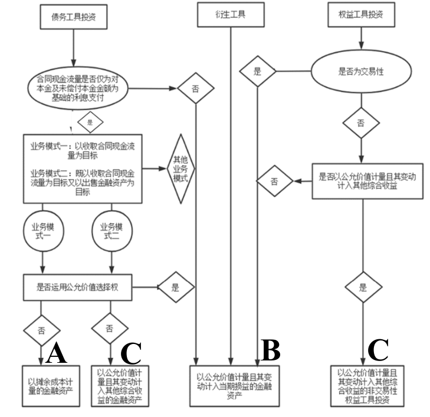  

其实比较依赖主观判断  

### 投资业务对利润的影响  

企业某项投资的全部资金收益由两部分构成  

- 现金股利或现金利息  
- 资本利得（Capital Gain/Loss）—买卖价差  

财务会计中，投资业务会计核算确认的投资收益（损失）与实际资金收支并不一致  

- 投资收益：用于核算企业对外投资过程中所取得的收益或发生的损失，包括股利、利息以部分投资的资本利得。如果取得收益，要贷记；如果发生损失，要借记  
- 公允价值变动损益：用于核算某些投资因公允价值变动影响当期损益的利得或损失。如果取得收益，要贷记；如果发生损失，要借记  

### 以摊余成本计量的金融资产  

一定对应债权类投资，只有债权类投资才有机会以摊余成本计量  

同时符合下列条件的金融资产应当分类为以摊（销后剩）余成本计量的金融资产：  

- 企业管理该金融资产的业务模式是以收取合同现金流量为目标  
- 该金融资产的合同条款规定，在特定日期产生的现金流量，仅为对本金和以未偿付本金金额为基础的利息的支付  

最常见的此类业务就是债券投资，企业可以设置“债权投资”科目核算有关业务  

债券投资还有折溢价问题，传统上适用  

市场上的利率和票面利率可能不一致  
$$  
V=\frac{F\times R}{(1+r)}+\frac{F\times R}{(1+r)^2}+\frac{F\times R}{(1+r)^3}+\frac{F\times R}{(1+r)^4}+\frac{F\times R}{(1+r)^4}+\frac{F}{(1+r)^5}  
$$  
If $r=R$,  
$$  
V_0=\frac{F\times R}{(1+r)}+\frac{F\times R}{(1+r)^2}+\frac{F\times R}{(1+r)^3}+\frac{F\times R}{(1+r)^4}+\frac{F}{(1+r)^4}=F  
$$  
$F$：债券的面值  

$R$：债券的票面利率  

$r$：贴现率或实际利率  

If $r<R$, $V>V_0=F$.  

If $r>R$, $V<V_0=F$.  

但是实际上现在都是电子债券了，拍出来的利率都是平价发行  

# Lecture 12  

金融资产相关的会计核算  

## 债权投资（Debt Investment）  

取得债权投资的会计处理  

- 按该债券投资的面值，借记“债权投资——成本”科目  
- 按支付的价款中包含的已到付息期但尚未领取的利息，借记“应收利息”科目  
- 按实际支付的金额（含交易费用），贷记“银行存款”等科目  
- 按借贷方差额，借记或贷记“债权投资——利息调整”科目（反映债券的折溢价）  

例：2013年1月1日，甲公司支付价款1000万元（含交易费用）购入某公司新发行的5年期债券，面值1250万元，票面利率4.72%，按年支付利息（即每年支付59万元），本金最后一次返还。甲公司购入债券之后准备长期持有，直到债券到期  

2013年1月1日，购入债券的会计处理  

借：债权投资——成本	1250万  
	&emsp;&emsp;贷：银行存款	1000万  
		&emsp;&emsp;&emsp;&emsp;债权投资——利息调整	250万  

折价的可能原因：票面利率低于市场利率  

“债权投资——利息调整”可以理解为该投资的折溢价，应该与按照票面利率与面值计提的利息结合在一起最终反映出债权投资的实际收益  

在每一期确认当期投资收益时，既要考虑应该收到的计提利息，也要考虑初始投资确认的折溢价摊销部分的影响  

### 资产负债表日债权投资的会计处理——分期付息、一次还本  

分期付息、一次还本的债券投资，应按票面利率乘以面值计算确定的应收未收利息，借记“应收利息”科目，按照实际利率乘以实际被占用资金（也叫摊余成本）计算确定的利息收入，贷记“投资收益”（ US.Interest Revenue），按其差额借记或贷记“债权投资——利息调整”科目  

短期内可收回——应收利息，短期不能收回——按长期资产核算  

资产负债表日债权投资的会计处理（分期付息、一次还本）  

借：应收利息	按票面利率与面值计算  
	&emsp;&emsp;（债权投资——利息调整）  
	&emsp;&emsp;贷：投资收益	按实际利率乘以实际被占用的资金计算  
		&emsp;&emsp;&emsp;&emsp;（债权投资——利息调整）  

一次还本付息的债券投资，应按票面利率计算确定的应收未收利息，借记“债权投资——应计利息”科目，按照实际利率法计算确定的利息收入，贷记“投资收益”，按其差额借记或贷记“债权投资——利息调整”科目  

借：债权投资——应计利息	按票面利率与面值计算  
	&emsp;&emsp;（债权投资——利息调整）  
	&emsp;&emsp;贷：投资收益	按实际利率乘以实际被占用的资金计算  
		&emsp;&emsp;&emsp;&emsp;（债权投资——利息调整）  

理论上，应该首先计算这笔债券投资的实际利率，但为了简便，这里省去了计算过程，直接告诉大家实际利率为10%  
$$  
59(1+r)^{-1}+59(1+r)^{-2}+59(1+r)^{-3}+59(1+r)^{-4}+(59+1250)(1+r)^{-5}=1000  
$$  
解得  
$$  
r=10\%  
$$  
在确定每一期投资收益的时候可以画一个表方便理解  

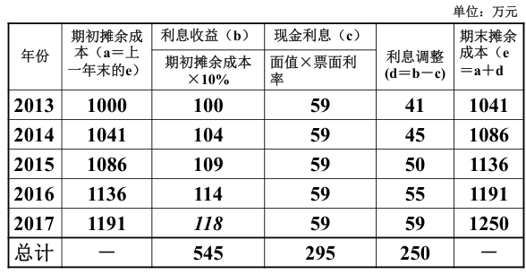  

第五年正常$1191\times10\%=119$，但是按118算，是用利息调整算的（把折价250万摊销完）。具体原因是计算市场利率不精准。  

接前例：2013年12月31日，确认实际利息收入、收到票面利息的会计处理  

借：应收利息	59万  
	&emsp;&emsp;债权投资——利息调整	41万  
	&emsp;&emsp;贷：投资收益	100万  

借：银行存款	59万  
	&emsp;&emsp;贷：应收利息	59万  

2014年12月31日，确认实际利息收入、收到票面利息的会计处理  

借：应收利息	59万  
	&emsp;&emsp;债权投资——利息调整	45万  
	&emsp;&emsp;贷：投资收益	104万  

借：银行存款	59万  
	&emsp;&emsp;贷：应收利息	59万  

后面几年情况相同，这种方法叫做实际利率法。  

### 实际利率法  

使用实际利率法确认债权投资的投资收益＝债权投资摊余成本（可以简单理解为债权投资账面余额或投资企业实际被占用的资金）×实际利率  

实际利率是指将金融资产在预计存续期的估计未来现金流量，折现为该金融资产账面余额所使用的利率  

以前也用直线法（旧会计准则采用），直线法就是把每年的利息调整都记为50；但是采用直线法收益率逐年递减，不能客观反映投资收益的实际情况  
$$  
10.9\%\rightarrow9.1\%  
$$  

### 债权投资到期日的会计处理  

应按实际收到的金额（债券面值），借记“银行存款”等科目，贷记“债权投资——成本”科目  

借：银行存款	面值  
	&emsp;&emsp;贷：债权投资——成本	面值  

接前例：2017年12月31日，到期收回本金的会计处理  

借：银行存款	1250万  
	&emsp;&emsp;贷：债权投资——成本	1250万  

### 一次性还本付息  

假定前例中债券不是分次付息，而是到期一次还本付息，债券的实际利率为9.05%  
$$  
(59+59+59+59+59+1250)\times(1+r)^{-5}=1000  
$$  
解得  
$$  
r=9.05\%  
$$  
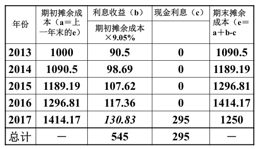  

同理，第五年的利息收益也是要让摊余成本=1250万的计算结果，不是单纯的期初摊余成本*9.05%  

## 以公允价值计量且其变动计入其他综合收益的金融资产  

同时符合下列条件的债权类金融资产应当分类为以公允价值计量且其变动计入其他综合收益的金融资产（会计科目——“其他债权投资” ）  

- 企业管理该金融资产的业务模式既以收取合同现金流量为目标又以出售该金融资产为目标  
- 该金融资产的合同条款规定，在特定日期产生的现金流量，仅为对本金和以未偿付本金金额为基础的利息的支付  

企业可以将非交易性权益工具投资指定为以公允价值计量且其变动计入其他综合收益的金融资产（会计科目——“其他权益工具投资” ）  

例：2013年1月1日，甲公司支付价款1000万元（含交易费用）购入乙公司新发行的5年期债券，面值1250万元，票面利率4.72%，按年支付利息（即每年支付59万元），本金最后一次返还。甲公司根据其管理该债券的业务模式和该债券的合同现金流量特征，将该债券分类为以公允价值计量且其变动计入其他综合收益的金融资产。其他信息如下，且乙公司债券公允价值不含利息：  
（1）2013年12月31日，乙公司债券公允价值为1200万元  
（2）2014年12月31日，乙公司债券公允价值为1300万元  
（3）2015年12月31日，乙公司债券公允价值为1250万元  
（4）2016年12月31日，乙公司债券公允价值为1200万元  
（5）2017年1月20日，甲公司通过公开市场将乙公司债券全部出售，取得款项1260万元。  

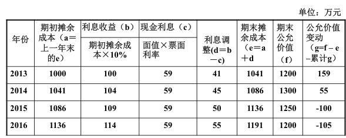  

2013: 1200-1041=159  
2014: 1086+159=1245; 1300-1245=55  
2015: 1136+159+55=1350; 1250-1350=-100  
2016: 1191+159+55-100=1305;1200-1305=-105  

2013年1月1日，购入乙公司债券  
借：其他债权投资——成本	1250万  
	&emsp;&emsp;贷：银行存款	1000万  
		&emsp;&emsp;&emsp;&emsp;其他债权投资——利息调整	250万  

2013年12月31日，确认乙公司债券利息收入、公允价值变动，收到债券利息  

借：应收利息	59万  
	&emsp;&emsp;其他债权投资——利息调整	41万  
	&emsp;&emsp;贷：投资收益	100万  

借：银行存款	59万  
	&emsp;&emsp;贷：应收利息	59万  

借：其他债权投资——公允价值变动	159万  
	&emsp;&emsp;贷：其他综合收益——其他债权投资公允价值变动	159万  

后面几年都类似  

2017年1月20日，确认出售乙公司债券实现的损益  
借：银行存款	1260万  
	&emsp;&emsp;其他综合收益——其他债权投资公允价值变动	9万  
	&emsp;&emsp;其他债权投资——利息调整	59万  
	&emsp;&emsp;贷：其他债权投资——成本	1250万  
		&emsp;&emsp;&emsp;&emsp;其他债权投资——公允价值变动	9万  
		&emsp;&emsp;&emsp;&emsp;投资收益	69万  

### 债权投资与其他债权投资会计处理  

- 相同点  
  - 初始投资时，短期内即将发放的现金利息单独确认为应收利息  
  - 按实际利率法确认持有期投资收益  
- 不同点  
  - 债权投资按摊余成本计量；其他债权投资按公允价值计量，公允价值变化计入其他综合收益  
  - 债权投资的投资收益仅为利息收益，其他债权投资的投资收益除了利息收益之外，还包括卖出价格与摊余成本之差（一次性计入出售债券当期）  

## 以公允价值计量且其变动计入当期损益的金融资产  

以摊余成本计量的金融资产和以公允价值计量且其变动计入其他综合收益的金融资产之外的金融资产应当作为以公允价值计量且其变动计入当期损益的金融资产  

持有该类金融资产主要以交易性为目的，主要是为了近期内出售的。例如，企业以赚取差价为目的从二级市场购入的股票、债券和基金等  

企业可以设置“交易性金融资产” 、“公允价值变动损益”账户来核算有关业务  

## 其他权益工具投资VS.交易性金融资产  

例：2016年5月6日，甲公司支付价款1016万元（含交易费用1万元和已宣告发放现金股利15万元），购入乙公司发行的股票200万股，占乙公司有表决权股份的0.5%。公司按照10%的比例提取法定盈余公积金  

如果甲公司将其指定为“以公允价值计量且其变动计入其他综合收益的非交易性权益工具投资” 的会计处理  

2016年5月6日购入股票（不同）  

借：应收股利	15万  
	&emsp;&emsp;其他权益工具投资——成本	1001万  
	&emsp;&emsp;贷：银行存款	1016万  

如果甲公司将其划分为“以公允价值计量且其变动计入当期损益的金融资产” 的会计处理  

2016年5月6日购入股票（不同）  
借：应收股利	15万  
	&emsp;&emsp;交易性金融资产——成本	1000万  
	&emsp;&emsp;投资收益	1万  
	&emsp;&emsp;贷：银行存款	1016万  

借记投资收益其实是损失  

2016年5月10日，到乙公司发放的现金股利15万元。这一点会计处理相同  

甲公司收2016年5月10日收到股利（相同）  

借：银行存款	15万  
	&emsp;&emsp;贷：应收股利	15万  

2016年6月30日，乙公司股票市价每股5.2元（假定甲公司需要编制半年度财务报表）  

如果甲公司将其划分为“以公允价值计量且其变动计入其他综合收益的非交易性权益工具投资”的会计处理  

2016年6月30日确认价格变动（不同）  

借：其他权益工具投资——公允价值变动	39万  
	&emsp;&emsp;贷：其他综合收益——其他权益工具投资公允价值变动	39万  

如果甲公司将其划分为“以公允价值计量且其变动计入当期损益的金融资产”的会计处理  

2001年6月30日确认价格变动（不同）  

借：交易性金融资产——公允价值变动	40万  
	&emsp;&emsp;贷：公允价值变动损益	40万  

金额不同原因：成本不同1001万和1000万  

2016年12月31日，乙公司股票市价每股4.8元（假定甲公司需要编制半年度财务报表）  

如果甲公司将其划分为“以公允价值计量且其变动计入其他综合收益的非交易性权益工具投资”的会计处理  

2016年12月31日确认价格变动（不同）  

借：其他综合收益——其他权益工具投资公允价值变动	80万  
	&emsp;&emsp;贷：其他权益工具投资——公允价值变动	80万  

如果甲公司将其划分为“以公允价值计量且其变动计入当期损益的金融资产”的会计处理  

2016年12月31日确认价格变动（不同）  

借：公允价值变动损益	80万  
	&emsp;&emsp;贷：交易性金融资产——公允价值变动	80万  

2017年5月9日，乙公司宣告发放股利4000万元，甲公司应享有20万元  

这一部分相同  

2017年5月9日确认应收股利（相同）  

借：应收股利	20万  
	&emsp;&emsp;贷：投资收益	20万  

2017年5月15日，甲公司收到乙公司发放的现金股利  

这一部分也相同  

2017年5月15日收到现金股利（相同）  

借：银行存款	20万  
	&emsp;&emsp;贷：应收股利	20万  

2017年5月20日，甲公司以每股4.9元的价格将乙公司股票全部转让  

如果甲公司将其划分为“以公允价值计量且其变动计入其他综合收益的非交易性权益工具投资”的会计处理  

2017年5月20日出售股票（不同）  
借：银行存款	980万  
	&emsp;&emsp;其他权益工具投资——公允价值变动41万  
	&emsp;&emsp;盈余公积——法定盈余公积	2.1万  
	&emsp;&emsp;利润分配——未分配利润	18.9万  
	&emsp;&emsp;贷：其他权益工具投资——成本	1001万  
		&emsp;&emsp;&emsp;&emsp;其他综合收益——其他权益工具投资公允价值变动	41万  

如果计入其他综合收益，最后变现的时候也不能计入当期损益  

重点需要记忆以下两点（例子中损失的21万分两部分处理）  

- 盈余公积——法定盈余公积  
- 利润分配——未分配利润  

如果甲公司将其划分为“以公允价值计量且其变动计入当期损益的金融资产”的会计处理  

2017年5月20日出售股票（不同）  
借：银行存款	980万  
	&emsp;&emsp;交易性金融资产——公允价值变动	40万  
	&emsp;&emsp;贷：交易性金融资产——成本	1000万  
		&emsp;&emsp;&emsp;&emsp;投资收益	20万  

金融性金融资产是卖出的980万跟上一次（2016年末）的960万相比，所以才出现了20万的投资收益。所以时候当时的账面价值比，而不是买入成本比。  

### 其他权益工具投资与交易性金融资产会计处理  

- 相同点  
  - 均要求按公允价值进行后续计量，按公允价值在资产负债表上对外披露  
  - 收到现金股利确认为投资收益（收到初始投资时已宣告发放但尚未领取的现金股利冲减应收股利）  
- 不同点  
  - 其他权益工具投资取得时发生的交易费用应当计入初始投资成本；交易性金融资产则计入“投资收益”，影响购入期损益  
  - 其他权益工具投资入账后公允价值的变动直接计入所有者权益（其他综合收益），并不影响当期损益；交易性金融资产通过“公允价值变动损益”先影响当期净利润，然后再影响期末所有者权益  
  - 企业持有交易性金融资产的全部资本利得都进入当期利润，分阶段影响损益，持有其他权益工具投资的全部资本利得并不影响损益  

企业持有的其他债权投资需要在利润表中确认全部资本利得，但在确认时间方面与交易性金融资产之间存在差异  

## 金融资产减值  

债权投资要设置“债权投资减值准备”备抵账户，反映资产的减值状况，减值产生的相关损失计入“信用减值损失”  

企业持有的其他债权投资在预期信用损失法下发生减值，通过“信用减值损失”账户影响当期损益，同时调整其他综合收益——信用减值准备  

例：甲公司于2020年12月15日购入一项公允价值为1000万元的债务工具，分类为以公允价值计量且其变动计入其他综合收益的金融资产。该工具合同期限为10年，年利率为5%，实际利率也为5%。2020年12月31日，由于市场利率变动，该债务工具的公允价值跌至950万元，甲公司计提信用减值损失30万元。为简化起见，本例不考虑利息。2021年1月1日，甲公司决定以当日的公允价值950万元，出售该债务工具。假定不考虑其他因素。  

甲公司账务处理如下：  
（1）2020年12月15日购入债务工具  
借：其他债权投资——成本	1000万  
	&emsp;&emsp;贷：银行存款	1000万  

（2）2020年12月31日  
借：其他综合收益——其他债权投资公允价值变动	50万  
	&emsp;&emsp;贷：其他债权投资——公允价值变动	50万  

借：信用减值损失	30万  
	&emsp;&emsp;贷：其他综合收益——信用减值准备	30万  

（3）2021年1月1日出售债务工具  
借：银行存款	950万  
	&emsp;&emsp;投资收益	20万  
	&emsp;&emsp;其他综合收益——信用减值准备	30万  
	&emsp;&emsp;其他债权投资——公允价值变动	50万  
	&emsp;&emsp;贷：其他综合收益——其他债权投资公允价值变动	50万  
		&emsp;&emsp;&emsp;&emsp;其他债权投资——成本	1000万  

商学院专业（企业管理的不同方向）  

- 会计  
- 金融（微观金融）  
- 市场营销  
- 人力资源  
- 运营管理  
- 战略管理  

CPA 注册会计师  

CFA 特许金融分析师  

英联邦体系 ACCA  

会计初级职称、中级职称、高级职称  

个人应该做其做得好且喜欢做的事情  

## 长期股权投资(Long-term Equity Investment)  

- 企业持有的持股比例较大（>=20%）、时间较长的股权投资不按照金融资产核算，而要确认为长期股权投资  
- 长期股权投资主要包括对子公司的投资、对合营企业的投资以及对联营企业的投资  
- 被投资企业具体划分标准主要体现在投资方的控制权与影响力  

长期股权投资通常包括  

- 企业持有的能够对被投资单位实施控制的权益性投资（控制），被投资单位为子公司（subsidiary）  
- 企业持有的能够与其他合营方一同对被投资单位实施控制的权益性投资（共同控制），被投资单位为合营企业（joint venture）  
- 企业持有的能够对被投资单位施加重大影响的权益性投资（重大影响），被投资单位为联营企业（associate）  

控制的关键是具有超过50%的表决权，持有50%的表决权一般属于合营企业  

在持有的表决权低于50%、但有相关协议约定的情况下，被投资单位仍然可以作为合营企业  

重大影响包括  

- 董事会或类似权利机构派驻代表  
- 参与制定被投资单位财务和经营决策  
- 与被投资单位之间发生重要交易  
- 向被投资单位派出管理人员  
- 向被投资单位提供关键技术资料  

### 取得子公司股权  

企业**非同一控制下**取得子公司以及对联营企业、合营企业的长期股权投资初始投资成本确认  

- 以支付现金取得的长期股权投资：应按照实际支付的购买价款作为初始投资成本，包括购买过程中支付的手续费等必要支出  

  - 支付价款中包含的被投资单位已宣告但尚未发放的现金股利或利润应当确认为应收项目，不构成长期股权的投资成本  

  - 垫付的股利计入“应收股利”  

- 以发行权益性证券方式取得的长期股权投资，其成本为所发行权益性证券的公允价值（不包括应自被投资单位收取的已宣告但尚未发放的现金股利或利润）  

### 长期股权投资的后续计量  

权益法（Equity Method）  

成本法（Cost Method）  

# Lecture 13  

长期股权投资的后续计量  

- 权益法（Equity Method）  
- 成本法（Cost Method）  

## 权益法  

权益法（Equity Method）：指长期股权投资最初以支付对价的公允价值计价，以后根据投资企业享有被投资单位所有者权益份额的变动对投资的账面价值进行调整的方法  

适用范围：投资企业对被投资单位具有共同控制或重大影响的长期股权投资（合营企业和联营企业）  

### 权益法——初始成本的调整  

初始成本大于取得投资时应享有被投资单位可辨认净资产公允价值份额的，不调整  

借：长期股权投资——成本	XX  
	&emsp;&emsp;贷：银行存款	XX  

这部分差额在本质上是投资过程中产生的商誉，但是并不需要单独确认商誉  

初始成本小于取得投资时应享有被投资单位可辨认净资产公允价值份额的，两者差额体现转让方的让步，计入“营业外收入”，同时增加长期股权投资账面价值  

借：长期股权投资——成本	XX  
	&emsp;&emsp;贷：银行存款	XX  
		&emsp;&emsp;&emsp;&emsp;营业外收入	XX  

例 ： A企业于20×5年1月取得B公司30%的股权，支付价款6000万元取得投资时被投资单位净资产账面价值为15000万元（假定被投资单位各项可辨认资产、负债的公允价值与其账面价值相同）  

实际投资成本大于权益份额  

A企业在取得B公司的股权后，能够对B公司施加重大影响，对该投资采用权益法核算。取得投资时，A企业应进行以下账务处理  

借：长期股权投资——成本	6000万  
	&emsp;&emsp;贷：银行存款	6000万  

假定本例中取得投资时被投资单位可辨认净资产的公允价值为24000万元，A企业按持股比例30％计算确定应享有7200万元，则初始投资成本与应享有被投资单位可辨认净资产公允价值份额之间的差额1200万元应计入取得投资当期的营业外收入。有关账务处理为  

借：长期股权投资——成本	7200万  
	&emsp;&emsp;贷：银行存款	6000万  
		&emsp;&emsp;&emsp;&emsp;营业外收入	1200万  

### 权益法——被投资单位实现净损益，投资企业的会计处理  

被投资单位盈利  

借：长期股权投资——损益调整	 XX  
	&emsp;&emsp;贷：投资收益	XX  

被投资单位亏损  

借：投资收益	XX  
	&emsp;&emsp;贷：长期股权投资——损益调整	XX  

### 权益法——被投资单位其他综合收益发生变动，投资企业的会计处理  

借：长期股权投资——其他综合收益	XX  
	&emsp;&emsp;贷：其他综合收益	XX  

借：其他综合收益	XX  
	&emsp;&emsp;贷：长期股权投资——其他综合收益	XX  

### 权益法——被投资单位分派现金股利，投资企业的会计处理  

借：应收股利	XX  
	&emsp;&emsp;贷：长期股权投资——损益调整	XX  

相当于所有者权益减少  

例：A公司持有B公司30％的股份，当期B公司因持有的其他权益工具投资公允价值的变动计入其他综合收益的金额为1200万元，除该事项外，B公司当期实现的净损益为6400万元。假定A公司与B公司适用的会计政策、会计期间相同，投资时B企业有关资产、负债的公允价值与其账面价值相同，双方在当期及以前期间未发生任何内部交易  

A企业在确认应享有被投资单位所有者权益的变动时  

借：长期股权投资——损益调整	1920万  
				&emsp;&emsp;&emsp;&emsp;&emsp;&emsp;&emsp;&emsp;——其他综合收益	360万  
	&emsp;&emsp;贷：投资收益	1920万  
		&emsp;&emsp;&emsp;&emsp;其他综合收益	360万  

例：新希望持股民生银行  

- 新希望持股民生银行4.18%  
- 2018年民生银行实现净利润503.3亿元  
- 新希望2018年确认民生银行的投资收益503.3× 4.18% = 21亿元  
- 此项投资收益占公司当年净利润27.2亿元的77.2％  

## 成本法  

成本法（Cost Method）：指长期股权投资按投资成本计价的方法  

适用范围：投资企业能够对被投资单位实施控制的长期股权投资（子公司）  

采用成本法核算的非同一控制下形成的长期股权投资，初始或追加投资时，按照支付成本或资产公允价值增加长期股权投资的账面价值  

被投资单位宣告分派的现金股利或利润中，投资企业享有的部分，应确认为当期投资收益，成本法核算与交易性金融资产和其他权益工具投资基本一致  

### 成本法——被投资单位宣告派发现金股利的会计处理  

借：应收股利	XX  
	&emsp;&emsp;贷：投资收益	XX  

### 减值准备  

企业应当在资产负债表日判断长期投资是否存在可能发生减值的迹象，并相应计提减值准备  

会计处理  

借： 资产减值损失	XX  
	&emsp;&emsp;贷：长期股权投资减值准备	XX  

### 出售长期股权投资的会计处理  

借：银行存款	实际取得的金额  
	&emsp;&emsp;长期股权投资减值准备	账面余额  
	&emsp;&emsp;(投资收益) 	（差额）  
	&emsp;&emsp;贷：长期股权投资	账面余额  
		&emsp;&emsp;&emsp;&emsp;(投资收益) 	（差额）  

长期股权投资账户的全部明细账户在股权出售时均需结转，包括成本、损益调整、其他综合收益  

采用权益法核算的长期股权投资，原记入其他综合收益中的金额，在处置时也应进行结转，将与所出售股权相对应的部分在处置时自“其他综合收益”转入“投资收益”  

### 期末对外披露  

长期股权投资在资产负债表中的非流动资产下的“长期股权投资”项目披露，金额应该按照总账科目的借方余额减去“长期股权投资减值准备”之后的账面价值填列  

## 企业借钱筹集资金的业务  

## 短期借款  

短期借款指企业从金融机构借入的期限在1年以内的各种借款  

企业应设置“短期借款”科目来核算有关业务，企业可以根据债权人设置明细科目  

### 短期借款的会计处理  

取得短期借款  

借：银行存款	XX  
	&emsp;&emsp;贷：短期借款	XX  

资产负债表日，确认利息费用  

借：财务费用	XX  
	&emsp;&emsp;贷：应付利息	XX  

到期日，偿还借款本金与利息  

借：短期借款	XX  
	&emsp;&emsp;应付利息	XX  
	&emsp;&emsp;贷：银行存款	XX  

应付短期债券的会计核算与短期借款相似，如果债券发行手续费的规模不大，可以一次性计入当期财务费用  

## 应付债券(Bonds Payable)  

企业发行的债券按照期限划分为应付短期债券与应付债券  

应付债券发行过程中形成的折溢价应在债券存续期内按照实际利率法合理摊销  

包含一般公司债券和可转换公司债券  

企业设置“应付债券”科目，核算为筹集长期资金而实际发行债券的本金、折溢价及利息  

在“应付债券”科目下设置“面值”“利息调整”“应计利息”三个明细科目  

债券发行，取得资金  

借：银行存款	实际收到的款项  
	&emsp;&emsp;（应付债券——利息调整）XX  
&emsp;&emsp;贷：应付债券——面值	债券面值  
	&emsp;&emsp;&emsp;&emsp;（应付债券——利息调整）	X  

### 利息调整的摊销  

应付债券的利息调整应在债券的存续期间内采用实际利率法进行摊销。实际利率法是指按照应付债券的实际利率计算其摊余成本及各期利息费用的方法；实际利率，是指将应付债券在债券存续期间的未来现金流量，折现为该债券当前账面价值所使用的利率  

计提利息、摊销利息调整的会计处理  

每年付息的应付债券  

借：在建工程/财务费用	摊余成本×实际利率	  
	&emsp;&emsp;（应付债券——利息调整）	XX  
	&emsp;&emsp;贷：应付利息	本金×票面利率  
		&emsp;&emsp;&emsp;&emsp;（应付债券——利息调整)	XX  

一次还本付息的应付债券  

借：在建工程/财务费用	摊余成本×实际利率  
	&emsp;&emsp;（应付债券——利息调整）	XX  
	&emsp;&emsp;贷：应付债券——应计利息	本金×票面利率  
		&emsp;&emsp;&emsp;&emsp;（应付债券——利息调整）	XX  

每年付息债券付息的会计处理  

借：应付利息	XX  
	&emsp;&emsp;贷：银行存款	XX  

每年付息债券最后还本的会计处理  

借：应付债券——面值	本金  
	&emsp;&emsp;贷：银行存款	本金  

一次还本付息债券还本付息的会计处理  

借：应付债券——面值	XX  
			&emsp;&emsp;&emsp;&emsp;&emsp;&emsp;——应计利息	XX  
&emsp;&emsp;贷：银行存款	（本金 + 全部利息）	  

例：甲企业发行6000万元的债券，票面利率为年利率6%，期限5年，每年年底支付利息。发行时实际利率为5%，取得资金6259.62万元。假定债券发行过程中无相关稅费  

债券发行的会计处理  

借：银行存款	62,596,200  
	&emsp;&emsp;贷：应付债券——面值	60,000,000  
		应付债券——利息调整	2,596,200  

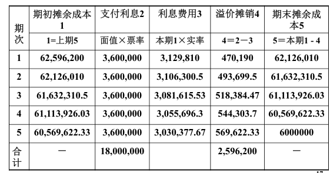  

摊销利息调整的会计处理（第一年）  

借：在建工程/财务费用	3,129,810  
	&emsp;&emsp;应付债券——利息调整	470,190  
	&emsp;&emsp;贷： 银行存款	3,600,000  

第二年、第三年、第四年会计分录相同，金额不同  

摊销利息调整的会计处理（第五年）  

借：在建工程/财务费用	3,030,377.67  
	&emsp;&emsp;应付债券——利息调整	569,622.33  
	&emsp;&emsp;贷：银行存款	3,600,000  

返还本金的会计处理  

借：应付债券——面值	60,000,000  
	&emsp;&emsp;贷：银行存款	60,000,000  

也可以把第五年返还本金及支付最后一期利息合并处理  

借：应付债券——面值	60,000,000  
	&emsp;&emsp;在建工程/财务费用	3,030,377.67  
	&emsp;&emsp;应付债券——利息调整	569,622.33  
	&emsp;&emsp;贷：银行存款	63,600,000  

## 长期借款  

企业从金融机构借入的期限在1年以上（不含1年）的各种借款，在会计核算中设置“长期借款”科目核算  

长期借款的会计处理  

取得长期借款  

借：银行存款	实际收到的金额	XX  
	&emsp;&emsp;（长期借款——利息调整）	XX	  
	&emsp;&emsp;贷：长期借款——本金	XX  

标准做法：计算实际利率  

计提借款利息  

借：在建工程/财务费用	摊余成本×实际利率  
	&emsp;&emsp;贷：应付利息	借款本金×合同利率  
		&emsp;&emsp;&emsp;&emsp;长期借款——利息调整	XX  

支付利息  

借：应付利息	XX  
	&emsp;&emsp;贷：银行存款	XX  

符合资本化条件的利息费用可以计入在建工程或开发成本  
（一）资产支出已经发生；  
（二）借款费用已经发生；  
（三）为使资产达到预定可使用或者可销售状态所必要的购建或者生产活动已经开始  

归还长期借款  

借：长期借款——本金	XX  
	&emsp;&emsp;贷：银行存款	XX  

### 期末披露  

长期借款与应付债券项目应扣除将于一年内到期且企业不能自主地将清偿义务展期的部分，分别在资产负债表的非流动负债下的“长期借款”与“应付债券”项目对外披露  

一年内到期且企业不能自主地将清偿义务展期的部分，在资产负债表中流动负债中的“一年内到期的非流动负债”项目对外披露  

## 会计循环  

1. 分析业务  
2. 记录业务的影响  
3. 汇总业务影响  
4. 准备报告  

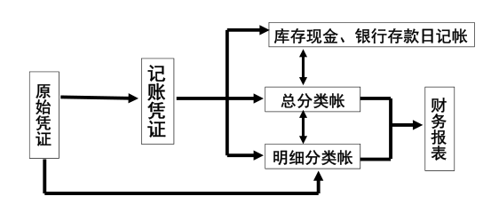  

有些业务可能没用原始凭证，比如计提减值准备  

### 过账  

将记账凭证中登记的每笔会计分录的金额转记入分类账的有关账户中，这一转记工作称为过账  

### 分类账(Ledger)  

按资产、负债、股东权益、收入、费用逐类设立账户，并分别编号、顺序排列的账簿（订本式或活页式），称为分类账  

- 总分类账（General ledger），资产、负债、股东权益、收入、费用五类账户构成的一整套账户体系，称为总分类账（总账），每一个账户总括反映某一类业务，例如银行存款  
- 明细分类账（Subsidiary ledger），根据总分类账账户设置，详细记录某一类经济业务的分类账，例如应收账款总账按每个顾客设置明细账， 该总账账户又称“统驭账户”（ Control accounts），其余额应等于各个明细账余额之和  

例：应交税费  

- 应交税费——应交增值税  
- 应交税费——应交消费税  
- 应交税费——应交城市维护建设税  
- 应交税费——应交教育费附加  
- 应交税费——应交印花税  
- 应交税费——应交所得税  

### 试算平衡表(Trial Balance)  

“全部科目借方余额合计数＝全部科目贷方余额合计数”说明记账、过账基本正确试算表无法检验的错误  

- 漏记  
- 重记  
- 串户  
- 错误数额恰好抵销  

### 调整分录  

产生原因：权责发生制原则  

企业的经济业务分为两类：  

- 有实物流转的业务，例如：采购、销售、生产领用原材料  
- 没有实物流转的业务，例如：计提坏账准备、固定资产计提折旧  

调整分录记录没有实物流转的经济业务  

种类  

1. 预收账款的结转（负债转为收入）  
2. 预付费用的摊销（资产转为费用）  
3. 应计收入（利得）的记录  
4. 应计费用（损失）的记录  
5. 以公允价值计价的资产调整公允价值  

- 预收账款的结转  

建设施工单位按履约进度确认劳务收入  

借：合同负债	XX  
	&emsp;&emsp;贷：主营业务收入	XX  

-  预付费用的摊销  

计提固定资产折旧  

借：制造费用/管理费用/销售费用	XX  
	&emsp;&emsp;贷：累计折旧	XX  

- 应计收入（利得）的记录  

债权投资确认利息  

借：应收利息	XX  
	&emsp;&emsp;（债权投资——利息调整） 	XX  
	&emsp;&emsp;贷：投资收益	XX  
		&emsp;&emsp;&emsp;&emsp;（债权投资——利息调整）	XX  

- 应计费用（损失）的记录  

期末计提存货跌价准备  

借：资产减值损失	XX  
	&emsp;&emsp;贷：存货跌价准备	XX  

计提短期借款的利息费用  

借：财务费用	XX  
	&emsp;&emsp;贷：应付利息	XX  

计提长期借款的利息费用  
借：财务费用	XX  
	&emsp;&emsp;贷：应付利息	XX  
		&emsp;&emsp;&emsp;&emsp;长期借款——利息调整	XX  

计提应付工资  

借：生产成本/制造费用/管理费用/销售费用/在建工程	XX  
	&emsp;&emsp;贷：应付职工薪酬	XX  

计提所得税（净利润前最后一笔调整分录）  

借：所得税费用——当期所得税费用	XX  
	&emsp;&emsp;贷：应交税费——应交所得税	XX  

### 结账(Closing the Books)  

企业开设的全部账户分为两类  

- 永久性账户（Permanent Accounts），这类账户期末有余额，并且余额随企业经营活动的延续而递延到下一个会计期间，例如：资产类、负债类、所有者权益类账户  
- 暂时性账户（Temporary Accounts），它反映某一期间的经营成果，应归属于特定的会计期间，只要该会计期间结束，这些账户就应该全部结平。到下一个会计期间，再由零重新开始，例如：收入类、费用类账户  

每期期末 编制结账分录（ Closing Entries），将暂时性账户的余额转入“本年利润”账户（US. Income Summary）  

“本年利润”科目，用于核算企业实现的净利润或发生的净亏损。期末，将本期收入和支出相抵后实现的净利润或净亏损，转入“利润分配——未分配利润”科目（属于所有者权益类）  

期末，结转收入  
借：主营业务收入	XX  
	&emsp;&emsp;其他业务收入	XX  
	&emsp;&emsp;其他收益	XX  
	&emsp;&emsp;营业外收入	XX  
	&emsp;&emsp;贷：本年利润	XX  

期末，结转成本、费用  

借：本年利润  
	&emsp;&emsp;贷：主营业务成本	XX  
		&emsp;&emsp;其他业务成本	XX  
		&emsp;&emsp;税金及附加	XX  
		&emsp;&emsp;销售费用	XX  
		&emsp;&emsp;管理费用	XX  
		&emsp;&emsp;研发费用	XX  
		&emsp;&emsp;财务费用	XX  
		&emsp;&emsp;资产减值损失	XX  
		&emsp;&emsp;信用减值损失	XX  
		&emsp;&emsp;营业外支出	XX  
		&emsp;&emsp;所得税费用	XX  

期末，结转公允价值变动损益  

结转公允价值变动净收益  

借：公允价值变动损益	XX  
	&emsp;&emsp;贷：本年利润	XX  

结转公允价值变动净损失  

借：本年利润	XX  
	&emsp;&emsp;贷：公允价值变动损益	XX  

期末，结转投资收益  

结转投资净收益  

借：投资收益	XX  
	&emsp;&emsp;贷：本年利润	XX  

结转投资净损失  

借：本年利润	XX  
	&emsp;&emsp;贷：投资收益	XX  

期末，结转资产处置收益  

结转资产处置净收益  

借：资产处置损益	XX  
	&emsp;&emsp;贷：本年利润	XX  

结转资产处置净损失  

借：本年利润	XX  
	&emsp;&emsp;贷：资产处置损益	XX  

期末，将收入和支出相抵后结出的净利润，转入“利润分配”  

借：本年利润	XX  
	&emsp;&emsp;贷：利润分配——未分配利润	XX  

期末，将收入和支出相抵后结出的净亏损，转入“利润分配”  

借：利润分配——未分配利润	XX  
	&emsp;&emsp;贷：本年利润	XX  

### 留存收益(Retained Earnings)  

留存收益是指归所有者所共有的、由经营收益转化而形成的所有者权益，可以分为盈余公积和未分配利润两部分  

盈余公积主要包括法定盈余公积、任意盈余公积  

未分配利润是指企业应向所有者分配而未分配，留于以后年度向所有者分配的利润  

根据《公司法》等有关规定，企业当年实现的净利润，一般应当按照如下顺序进行分配  

1. 提取法定公积金  
2. 提取任意公积金  
3. 向投资者分配利润或股利  

#### 利润分配的会计核算  

企业通过“利润分配”科目核算利润的分配（或亏损的弥补）以及历年分配（或弥补）后的余额  

利润分配科目可以设置“提取法定盈余公积”、“提取任意盈余公积”、“应付现金股利或利润”、“未分配利润”等明细进行核算  

#### 法定盈余公积  

指按照净利润和法定比例（10%）计提的盈余公积金  

法定盈余公积主要用于弥补公司亏损或转增资本  

公司法定公积金累计额为公司注册资本的50%以上时，可以不再提取法定公积金。超过注册资本25%以上的部分，可以用于弥补亏损或转增资本  

#### 任意盈余公积  

在计提了法定盈余公积之后，公司还可以根据政策需要，计提任意盈余公积，任意盈余公积的计提比例由公司自行确定  

任意盈余公积可以用于弥补亏损或转增资本。公司在用盈余公积弥补亏损或转增资本时，一般先使用任意盈余公积，在任意盈余公积用完之后，再按规定使用法定盈余公积  

盈余公积的会计处理  

提取法定盈余公积  

借：利润分配——提取法定盈余公积	XX  
	&emsp;&emsp;贷：盈余公积——法定盈余公积	XX  

提取任意盈余公积  

借：利润分配——提取任意盈余公积	XX  
	&emsp;&emsp;贷：盈余公积——任意盈余公积	XX  

#### 宣告分配现金股利或利润的会计处理  

借：利润分配——应付现金股利或利润	XX  
	&emsp;&emsp;贷：应付股利	XX  

#### 未分配利润  

是指公司留待以后年度进行分配的结存利润，是所有者权益的组成部分  

未分配利润等于期初未分配利润，加上本期实现的净利润，减去提取的各种盈余公积和分出股利（或利润）后的余额  

相对于所有者权益的其它部分来讲，公司对未分配利润的使用分配有较大的自主权  

未分配利润的两层含义  

- 留待以后年度处理的利润  
- 未指定特定用途的利润  

未分配利润通过“利润分配”科目下的“未分配利润”明细科目进行核算  

- 利润分配——未分配利润科目的期末余额如果在贷方，表示未分配的利润  
- 利润分配——未分配利润科目的期末余额如果在借方，表示未弥补的亏损  

结转利润分配内部明细科目余额  

将“利润分配”科目所属其他明细科目的余额都转入“利润分配——未分配利润”明细科目。结转后，除未分配利润明细科目外，其他明细科目应无余额  

借：利润分配——未分配利润	XX  
	&emsp;&emsp;贷：利润分配——提取法定盈余公积	XX  

借：利润分配——未分配利润	XX  
	&emsp;&emsp;贷：利润分配——提取任意盈余公积	XX  

借：利润分配——未分配利润	XX  
	&emsp;&emsp;贷：利润分配——应付现金股利或利润 	XX  

### 主要财务报表  

- 资产负债表（Balance Sheet）  
- 损益表/利润表（Income Statement）  
- 现金流量表（Statement of Cash Flows）  
- 所有者权益变动表（Statement ofChanges in Equity)  

现金流量表太难了，所有者权益变动表太简单了。重点是简单的资产负债表和利润表  

编制报表的顺序  

1. 利润表（Income Statement）  
2. 资产负债表（Balance Sheet）  
3. 现金流量表（Statement of Cash Flows）  
4. 所有者权益变动表（Statement of Changes in Equity)  

利润表要背下来  

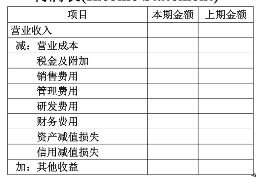  

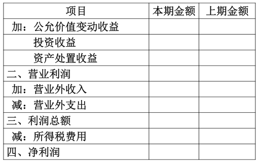  

利润表列报说明  

- 营业收入＝主营业务收入＋其他业务收入  
- 营业成本＝主营业务成本＋其他业务成本  
- 公允价值变动收益、资产处置收益与投资收益等项目如出现损失、营业利润与利润总额以及净利润如出现亏损，均用“－”号填列  
- 财务费用也有可能存在负数（利息收益、汇兑收益等）  

资产负债表  

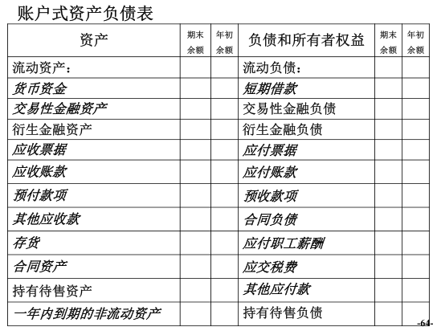  

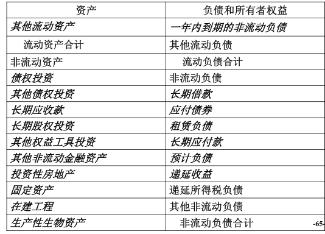  

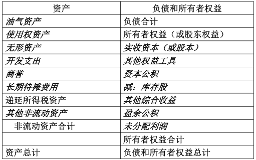  

其他流动资产：其他流动性较强的资产，一般可在一年期以内变现  

- 一年内的待摊费用（为财产买的一年期保险）  
- 购买的理财产品  
- 待抵扣和待认证的增值税进项税  
- 预缴企业所得税  
- 合同取得成本  

其他应收款：包括其他应收款、应收利息、应收股利等账户余额  

其他应付款：包括其他应付款、应付利息、应付股利等账户余额  

## 致福轩公司案例  

2018年1月1日Mr. Lin和Mr. Hai两人每人各拿出50万元人民币，成立了致福轩有限责任公司，该公司主营业务为仿古木制家具的加工及购销业务。假定公司为增值税一般纳税人，适用增值税税率13％  

借：银行存款	1,000,000  
	&emsp;&emsp;贷：实收资本——Lin	500,000  
		&emsp;&emsp;&emsp;&emsp;实收资本——Hai	500,000  

2018年1月5日，致福轩公司购入一辆广州本田轿车作为办公用车，价款250,000元，增值税税率13%，款项已支付，公司已取得增值税专用发票  

借：固定资产	250,000  
	&emsp;&emsp;应交税费——应交增值税（进项税额）	32,500	  
	&emsp;&emsp;贷：银行存款	282,500  

2018年3月10日，致福轩公司购入上等仿古木椅20套，价稅合计113,000元，货款尚未支付  

借：库存商品	100,000  
	&emsp;&emsp;应交税费——应交增值税（进项税额）	13,000  
	&emsp;&emsp;贷：应付账款	113,000  

2018年6月26日，致福轩公司利用暑假时期，开办木匠培训班，讲授如何生产木椅可使成本最小化问题。共取得培训收入424,000元（含税），同时发生相应支出200,000元（主要是人工薪酬），培训业务增值税税率为6%  

借：银行存款	424,000  
	&emsp;&emsp;贷：其他业务收入	400,000  
		&emsp;&emsp;&emsp;&emsp;应交税费——应交增值税（销项税额）	24,000  

借：其他业务成本	200,000  
	&emsp;&emsp;贷：银行存款	200,000  

2018年9月18日，致福轩公司在中央电视台播放使用仿古木制家具增进人体健康的宣传广告，同时以支票形式支付广告费20,000元，未取得增值税专用发票  

借：销售费用	20,000  
	&emsp;&emsp;贷：银行存款	20,000  

2018年10月5日，一位名为万众的台湾商人以1,000,000元的价格从致福轩公司购入20套仿古木椅，增值税税率13%，货款尚未支付，该批木椅系2018年3月10日购入的，成本价为100,000元  

借：应收账款	1,130,000  
	&emsp;&emsp;贷：主营业务收入	1,000,000  
		&emsp;&emsp;&emsp;&emsp;应交税费——应交增值税（销项税额）	130,000  

借：主营业务成本	100,000  
	&emsp;&emsp;贷：库存商品	100,000  

2018年12月2日，致福轩公司收到台湾商人万众退回的3套木椅（因为这三套木椅，每套只有三条腿），已取得税务部门的有关证明，可以抵减增值税销项税额  

借：主营业务收入	150,000  
	&emsp;&emsp;应交税费——应交增值税（销项税额抵减）	19,500	  
	&emsp;&emsp;贷：应收账款	169,500  

借：库存商品	15,000  
	&emsp;&emsp;贷：主营业务成本	15,000  

2018年12月20日，致福轩公司投入50,000元研发费用，研究如何能够使三条腿的木椅增强稳定性。由于该研究课题仅仅处于理论研究水平，故该笔支出属于研究费用，而不属于开发费用  

借：研发支出——费用化支出	50,000  
	&emsp;&emsp;贷：银行存款	50,000  

借：研发费用	50,000  
	&emsp;&emsp;贷：研发支出——费用化支出	50,000  

2018年12月31日，Mr. Lin与Mr. Hai领取2018年全年工资，共计250,000元，假定工资以银行存款的形式支付  

借：管理费用	250,000  
	&emsp;&emsp;贷：银行存款	250,000  

下面开始调整分录  

2018年年末，计提累计折旧。假定固定资产残值率为4%，采用直线法计提折旧，使用年限为5年  

2018年折旧44,000（提11个月）  

借：管理费用	44,000  
	&emsp;&emsp;贷：累计折旧	44,000  

2018年年末，计算应交增值税所产生的城建税、教育费附加  

2018年应交增值税为89,000  

借：税金及附加	8,900  
	&emsp;&emsp;贷：应交税费——应交城建税	6,230  
		&emsp;&emsp;&emsp;&emsp;应交税费——应交教育费附加	2,670  

2018年年末，计提应收账款坏账准备。假定采用应收账款余额百分比法计提坏账准备，计提比例为5%  

应计提坏账准备48,025  

借：信用减值损失	48,025  
	&emsp;&emsp;贷：坏账准备	48,025  

营业收入＝100－15＋40＝125  
营业成本＝10－1.5＋20＝28.5  
营业利润＝125－28.5－0.89－2－（25＋4.4）－5－4.8025=54.4075  
利润总额＝54.4075  

2018年年末，计提所得税，税率为25%。假定会计上的利润总额与税法中规定的应纳税所得一致，不需调整  

借：所得税费用——当期所得税费用	136,019  
	&emsp;&emsp;贷：应交税费——应交所得税	136,019  

2018年末结转本年成本、费用  

借：主营业务收入	850,000  
	&emsp;&emsp;其他业务收入	400,000  
	&emsp;&emsp;贷：本年利润	1,250,000  

借：本年利润	841,944  
	&emsp;&emsp;贷：主营业务成本	85,000  
		&emsp;&emsp;其他业务成本	200,000  
		&emsp;&emsp;税金及附加	8,900  
		&emsp;&emsp;信用减值损失	48,025  
		&emsp;&emsp;销售费用	20,000  
		&emsp;&emsp;管理费用	294,000  
		&emsp;&emsp;研发费用	50,000  
		&emsp;&emsp;所得税费用	136,019  

2018年末结转本年利润  

借：本年利润	408,056  
	&emsp;&emsp;贷：利润分配——未分配利润	408,056  

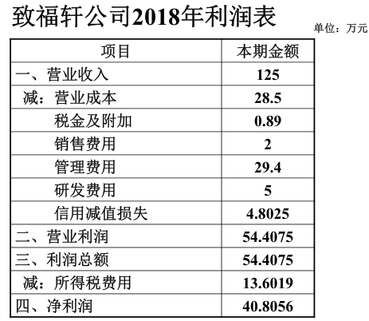  

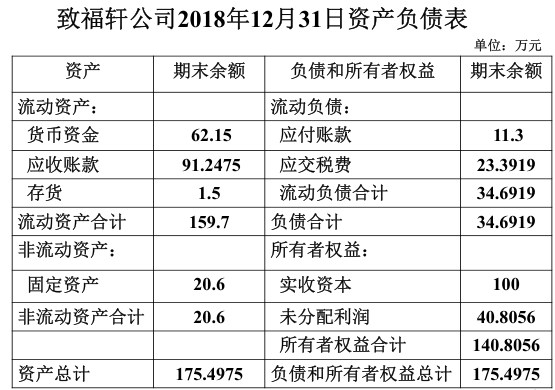  

以上例子是一年的报表，下面是一个月和利润分配  

2019年1月8日，致福轩公司购入一批仿古书橱，增值税专用发票上注明价款30万元，增值税3.9万元，款项已支付  

借：库存商品	300,00  
	&emsp;&emsp;应交税费——应交增值税（进项税额）	39,000  
	&emsp;&emsp;贷：银行存款	339,000  

2019年1月28日，致福轩公司将购入的仿古书橱全部卖给辉瑞公司，销售时开出的增值税专用发票上注明价税合计56.5万元，款项尚未收到  

借：应收账款	565,000  
	&emsp;&emsp;贷：主营业务收入	500,000  
		&emsp;&emsp;&emsp;&emsp;应交税费——应交增值税（销项税额）	65,000	  

借：主营业务成本	300,000  
	&emsp;&emsp;贷：库存商品	300,000  

编制调整分录  

计提固定资产累计折旧。假定固定资产残值为4%，采用直线法计提折旧，使用年限为5年  

借：管理费用	4,000  
	&emsp;&emsp;贷：累计折旧	4,000  

计算应交增值税所产生的城建税、教育费附加。城市维护建设税税率为7%，教育费附加征收比率为3%  

借：税金及附加	2,600  
	&emsp;&emsp;贷：应交税费——应交城建税	1,820  
		&emsp;&emsp;&emsp;&emsp;应交税费——应交教育费附加	780  

计提坏账准备。假定仍采用应收账款余额百分比法计提坏账准备，计提比例为5%  

借：信用减值损失	28,250  
	&emsp;&emsp;贷：坏账准备	28,250  

计提所得税，假定会计上的利润总额与税法中规定的应纳税所得一致，不需调整。所得税税率为25%  

利润总额165,150  

借：所得税费用——当期所得税费用	41,288  
	&emsp;&emsp;贷：应交税费——应交所得税	41,288  

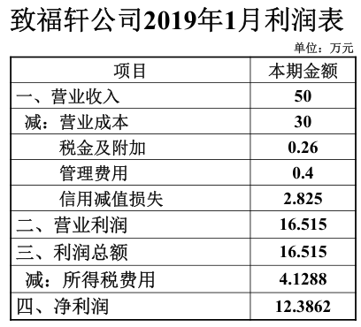  

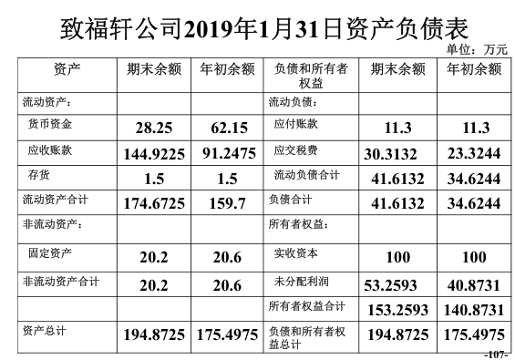  

2019年12月31日，致福轩公司以银行存款支付Mr. Lin和Mr. Hai两人当年工资共计10万元  

借：管理费用	100,000  
	&emsp;&emsp;贷：银行存款	100,000  

假定2019年致福轩公司无其他经济业务，编制调整分录  

计提固定资产累计折旧。假定固定资产残值为5%，采用直线法计提折旧，使用年限为5年  

借：管理费用	44,000  
	&emsp;&emsp;贷：累计折旧	44,000  

计提所得税。假定会计上的利润总额与税法中规定的应纳税所得一致，不需调整  

利润总额21,150，全年应交所得税5,288  

借：应交税费——应交增值税	36,000  
	&emsp;&emsp;贷：所得税费用——当期所得税费用	36,000  

结转全年收入、成本费用  

借：主营业务收入	500,000  
	&emsp;&emsp;贷：本年利润	500,000  

借：本年利润	484,138  
	&emsp;&emsp;贷：主营业务成本	300,000  
		&emsp;&emsp;&emsp;&emsp;税金及附加	2,600  
		&emsp;&emsp;&emsp;&emsp;管理费用	148,000  
		&emsp;&emsp;&emsp;&emsp;信用减值损失	28,250  
		&emsp;&emsp;&emsp;&emsp;所得税费用	5,288  

2019年年末，致福轩公司进行利润分配，按净利润10%提取法定公积金  

全年净利润15,862  

借：利润分配——提取法定盈余公积	1,586  
	&emsp;&emsp;贷：盈余公积——法定盈余公积	1,586  

2019年年末，致福轩公司进行利润分配，用银行存款向投资者分配利润15万元  

借：利润分配——应付现金股利或利润	150,000  
	&emsp;&emsp;贷：银行存款	150,000  

结转全年利润  

借：本年利润	15,862  
	&emsp;&emsp;贷：利润分配——未分配利润	15,862  

借：利润分配——未分配利润	151,586  
	&emsp;&emsp;贷：利润分配——提取法定盈余公积	1,586  
		&emsp;&emsp;&emsp;&emsp;利润分配——应付现金股利或利润	150,000  

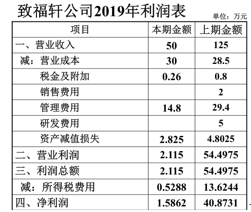  

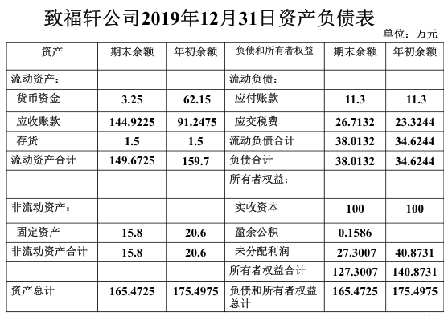  

# Lecture 14  

## 财务报表附注  

附注是财务报表不可或缺的组成部分，是对在资产负债表、利润表、现金流量表和所有者权益变动表等报表中列示项目的文字描述或明细资料，以及对未能在这些报表中列示项目的说明等  

### 内容  

附注通常包括  

- 企业的基本情况  
- 财务报表的编制基础（持续经营）  
- 遵循企业会计准则的声明  
- 重要会计政策和会计估计  
- 会计政策和会计估计变更以及差错更正的说明  
- 财务报表项目附注  
- 其他需要说明的事项：资产负债表日后非调整事项、股份支付、关联方及关联交易  

## 会计差错更正  

会计差错：在会计核算时，由于确认、计量、记录等方面出现的错误  

### 会计差错产生的原因  

- 会计政策使用上的差错  
- 会计估计上的差错  
- 其他差错，例如错记借贷方向、错记账户；遗漏交易或事项；对事实的忽视和误用  

### 处理方式  

对于会计差错，企业应区别不同情况，分别采用不同的方法进行处理  

#### 当期发生的会计差错  

对于当期发生的会计差错，应直接调整当期相关项目  

年报未披露之前也可视为当期  

例：2008年12月31日，甲公司发现一台销售部门使用的固定资产当年计提的折旧被确认为“管理费用”，金额1,000元  

借：销售费用	1,000  
	&emsp;&emsp;贷：管理费用	1,000  

#### 前期发生的会计差错  

前期会计差错可以分为重要的前期差错和不重要的前期差错  

- 不重要的前期差错，调整发现当期与前期相同的相关项目  
- 重要的前期差错要通过“以前年度损益调整”进行追溯更正（贷记表示收益，借记表示损失），最终余额要调整为0，调整到“利润分配——未分配利润”里  

例：2008年12月31日，甲公司发现2007年度的一台管理用设备少计提折旧3,000元。（甲公司资产总额超亿元）  

视为不重要的差错  

借：管理费用	3,000  
	&emsp;&emsp;贷：累计折旧	3,000  

### 会计差错可以作为操纵利润的手段  

在1999-2001年间，共有402家公司披露以前年度报表存在重大会计差错并进行了追溯调整，去除5家未披露调整金额的上市公司，在余下的397家公司中，12家只涉及账目之间的调整,不影响损益；42家公司的会计差错是以前年度少计了利润；而343家公司的会计差错都是以前年度高报了盈余，占样本总数86.4%  

“中国上市公司会计差错的动因分析”——张为国、王霞  

2019年4月30日，康美药业发布“前期会计差错更正”，货币资金由341.5亿元调减为42.1亿元  

## 会计研究学术期刊  

国内：会计研究；中国会计评论；经济研究；管理世界  

国外：The Accounting Review; Journal of Accounting and Economics; Journal of Accounting Research; Contemporary Accounting Research  

## 财务会计的局限  

- 不够精确，存在主观估计判断，例如固定资产计提折旧、资产减值  

- 大部分资产采用历史成本计价，对于经营时间比较长的公司资产账面价值与实际价值可能会出现严重偏离，例如土地  

  - 2015年巴菲特致股东的信  

    我们接手伯克希尔的前几十年，公司账面价值与内在价值之间的关联性远比现在要强。今天，我们的重心已经发生重大变化，转向拥有和运营大型商业资产。这其中不少企业的价值要远远超过他们基于成本计算的账面价值。结果就是，伯克希尔公司内在价值与账面价值的差距实质上拉大  

- 选用不同会计政策导致各期业绩有所不同  

- 一些资产没有得到反映，例如品牌价值  

- 只能够反映以货币计量的经济业务，反映内容不够全面，例如无法反映客户满意度