---  
title: 《力学与材料》课程笔记  
date: 2026-04-13
description: 墨尔本大学机械工程系-2026第一学期  
math: true  
slug: mechanics&materials
categories:  
    - university  
tags:  
    - 交换
image: mm.png
isCJKLanguage: false
---  

# Lecture 1 Mechanics and Continuum Mechanics

## Aim of continuum mechanics

- ‘Continuum’ means we ignore molecular or microstructure interactions and consider the solid on a macroscopic level
- Another way of saying this is we treat a ‘solid’ as a continuous distribution of particles and don’t care about how those particles interact
- Note that Materials Science deals with microstructure of the solid
- The Mechanics part of this subject is a subset of mechanics that aims to predict deformation of solid under given load
- Many important systems deform elastically - we will consider these mostly

## Outline

- Theory of continuum mechanics: key concepts and governing equations (2-3 lectures)
- Methods to solve the equations (9-10 lectures)
  - Strain energy method
  - Castigliano’s theorem
  - Virtual work
- Analysis and assessment of structure failure (3 lectures)
  - Stress transformation
  - Yield criteria

# Lecture 2 Deformation

## Definition

- Deformation: change of size or shape of a structure under loading.

  Deformation at different points can differ and it is non-uniform.

- Strain: local deformation at a point in the structure.

  $\epsilon(x,y,z)$ is a strain field; it depends on $x, y, z$.

## Strain

To define Normal Strain,

$$
\epsilon=\frac{L-L_0}{L_0}=\frac{\Delta L}{L_0}
$$

Normal Strain is dimensionless and usually $|\epsilon|<0.1\%$.

To define Shear Strain,

$$
\gamma=\Delta \varphi=\frac{\pi}{2}-\varphi
$$

It is also dimensionless.

By the way we define strain, we can observe that one point has **infinite** neighbour points. If we follow the definition, we can define infinite strain values at this point. Generally speaking, the strain values are different. In order to describe the local deformation at this point, we need to know all of them. But it is proven that we only need to know a set of strain components along certain directions. We can calculate all others using some mathematical formula—strain transformation.

We find that we only have 6 independent strain components

- 3 normal strain $\epsilon_x,\epsilon_y,\epsilon_z$
- 3 shear strain $\epsilon_{xy},\epsilon_{xz},\epsilon_{yz}$

So we can form a strain tensor,

$$
\begin{bmatrix} \epsilon_{x}&  \epsilon_{xy}& \epsilon_{xz} \\ \epsilon_{yx}&  \epsilon_{y}& \epsilon_{yz} \\ \epsilon_{zx}&  \epsilon_{zy}& \epsilon_{z} \\ \end{bmatrix}
$$

To be clear, $\epsilon_x$ can also be $\epsilon_{xx}$ for mathematical convenience.

## How to calculate strain

1. Follow the definiton
2. Use strain-displacement relation

Consider an element of solid displaced and deformed a tiny amount.

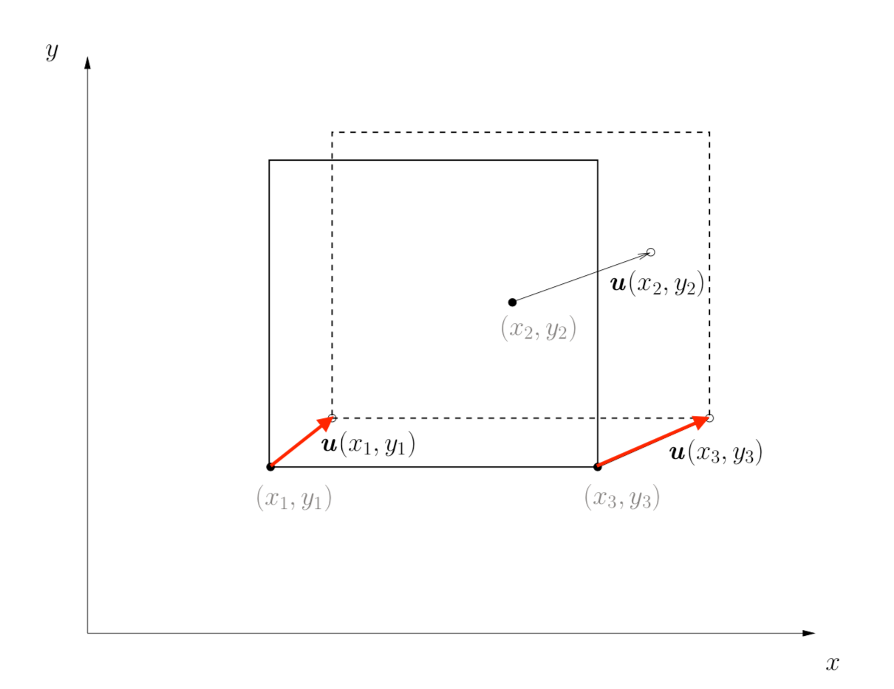

Displacement is a vector and we use $\vec{u}$ to describe it. $\vec{u}(x,y,z)$ is displacement field.

- Normal Strain

  $$
  \epsilon_{xx}=\frac{u_1(x+dx,y,z)-u_1(x,y,z)}{dx}=\frac{\partial u_1(x,y,z)}{\partial x}
  $$

  $$
  \epsilon_{yy}=\frac{\partial u_2(x,y,z)}{\partial y}
  $$

  $$
  \epsilon_{zz}=\frac{\partial u_3(x,y,z)}{\partial z}
  $$

- Shear Strain

  $$
  \alpha_1\approx\tan\alpha_1=\frac{u_2(x+dx,y,z)-u_2(x,y,z)}{dx}=\frac{\partial u_2(x,y,z)}{\partial x}
  $$

  $$
  \alpha_2\approx\tan\alpha_2=\frac{\partial u_1(x,y,z)}{\partial y}
  $$

  $$
  \gamma_{xy}=\frac{\partial u_2}{\partial x}+\frac{\partial u_1}{\partial y}
  $$

  $$
  \gamma_{yz}=\frac{\partial u_2}{\partial z}+\frac{\partial u_3}{\partial y}
  $$

  $$
  \gamma_{zx}=\frac{\partial u_3}{\partial x}+\frac{\partial u_1}{\partial z}
  $$

For mathematical convenience, we define

$$
\epsilon_{xy}=\frac{1}{2}\gamma_{xy}=\frac{1}{2}\left(\frac{\partial u_2}{\partial x}+\frac{\partial u_1}{\partial y}\right)
$$

$$
\vdots
$$

But why? If we define like this we can uniformly say

$$
\epsilon_{ij}=\frac{1}{2}\left(\frac{\partial u_i}{\partial x_j}+\frac{\partial u_j}{\partial x_i}\right)
$$

# Lecture 3 Stress

## Definition

- Internal Force: force applied to one part of a structure from other parts.

  Internal force at different locations of this structure can be different, i.e. non uniform.

- Stress: used to describe internal force acting at a point(locally)

  $\sigma(x,y,z)$ is a stress field

## Stress

If we choose a point and a plane nearby, we can define its normal force and shear force.

- Normal Stress: $\sigma=\dfrac{F}{A}$
- Shear Stress: $\tau=\dfrac{Q}{A}$

Double-subscript notation: $\sigma_{xx}$, the first x indicates the plane and the second x indicates the direction of force

### 2-D case

In a 2-D case, we only have 3 independent stress components, which can form a stress tensor.

$$
\begin{bmatrix} \sigma_{xx}& \tau_{xy}\\ \tau_{yx}& \sigma_{yy} \end{bmatrix}
$$

These 3 stress components have clear physical meaning, that is internal force from left, right, top, bottom neighbours.

### 3-D case

In a 3-D case, there are 6 independent stress $\sigma_x$, $\sigma_y$, $\sigma_z$, $\tau_{xy}$, $\tau_{yz}$, $\tau_{xz}$, and the stress tensor is

$$
\sigma = \begin{bmatrix} \sigma_{xx} & \tau_{xy} & \tau_{xz} \\ \tau_{yx} & \sigma_{yy} & \tau_{yz} \\ \tau_{zx} & \tau_{zy} & \sigma_{zz} \end{bmatrix}
$$

### Direction

The direction of stress might be confusing.

TIP: Shear stress is positive when it acts on a positive face in the positive coordinate direction.

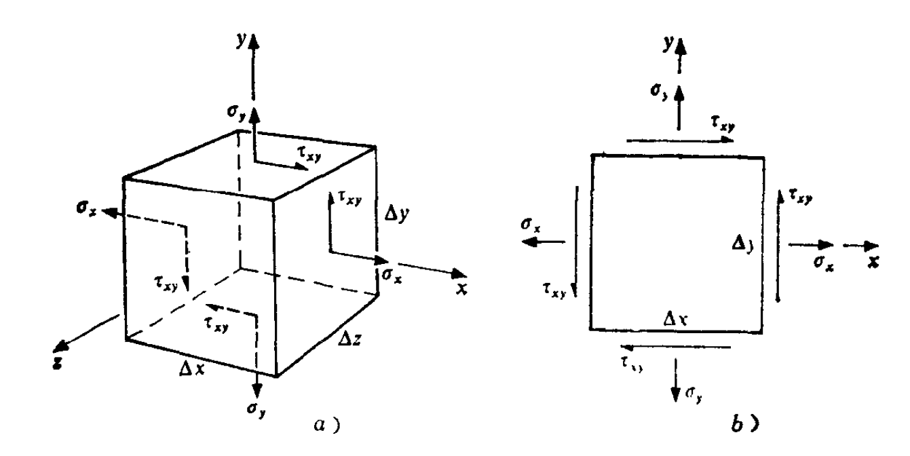

**Question**: what causes the stress generation in a structure?

- External force, in most cases.
- In some cases, mismatch could also causes stress in the absence of external forces. (See in the materials part)

# Lecture 4 Stress-Strain Relation(Hook's Law)

We have learned stress and strain.

- Stress: local internal force
- Strain: local deformation

Relation between $\vec{\sigma}$ and $\vec{\varepsilon}$ is a constitutive relation. It's a material property. It can be very complicated and we only consider the special case isotropic, linear, elasticity.

## Uniaxial Tension Case

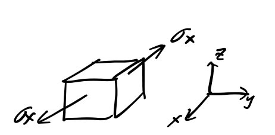

only $\sigma_x\neq0, \sigma_y=0,\sigma_z=0$
$$
\varepsilon_x=\frac{\sigma_x}{E}
$$
where $E$ is Young's modulus
$$
\varepsilon_y=-\nu\varepsilon_x
$$

$$
\varepsilon_z=-\nu\varepsilon_x
$$

## 3D Case

Uniaxial tension is a special case, and in a 3D case.
$$
\varepsilon_x=\frac{\sigma_x}{E}
$$

$$
\varepsilon_x=-\nu\varepsilon_y=-\nu\frac{\sigma_y}{E}
$$

$$
\varepsilon_x=-\nu\varepsilon_z=-\nu\frac{\sigma_z}{E}
$$

Using **superposition**, we have
$$
\varepsilon_y = \frac{1}{E} \left[ \sigma_y - \nu (\sigma_x + \sigma_z) \right] 
$$

$$
\varepsilon_x = \frac{1}{E} \left[ \sigma_x - \nu (\sigma_y + \sigma_z) \right] 
$$

$$
\varepsilon_z = \frac{1}{E} \left[ \sigma_z - \nu (\sigma_x + \sigma_y) \right]
$$

How about shear stress and shear strain
$$
\gamma_{xy} = \frac{1}{G} \tau_{xy}
$$
where $G$ is shear modulus

So we have

$$
\varepsilon_{xy} = \frac{1}{2G} \tau_{xy}
$$

$$
\varepsilon_{yz} = \frac{1}{2G} \tau_{yz} 
$$

$$
\varepsilon_{xz} = \frac{1}{2G} \tau_{xz}
$$

We have 3 parameters $E,\nu,G$, and we can prove that for isotropic material
$$
G=\frac{E}{2(1+\nu)}
$$
So we only have 2 independent modulus, and we often put them in a matrix form

$$
\begin{bmatrix} \varepsilon_x \\ \varepsilon_y \\ \varepsilon_z \\ \varepsilon_{yz} \\ \varepsilon_{xz} \\ \varepsilon_{xy}  \end{bmatrix} =  \begin{bmatrix} \dfrac{1}{E} & -\dfrac{\nu}{E} & -\dfrac{\nu}{E} & & & \\ -\dfrac{\nu}{E} & \dfrac{1}{E} & -\dfrac{\nu}{E} & & 0 & \\ -\dfrac{\nu}{E} & -\dfrac{\nu}{E} & \dfrac{1}{E} & & & \\ & & & \dfrac{1}{2G} & & \\ & 0 & & & \dfrac{1}{2G} & \\ & & & & & \dfrac{1}{2G} \end{bmatrix} \begin{bmatrix}  \sigma_x \\ \sigma_y \\ \sigma_z \\ \tau_{yz} \\ \tau_{xz} \\ \tau_{xy}  \end{bmatrix}
$$

## Example

$\sigma_x=200\text{MPa}, E=200\text{GPa},\nu=0.25$

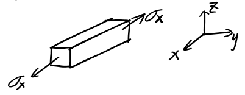

### Uniaxial tension case

$$
\varepsilon_x=\frac{\sigma_x}{E}=0.1\%
$$

$$
\varepsilon_z=\varepsilon_y=-\nu\varepsilon_x=-0.025\%
$$

### 3D case

If some constrain is applied, s.t. $\varepsilon_y=0,\varepsilon_z=0$

We can solve it because there are 3 equations and 3 variables.
$$
\varepsilon_x=0.083\%<0.1\%
$$

$$
\sigma_y=\sigma_z=66.7\text{MPa}
$$

Questions: 

1. Why $\varepsilon_x$ is smaller?
2. Why $\sigma_y\neq0$ but $\varepsilon_y =0 $? That is counter-intuitive.

- $\sigma$ and $\varepsilon$ in the $x,y,z$ directions are **coupled**, that is because Poisson ratio $\nu\neq 0$
- If we substitute $\nu=0$ into the matrix, we will see $\sigma$ and $\varepsilon$ in the $x,y,z$ directions are decoupled!
- So we can't underestimate the importance of Poisson ratio $\nu$
- It has been proven for isotropic material

$$
-1\leq\nu\leq0.5
$$

Poisson ration can be negative!

- Imagine, we can stretch along $x$-direction, the $y,z$ direction also expand. That is weird but possible!

# Lecture 5 Governing Equations of Continuum Mechanics

## Equation of Motion

In previous lectures, we know $\sigma$ at different points are different. $\sigma(x, y, z)$ 

To maintain the equilibrium, $\sigma(x, y, z)$ must satisfy some conditions. 

### 2D Case

We can draw a free body diagram

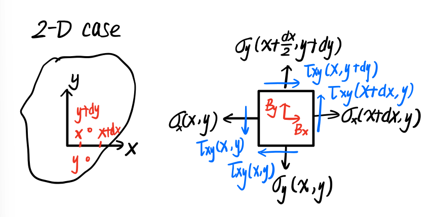

- Stress unit: $\dfrac{\text{force}}{\text{area}}$ 
- Body force $B_x,B_y$ unit: $\dfrac{\text{force}}{\text{volume}}$

Equilibrium Condition
$$
\sum F_x = 0
$$

$$
\sigma_x(x+dx, y) dy dz - \sigma_x(x, y) dy dz + \tau_{xy}(x, y+dy) dx dz - \tau_{xy}(x, y) dx dz + B_x dx dy dz = 0
$$

$$
\Rightarrow \frac{\partial \sigma_x}{\partial x} + \frac{\partial \tau_{xy}}{\partial y} + B_x = 0
$$

Similarly, 
$$
 \frac{\partial \sigma_y}{\partial y} + \frac{\partial \tau_{xy}}{\partial x} + B_y = 0
$$

### 3D Case

$$
\frac{\partial \sigma_x}{\partial x} + \frac{\partial \tau_{xy}}{\partial y} + \frac{\partial \tau_{xz}}{\partial z} + B_x = 0
$$

$$
\frac{\partial \sigma_y}{\partial y} + \frac{\partial \tau_{yx}}{\partial x} + \frac{\partial \tau_{yz}}{\partial z} + B_y = 0
$$

$$
\frac{\partial \sigma_z}{\partial z} + \frac{\partial \tau_{xz}}{\partial x} + \frac{\partial \tau_{yz}}{\partial y} + B_z = 0
$$

## List of Unknowns and Equations

### 15 Unknowns

At point $(x,y,z)$

- $\vec{\sigma}$

$$
\sigma_x,\sigma_y,\sigma_z,\tau_{xy},\tau_{yz},\tau_{xz}
$$

- $\vec{\varepsilon}$

$$
\varepsilon_{x}, \varepsilon_{y},\varepsilon_{z},\varepsilon_{xy},\varepsilon_{yz},\varepsilon_{xz}
$$

- $\vec{u}$

$$
u_x,u_y,u_z
$$

### 15 Equations

$$
\varepsilon_x = \frac{\partial u_x}{\partial x} = \frac{1}{2} \left( \frac{\partial u_x}{\partial x} + \frac{\partial u_x}{\partial x} \right)
$$

$$
\varepsilon_y = \frac{\partial u_y}{\partial y} = \frac{1}{2} \left( \frac{\partial u_y}{\partial y} + \frac{\partial u_y}{\partial y} \right)
$$

$$
\varepsilon_z = \frac{\partial u_z}{\partial z} = \frac{1}{2} \left( \frac{\partial u_z}{\partial z} + \frac{\partial u_z}{\partial z} \right)
$$

$$
\gamma_{xy} = \frac{\partial u_2}{\partial x} + \frac{\partial u_1}{\partial y}
$$

$$
\gamma_{zx} = \frac{\partial u_3}{\partial x} + \frac{\partial u_1}{\partial z}
$$

$$
\gamma_{yz} = \frac{\partial u_2}{\partial z} + \frac{\partial u_3}{\partial y}
$$

$$
\frac{\partial \sigma_x}{\partial x} + \frac{\partial \tau_{xy}}{\partial y} + \frac{\partial \tau_{xz}}{\partial z} + B_x = 0
$$

$$
\frac{\partial \sigma_y}{\partial y} + \frac{\partial \tau_{yx}}{\partial x} + \frac{\partial \tau_{yz}}{\partial z} + B_y = 0
$$

$$
\frac{\partial \sigma_z}{\partial z} + \frac{\partial \tau_{xz}}{\partial x} + \frac{\partial \tau_{yz}}{\partial y} + B_z = 0
$$

$$
\varepsilon_x = \frac{1}{E} [ \sigma_x - \nu ( \sigma_y + \sigma_z ) ]
$$

$$
\varepsilon_y = \frac{1}{E} [ \sigma_y - \nu ( \sigma_x + \sigma_z ) ]
$$

$$
\varepsilon_z = \frac{1}{E} [ \sigma_z - \nu ( \sigma_x + \sigma_y ) ]
$$

$$
\varepsilon_{xy} = \frac{1}{2G} \tau_{xy}
$$

$$
\varepsilon_{yz} = \frac{1}{2G} \tau_{yz}
$$

$$
\varepsilon_{xz} = \frac{1}{2G} \tau_{xz}
$$

## Solutions

With appropriate boundary conditions, we can derive unique solution.

Two types of boundary condition

1. Displacement constraint
2. External forces

Note: these set of equations, generally speaking, are very difficult to solve.

- Only a limited number of questions, we can get exact analytical solutions.
- In practice, we need some methods to help us get approximated solutions.
- There are many methods.
- In this subject, we will introduce two methods.
  1. **energy based method** (week 3-4)
  2. **finite element method** (week 6-7)

# Lecture 6 Virtual Work Principle(Rigid body system)

## Virtual Displacement and Virtual Work

$\delta u$, small, fictitious displacement we can apply on the structure

Since the structure is often under loading, a virtual displacement can generate virtual work $\delta W$

## Virtual Work Principle

For rigid body(system) under equilibrium, the summation of all virtual work should be 0, that is $\delta W=0$ 

There are some requirement of virtual displacement:

1. We can have many choices
2. Virtual displacement can not change the condition of the question

## Example 1

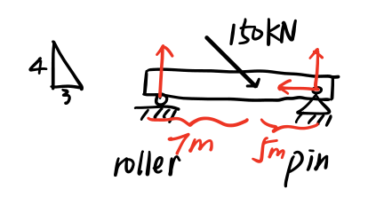

We draw a free body diagram

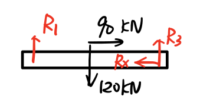

We have a virtual displacement $\delta u$

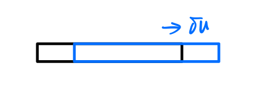

So we have 
$$
\sum\delta W=90\delta u-R_x\delta u=0
$$

$$
R_x=90\text{kN}
$$

We have two other displacements $\delta u_2, \delta u_3$

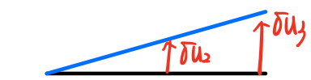
$$
\frac{\delta u_2}{\delta u_3}=\frac{7}{12}
$$

$$
\sum\delta W=-120\delta u_2+R_3\delta u_3=0
$$

$$
R_3=70\text{kN}
$$

We have another displacement upward

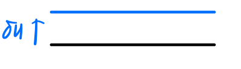
$$
\sum\delta W=-120\delta u+70\delta u+R_1\delta u=0 
$$

$$
R_1=50\text{kN}
$$

## Example 2 

A truss system

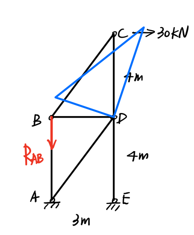
$$
\delta u=L\delta \theta
$$

$$
\delta u_B=3\delta \theta, \quad\delta u_C=4\delta \theta
$$

$$
\sum\delta W=-R_{AB}\cdot3\delta \theta+30\cdot4\delta \theta=0
$$

$$
R_{AB}=40\text{kN}
$$

# Lecture 7 Virtual Work Principle(Deformable Body)

## Strain Energy

Strain Energy: energy stored inside a deformable body / structure arising from deformation

Virtual displacement will cause virtual strain energy

## Virtual Work Principle

Virtual work done by external forces = virtual strain energy stored in the deformable body.

If the body is rigid, no deformation, no strain energy. It will be reduced to the one we used in lecture 6.

## Rayleigh-Ritz Method

Deflection of Cantilever Beam

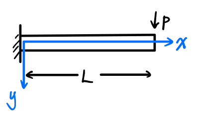

We need to calculate deflection $y(x)=?$

Assume that deflection can be expressed as:
$$
y(x)=Ax^3+Bx^2+Cx+D
$$
Note: 

- Because we do not know the exact form, this assumed form will lead to an 'Approximate' solution.
- We can assume other forms
- If we make good assumptions of the form, we can get 'better' approximated solution

Boundary condition:
$$
y(0)=D=0
$$

$$
y'(0)=C=0
$$

So $y(x)=Ax^3+Bx^2$.

Now we need to calculate **strain energy**

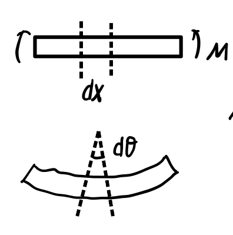

The relation between $M$ and $\theta$ is linear, so we have
$$
dU=\frac{1}{2}Md\theta
$$
We also know that
$$
d\theta=\frac{dx}{R}
$$

$$
\frac{1}{R}=\frac{M}{EI}
$$

And Euler Beam Theory
$$
M=-EI\frac{d^2y}{dx^2}
$$
So we have
$$
U=\int dU=\int_0^L\frac{M^2}{2EI}dx=\frac{EI}{2}\int_0^L\left(\frac{d^2y}{dx^2}\right)^2dx
$$
We put $y(x)$ into the formula
$$
U=EI(6A^2L^3+6ABL^2+2B^2L)
$$
Now we apply Virtual Work Principle

If we allow small variation of $A,B$
$$
\delta y=\delta Ax^3+\delta Bx^2
$$
The small energy change
$$
\delta U=\frac{\partial U}{\partial A}\delta A+\frac{\partial U}{\partial B}\delta B=EI(12AL^3+6BL^2)\delta A+EI(6AL^2+4BL)\delta B
$$
The virtual work:
$$
\left.\delta y\right|_{x=L}=\delta AL^3+\delta BL^2
$$

$$
\delta W=P\delta AL^3+P\delta BL^2
$$

So we have
$$
\begin{cases}
EI(12AL^3+6BL^2)=PL^3\\
EI(6AL^2+4BL)=PL^2
\end{cases}\Rightarrow
\begin{cases}
A=\dfrac{-P}{6EI}\\
B=\dfrac{PL}{2EI}
\end{cases}
$$

# Lecture 8 Castigliano's Theorem

## Castigliano's Theorom

Alternatively, we can apply virtual force to generate virtual work.

For example

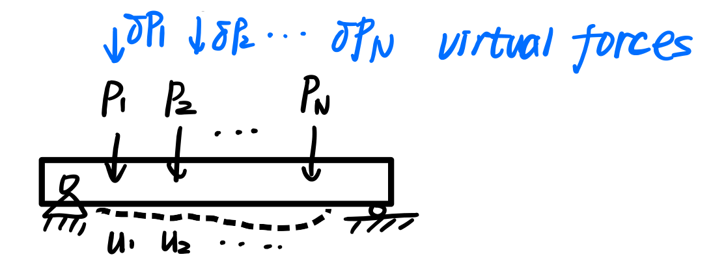

The virtual force $\delta P_1,\delta P_2,\cdots,\delta P_N$ will do virtual work $\delta W=\delta P_1u_1+\delta P_2u_2+\cdots+\delta P_Nu_N$

**Note:** virtual force is very small, it will change $u_1, u_2,\cdots,u_N$ very small. We just neglect them.

The change of strain energy is 
$$
\delta U=\frac{\partial U}{\partial P_1}\delta P_1+\frac{\partial U}{\partial P_2}\delta P_2+\cdots+\frac{\partial U}{\partial P_N}\delta P_N
$$
Now the Virtual Work Principle
$$
\delta P_1u_1+\delta P_2u_2+\cdots+\delta P_Nu_N=\frac{\partial U}{\partial P_1}\delta P_1+\frac{\partial U}{\partial P_2}\delta P_2+\cdots+\frac{\partial U}{\partial P_N}\delta P_N
$$
So we have a set of equations
$$
u_i=\frac{\partial U}{\partial P_i}\quad(i=1,2,\cdots,N)
$$
That is Castigliano's Theorem

## Example 1

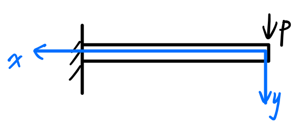

What is $y$ at the free end?

We need to calculate $U(P)$, and $\displaystyle U=\frac{1}{2EI}\int M^2dx$

But what is $M(x)$? Let's use method of section

We draw a free body diagram

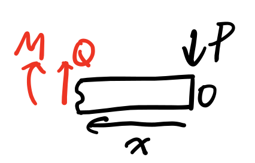
$$
\sum F_y=Q-P=0
$$

$$
\sum M_O=Qx+M=0
$$

$$
\Rightarrow M=-Px
$$

$$
U=\frac{1}{2EI}\int_0^L (-Px)^2dx=\frac{P^2L^3}{6EI}
$$

$$
y(0)=\frac{\partial U}{\partial P}=\frac{PL^3}{3EI}
$$

## Example 2

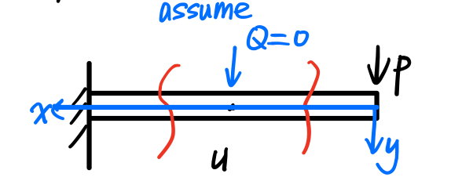

What is the displacement in the middle?

We don't have a force in the middle, but we apply a phantom $Q=0$

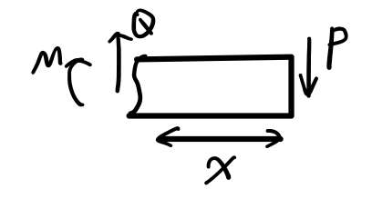

For right part$\left(0<x<\dfrac{1}{2}\right)$, $M_1(x)=-Px$

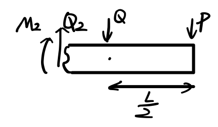

For the right part including middle point
$$
\begin{cases}
Q_2=P+Q\\
M_2(x)=-Q_2x+\dfrac{1}{2}QL=-Q\left(x-\dfrac{L}{2}\right)-Px\quad\left(\dfrac{L}{2}\leq x\leq L\right)
\end{cases}
$$
So we integrate it separately,
$$
U=\frac{1}{2EI}\int M^2dx=\frac{1}{2EI}\int_0^{L/2}M_1^2dx+\frac{1}{2EI}\int_{L/2}^LM_2^2dx
$$

$$
y\left(\dfrac{L}{2}\right)=\frac{\partial U}{\partial Q}= \frac{1}{EI}\left[ \frac{1}{3}Px^3 - \frac{1}{4}PLx^2+\frac{1}{2}Qx^3-\frac{1}{2}QLx^2+\frac{1}{4}QL^3x \right]_{L/2}^{L}=\frac{5PL^3}{48EI}
$$

Only after finishing all the calculus can we set $Q=0$.

**Note:** we can Swap the order of differentiation and integration

# Lecture 9 Impact Load

- Impact/ Collision, as a type of dynamic load, often happens in engineering practice.
- Collision, an event in which two or more subjects exert forces to each other in a very short period of time.
- For example, one object falling from rest and collide with other object, they then move and deform together.
- We can observe the potential energy, kinetic energy converted to strain energy stored in the object,or other energy-Energy conservation.

## Example

A mass $m$ slide down a pole and collide at the free end.

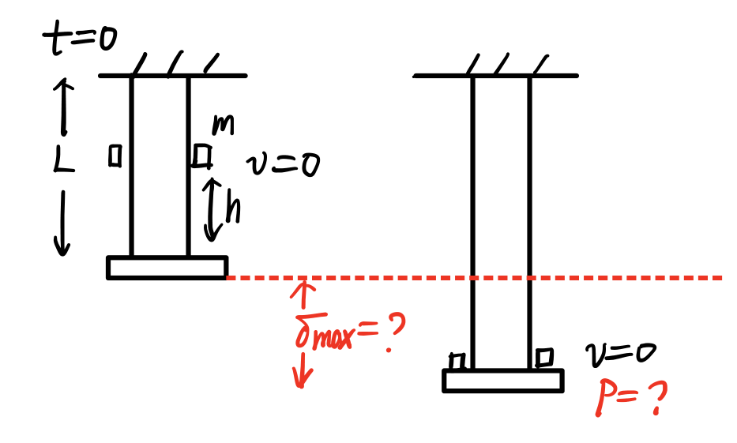

During the process, potential energy $\rightarrow$ kinetic energy $\rightarrow$ strain energy

Assumption

- After collision, the mass $m$ and free end disk stick together
- Disk and pole have $0$ mass
- All kinetic energy converted to strain energy

$P-\delta$ relation is linear, so 
$$
U=\frac{1}{2}P_{\text{max}}\delta_{\text{max}}
$$
We know that Potential energy $=$ Strain energy
$$
mg\left(h+\delta_{\text{max}}\right)=\frac{1}{2}P_{\text{max}}\delta_{\text{max}}
$$
Using Hook's Law
$$
\sigma=\frac{P}{A}=E\varepsilon=E\frac{\delta}{L}
$$
where $A$ is the cross-section area
$$
P=\frac{AE}{L}\delta
$$
So we have
$$
mg\left(h+\delta_{\text{max}}\right)=\frac{1}{2}\frac{AE}{L}\delta_{\text{max}}^2
$$
Solving the equation we have
$$
\delta=\frac{mgL}{AE}\sqrt{\left(\frac{mgL}{AE}\right)^2+2h\frac{mgL}{AE}}
$$

$$
P=\frac{AE}{L}\delta=mg\sqrt{\left(\frac{mgL}{AE}\right)^2+2h\frac{mgL}{AE}}
$$

If there is no impact, i.e. we put the mass on the free disk, allow the pole to deform quasi-statically until the quilibrium.
$$
mg=P=\frac{AE}{L}\delta_{\text{st}}
$$

$$
\delta_{\text{st}}=\frac{mgL}{AE}
$$

Thus we can rewrite the solution
$$
\delta=\delta_{\text{st}}+\sqrt{\delta_{\text{st}}^2+2h\delta_{\text{st}}}
$$
if $h\gg\delta_{\text{st}}$, 
$$
\delta\sim\sqrt{2h\delta_{\text{st}}}
$$
An actual case: $D=20$mm, $E=200$GPa, $L=1$m, $h=0.5$m, $m=20$kg
$$
\delta_{\text{st}}=3.119\times10^{-6}\text{m}
$$

$$
\delta=\sqrt{2h\delta_{\text{st}}}=1.769\times10^{-3}\text{m}
$$

$$
P=\frac{AE}{L}\delta=111.2\text{kN}
$$

That is a weight force of 11 tons

## Example 2(TO BE FINISHED)

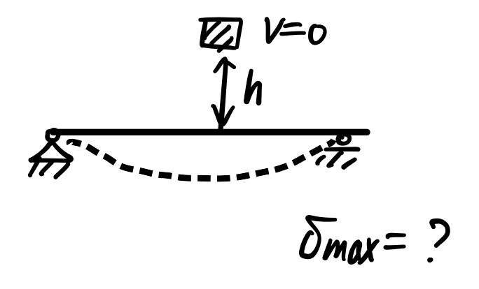

Clue: Derive the $P-\delta$ relation by

- Castigliano's theorem
- Euler beam theory

# Lecture 10 Buckling(I)

Buckling usually occurs for 'slender structure', which a structure with high aspect ratio $(>10)$ i.e. one or two dimension of the structure is / are much higher than the rest.

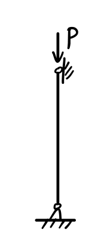

When it is overloaded, we could see sudden side-way deflection, that is buckling.

## Example

We use a simple and ideal demo

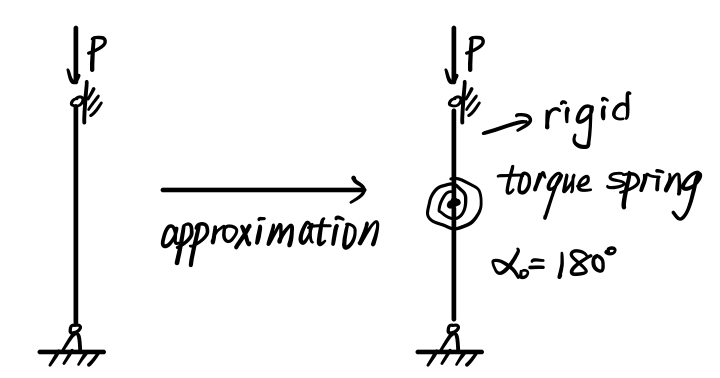

We have force moment $M_s$
$$
M_s=\beta|\Delta\alpha|
$$
where $\beta$ is spring constant

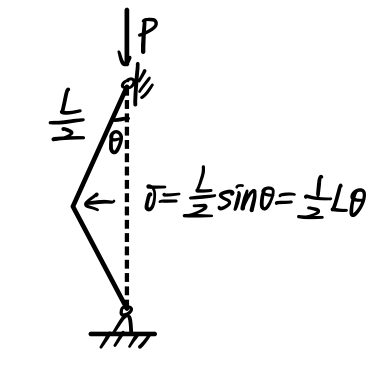
$$
\Delta \alpha=2\theta
$$
We draw a free body diagram

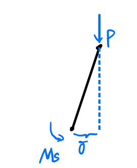
$$
\sum M_B=-M_s+P\delta=P\cdot\frac{L}{2}\theta-2\beta\theta=0
$$

$$
\theta\left(\frac{L}{4\beta}P-1\right)=0
$$

1. $P<\dfrac{4\beta}{L}$
   $\Rightarrow\theta=0,\delta=0$ no buckling
2. $P=\dfrac{4\beta}{L}$
   $\Rightarrow\theta$ can be any value $\Rightarrow$ non-zero $\delta\Rightarrow$ buckling
   We call this critical P value $P_{\text{cr}}=\dfrac{4\beta}{L}$
3. $P>\dfrac{4\beta}{L}$
   $\Rightarrow P\delta>M_s$ no equilibrium $\Rightarrow$ buckling

## Energy Perspective

1. $0<P<P_{\text{cr}}$
   Stable Equilibrium
   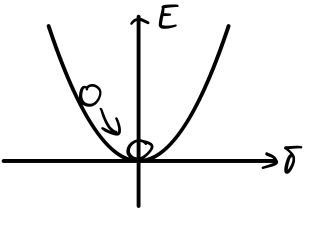
2. $P=P_{\text{cr}}$
   Neutral Equilibrium
   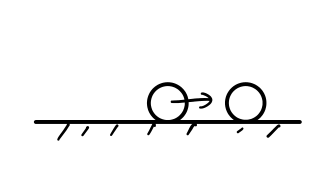
3. $P>P_{\text{cr}}$
   Unstable Equilibrium
   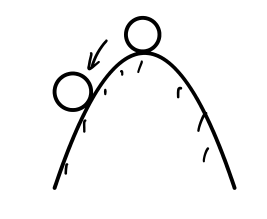

In all cases, $\theta=0$ is always a solution.

If you apply $P$ initially at $\theta=0$, the system will stay at $\theta=0$. (theoretically)

It will not buckle itself.

We need a small perturbation to trigger the buckling.

In real application, such small perturbation always exist, e.g. beam itself is not 100% straight.

# Lecture 11 Buckling(II)

## Example

A simply supported beam

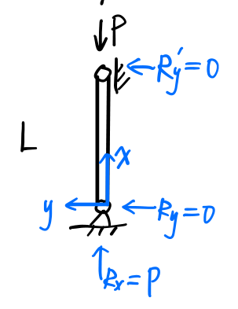

We draw its free body diagram

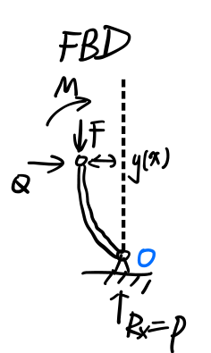
$$
\sum M_O=-M-Qx+Fy(x)=-M(x)+Py(x)=0
$$

$$
M(x)=Py(x)
$$

Then we apply Euler beam theory
$$
M(x)=-EI\frac{d^2y}{dx^2}=Py(x)
$$
We need to solve the ODE
$$
y''+\frac{P}{EI}y=0
$$
We define $k^2=\dfrac{P}{EI}$, so 
$$
y=A\sin (kx)+B\cos(kx)
$$
Boundary Condition is 
$$
y(0)=0, y(L)=0
$$
So we have 
$$
B=0, A\sin(kL)=0\Rightarrow\begin{cases}A=0\\kL=n\pi\end{cases}
$$
If $A=0$, there is no buckling and no deflection.

If $kL=n\pi(n=0,1,2,\cdots)$
$$
y=A\sin\left(\frac{n\pi}{L}x\right)
$$

- $n=0$, no buckling
- $n=1,2,3\cdots$ buckling

So critical loading is 
$$
P_{\text{cr}}=\frac{n^2\pi^2}{L^2}EI
$$

$$
n=1\quad P_{\text{cr}}=\frac{\pi^2}{L^2}EI\quad\text{mode 1}
$$

$$
n=2\quad P_{\text{cr}}=\frac{4\pi^2}{L^2}EI\quad\text{mode 2}
$$

$$
\vdots
$$

In practice, mode 2 or higher mode will not happen in most cases.

Why? Because 1st mode $P_{\text{cr}}$ is the smallest . It will occur first

If we apply force vey quickly, higher mode could happen.

## Example

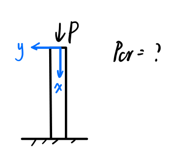

FBD

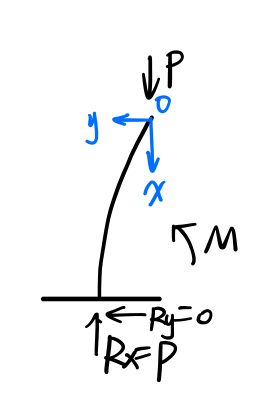
$$
Py(x)=M(x)=-EI\frac{d^2y}{dx^2}
$$

$$
y''+\frac{P}{EI}y=0
$$

$$
y=A\sin(kx)+B\cos(kx)
$$

Boundary condition
$$
y(0)=0,y'(L)=0\Rightarrow B=0,Ak\cos(kL)=0
$$
If $A=0$, no buckling

If $kL=(2n+1)\dfrac{\pi}{2}$,
$$
P=\frac{(2n+1)^2\pi^2}{4}\frac{EI}{L^2}
$$
Mode 1 
$$
P_{\text{cr}}=\frac{\pi^2EI}{4L^2}
$$

# Lecture 12 Stress Transformation(I)

## Mechanical Failure

What type of mechanical failure do we often observe in engineering practice

- yield(plastic deformation)
- buckling
- fracure
- fatigue
- wear

## Working procedure of yield analysis

1. Solve the governing equations by using the methods we learned
   The solution: $u(x,y,z),\sigma(x,y,z),\varepsilon(x,y,z)$
2. Yield criteria
   In this subject, we will learn 3 empirical criteria

## Stress Transformation

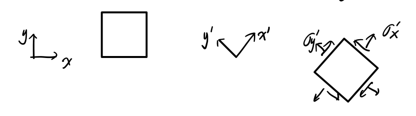

The internal force from other neighbors along other direction are usually different.
$$
\begin{bmatrix}
\sigma_x & \tau_{xy} \\
\tau_{xy} & \sigma_y
\end{bmatrix} \neq \begin{bmatrix}
\sigma_x' & \tau_{xy}' \\
\tau_{xy}' & \sigma_y'
\end{bmatrix}
$$
We use coordinate system to define neighbors or directions

The values in these two matrix are generally different.

The values depend on coordinate system (math) different neighbor (physics)

How can we calculate?

There are some different methods.

## Matrix Method

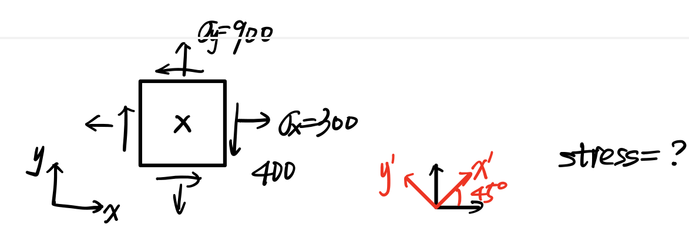

Rotation Matrix
$$
R=\begin{bmatrix}
\cos\theta&-\sin\theta\\
\sin\theta&\cos\theta
\end{bmatrix}
$$

$$
\sigma'=R^{T}\sigma R
$$

$$
\begin{aligned}
\sigma' &= \begin{bmatrix} \dfrac{\sqrt{2}}{2} & \dfrac{\sqrt{2}}{2} \\ -\dfrac{\sqrt{2}}{2} & \dfrac{\sqrt{2}}{2} \end{bmatrix} \begin{bmatrix} 300 & -400 \\ -400 & 900 \end{bmatrix} \begin{bmatrix} \dfrac{\sqrt{2}}{2} & -\dfrac{\sqrt{2}}{2} \\ \dfrac{\sqrt{2}}{2} & \dfrac{\sqrt{2}}{2} \end{bmatrix} \\
&= \frac{1}{2} \begin{bmatrix} 1 & 1 \\ -1 & 1 \end{bmatrix} \begin{bmatrix} 300 & -400 \\ -400 & 900 \end{bmatrix} \begin{bmatrix} 1 & -1 \\ 1 & 1 \end{bmatrix} = \begin{bmatrix} 200 & 300 \\ 300 & 1000 \end{bmatrix}
\end{aligned}
$$

# Lecture 13 Stress Transformation(II)

## Eigenvalue Method

To assess the safety of this point, we often need to know the max normal stress and the direction.

It is an eigenvalue problem
$$
\left|\sigma-I\sigma_P\right|=0
$$
where
$$
I=\begin{bmatrix}
1&0\\0&1
\end{bmatrix}
$$
Let's use the same example
$$
\left|\begin{matrix}
300-\sigma_P&-400\\
-400&900-\sigma_P
\end{matrix}\right|=0
$$
We can solve that 
$$
\sigma_P=100,1100
$$
They are the max, min normal stress at this point.

We call them principle stress

How about the direction?
$$
\left[\sigma-I\sigma_P\right]\begin{bmatrix}x\\y\end{bmatrix}=0
$$
For $\sigma_P=100$
$$
\begin{bmatrix}200&-400\\-400&800\end{bmatrix}\begin{bmatrix}x\\y\end{bmatrix}=0\Rightarrow\begin{bmatrix}x\\y\end{bmatrix}=\begin{bmatrix}2\\1\end{bmatrix}
$$
This vector determines a direction $x_P$

For $\sigma_P=1100$
$$
\begin{bmatrix}x\\y\end{bmatrix}=\begin{bmatrix}-1\\2\end{bmatrix}
$$
This vector determines a direction $y_P$, and $x_p\perp y_P$

## Max & Min

It has been proven in principle axis/coordinate:   
$$
 \tau \equiv 0
$$
And vice versa
$$
\sigma_P = \begin{bmatrix} \sigma_{P_1} & 0 \\ 0 & \sigma_{P_2} \end{bmatrix} = \begin{bmatrix} 100 & 0 \\ 0 & 1100 \end{bmatrix}
$$
Next, how about maximum shear stress?

In 2D case, it turns out $\tau_{max}$ happens at $45^\circ$ plane from the principle axis.

Example:
$$
R = \begin{bmatrix} 1 & -1 \\ 1 & 1 \end{bmatrix} \cdot \frac{1}{\sqrt{2}} 
$$

$$
\sigma' = R^T \cdot \sigma \cdot R = \frac{1}{2} \begin{bmatrix} 1 & 1 \\ -1 & 1 \end{bmatrix} \begin{bmatrix} \sigma_{P_1} & 0 \\ 0 & \sigma_{P_2} \end{bmatrix} \begin{bmatrix} 1 & -1 \\ 1 & 1 \end{bmatrix} = \frac{1}{2} \begin{bmatrix} \sigma_1 + \sigma_2 & \sigma_2 - \sigma_1 \\ \sigma_2 - \sigma_1 & \sigma_1 + \sigma_2 \end{bmatrix}
$$

$$
\tau_{max} = \frac{1}{2}(\sigma_2 - \sigma_1)
$$

Two tips to check answer

1. Symmetry

2. $$
   \sigma_x+\sigma_y\equiv\sigma_{x'}+\sigma_{y'}\quad\text{(2D case)}
   $$

# Lecture 14 Yield Criteria

## Yield

Materials start to develop plastic deformation

Three yield criteria

1. Maximum normal stress theory(Brittle materials)
2. Maximum shear stress theory(Ductile materials)
3. Maximum distortion energy theory

These rules are **empirical**. They are summarized based on a large number of experimetns.

## Maximum normal stress theory

Maximum normal stress is a principle stress

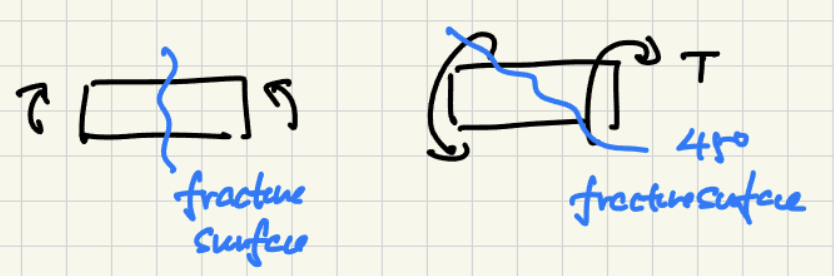
$$
|\sigma_{P_i}|>\sigma_Y\qquad\text{FAIL}
$$

$$
|\sigma_{P_i}|<\sigma_Y\qquad\text{SAFE}
$$

$i=1,2,3$

$\sigma_Y$ is a material property, we call it yield stress. We can measure it in experiment.

Often, we use uniaxial tension experiment to measure $\sigma_Y$

We can use diagram to represent this criteria

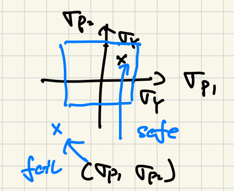

We have already solved principle stress at one point via stress transformation

In a 3D case, $\sigma_{P_1},\sigma_{P_2},\sigma_{P_3}$, we will have a cube.

## Maximum Shear Theory(Tresca)

Uniaxial tension experiment

For many ductile materials in uniaxial tension, it is often observed that the materials slip along the $45\degree$ planes.

If we do stress transformation, we will find that at the $45\degree$ plane, we will have the max shear stress.

Based on these two observations, it is reasonable to expect that ductile materials yield because of shear.

So we have 
$$
|\tau_{\text{max}}|<\tau_Y=\frac{\sigma_Y}{2}\qquad\text{SAFE}
$$

$$
|\tau_{\text{max}}|>\tau_Y=\frac{\sigma_Y}{2}\qquad\text{FAIL}
$$

In 2D case
$$
\tau_{\text{max}}=\frac{\sigma_2-\sigma_1}{2}
$$
In reality, we always have 3D. 2D is just a special case of 3D

## Example

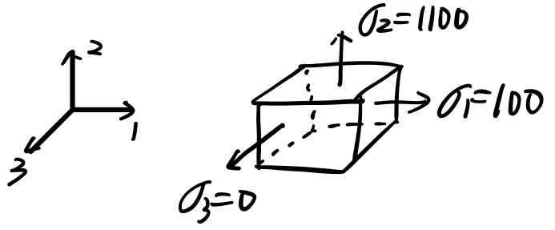
$$
\begin{align}
\text{1-2 plane}\quad\tau_{\max}&=500\\
\text{2-3 plane}\quad\tau_{\max}&=-550\quad\text{\textcolor{red}{The 3rd direction matters}}\\
\text{3-1 plane}\quad\tau_{\max}&=50
\end{align}
$$

Compare these three, we know that the absolute max, in the 2-3 plane $\tau_\max=-550$

**Note:** when we calculate $\tau_\max$, do not forget the 3rd direction, even if it has zero stress value.

## Diagram

Let's consider a case $\sigma_{zz}=0,\tau_{xz}=0,\tau_{yz}=0, \sigma_1\neq0,\sigma_2\neq0,\sigma_3=0$
$$
\text{1-2 plane}\quad\tau_{\max}=\frac{\sigma_2-\sigma_1}{2}
$$

$$
\text{2-3 plane}\quad\tau_{\max}=\frac{\sigma_3-\sigma_2}{2}=\frac{\sigma_2}{2}
$$

$$
\text{3-1 plane}\quad\tau_{\max}=\frac{\sigma_1-\sigma_3}{2}=\frac{\sigma_1}{2}
$$

By analyzing, $\tau_\max$ is either $\dfrac{\sigma_1}{2}$ or $\dfrac{\sigma_2}{2}$. We can draw a diagram

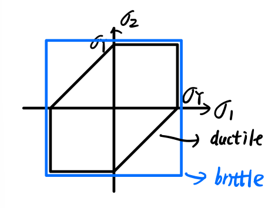

# Lecture 15 Maximum Distortion Energy Theory

- Tresca theory works well but not perfect
- Von Mises further improved the yield criteria for ductile material

## Strain Energy Calculation

Strain Energy: energy stored in a deformable body arising from deformation.

We need to use energy conservation $W=U$.

Let's consider a simple case

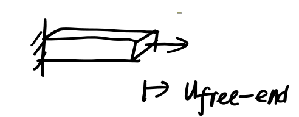

where there is a linear relation between $P$ and $u_f$
$$
W=\int Pdu_f
$$

$$
P=\sigma A=\sigma \int dA
$$

$$
U=W=\iint\sigma dAdu_f=\iiint\sigma du_fdydz
$$

We know
$$
u_f=\Delta L=L_0\varepsilon_x=\int \varepsilon_x dx
$$
so
$$
du_f=L_0d\varepsilon_x=\iint d\varepsilon_xdx
$$

$$
U=\int\iiint \sigma d\varepsilon dxdydz=V\int\sigma d\varepsilon
$$

We define that
$$
u=\frac{U}{V}=\int\sigma d\varepsilon
$$
We can use strain energy density to describe the energy stored at one material point.

Due to the linearity
$$
u=\frac{1}{2}\sigma\varepsilon
$$
For a general 3D case
$$
u=\frac{1}{2}(\sigma_x\varepsilon_x+\sigma_y\varepsilon_y+\sigma_z\varepsilon_z+\tau_{xy}\gamma_{xy}+\tau_{yz}\gamma_{yz}+\tau_{xz}\gamma_{xz})
$$
Given that we know $\sigma_1,\sigma_2,\sigma_3,\tau\equiv0$
$$
u=\frac{1}{2}(\sigma_1\varepsilon_1+\sigma_2\varepsilon_2+\sigma_3\varepsilon_3)
$$
Let's use Hook's Law
$$
\varepsilon_1 = \frac{1}{E} [ \sigma_1 - \nu ( \sigma_2 + \sigma_3 ) ]
$$

$$
\varepsilon_2 = \frac{1}{E} [ \sigma_2 - \nu ( \sigma_3 + \sigma_1 ) ]
$$

$$
\varepsilon_3 = \frac{1}{E} [ \sigma_3 - \nu ( \sigma_1 + \sigma_2 ) ]
$$

So we can conclude
$$
u=\frac{1}{2E}\left[\sigma^2_1+\sigma^2_2+\sigma^2_3-2\nu(\sigma_1\sigma_2+\sigma_2\sigma_3+\sigma_3\sigma_1)\right]
$$

## Von Mises Method

Von Mises proposed to decompose stress into two component

- hydrostatic stress
- distortion stress

$$
\begin{aligned}
\underline{\sigma} &= 
\begin{bmatrix}
\sigma_1 & & \\
& \sigma_2 & \\
& & \sigma_3
\end{bmatrix} = 
\underbrace{\begin{bmatrix}
\sigma_H & & \\
& \sigma_H & \\
& & \sigma_H
\end{bmatrix}}_{\text{change size}} +
\underbrace{\begin{bmatrix}
\sigma_1 - \sigma_H & & \\
& \sigma_2 - \sigma_H & \\
& & \sigma_3 - \sigma_H
\end{bmatrix}}_{\text{change shape}}
\end{aligned}
$$

$$
\sigma_H = \frac{\sigma_1 + \sigma_2 + \sigma_3}{3}
$$

Strain energy from $\sigma_H$
$$
u_H=\frac{3}{2}\frac{1-2\nu}{E}\sigma_H^2
$$
Distortion strain energy
$$
u_D=u-u_H=\frac{1+\nu}{3E}\frac{(\sigma_1-\sigma_2)^2 + (\sigma_2-\sigma_3)^2 + (\sigma_3-\sigma_1)^2}{2}=\frac{1+\nu}{3E}\sigma_{VM}^2
$$

$$
\sigma_{VM} = \sqrt{\frac{(\sigma_1-\sigma_2)^2 + (\sigma_2-\sigma_3)^2 + (\sigma_3-\sigma_1)^2}{2}}
$$

Von Mises proposed that if $u_D$ is higher than a threshold value(material property measured in experiment), then this material point fail.

Uniaxial tension case:

$\sigma_1\neq 0, \sigma_2=\sigma_3=0$
$$
u_D=\frac{1+\nu}{3E}\sigma_{1}^2
$$
At the yield point, $\sigma_1=\sigma_Y$
$$
u_Y=\frac{1+\nu}{3E}\sigma_{Y}^2
$$
The Von Mises Criteria
$$
u_D\geq u_Y\qquad\text{FAIL}
$$

$$
u_D< u_Y\qquad\text{SAFE}
$$

OR
$$
(\sigma_1-\sigma_2)^2 + (\sigma_2-\sigma_3)^2 + (\sigma_3-\sigma_1)^2\geq2\sigma_Y^2\qquad\text{FAIL}
$$

$$
(\sigma_1-\sigma_2)^2 + (\sigma_2-\sigma_3)^2 + (\sigma_3-\sigma_1)^2<2\sigma_Y^2\qquad\text{SAFE}
$$

OR
$$
|\sigma_{VM}|\geq\sigma_Y\qquad\text{FAIL}
$$

$$
|\sigma_{VM}|<\sigma_Y\qquad\text{SAFE}
$$

